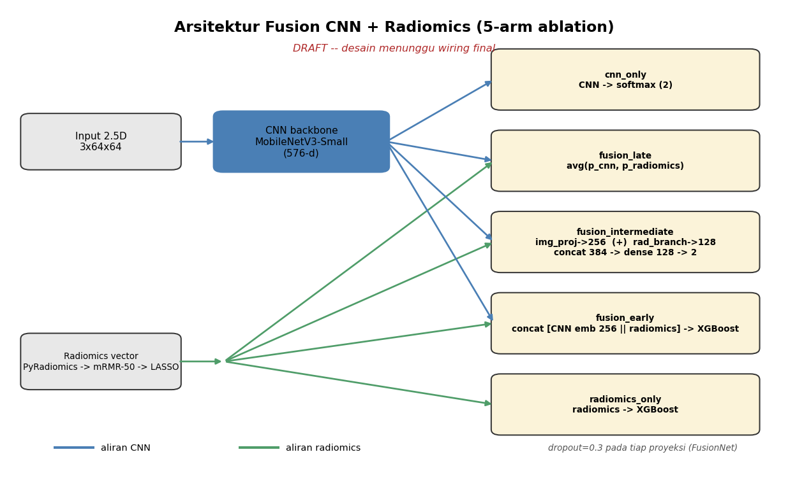
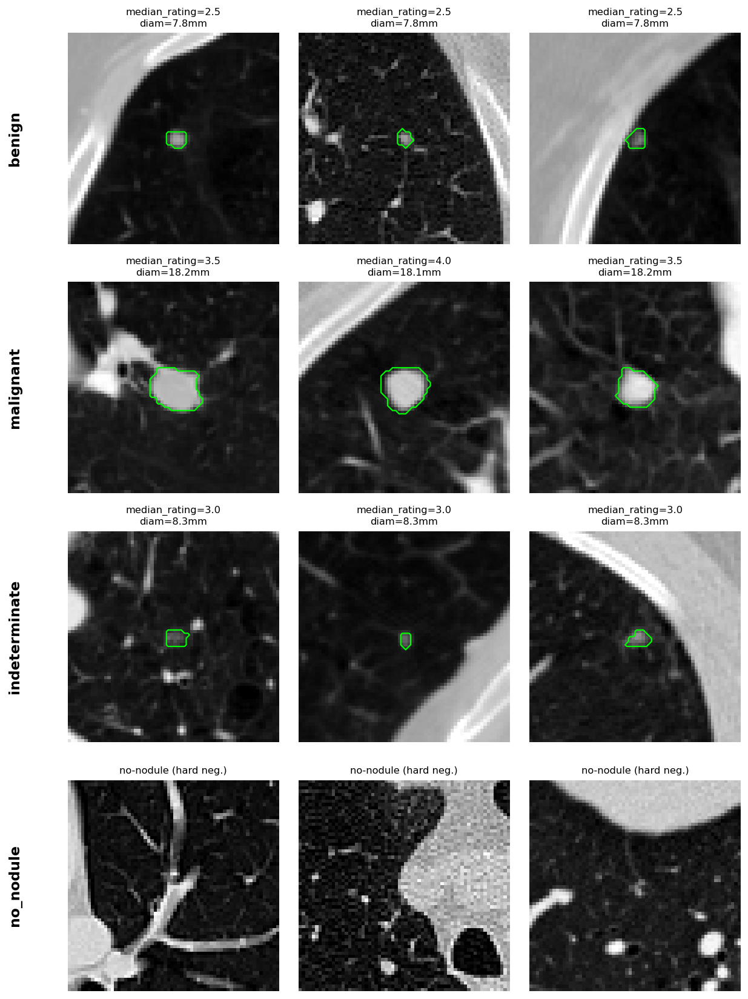
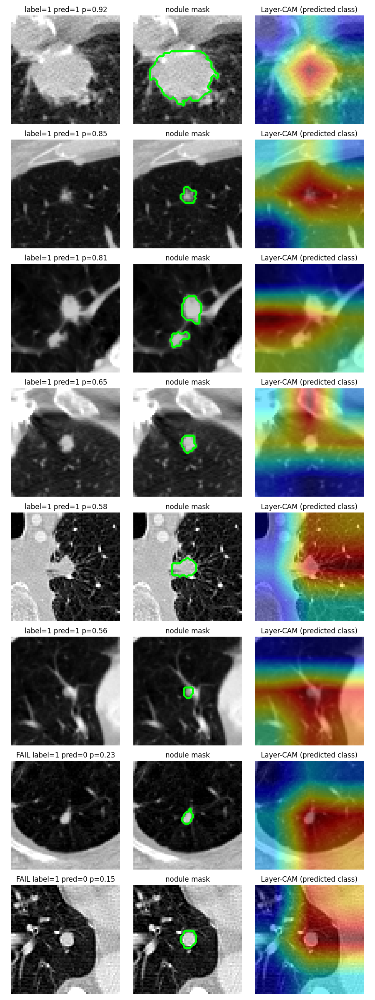
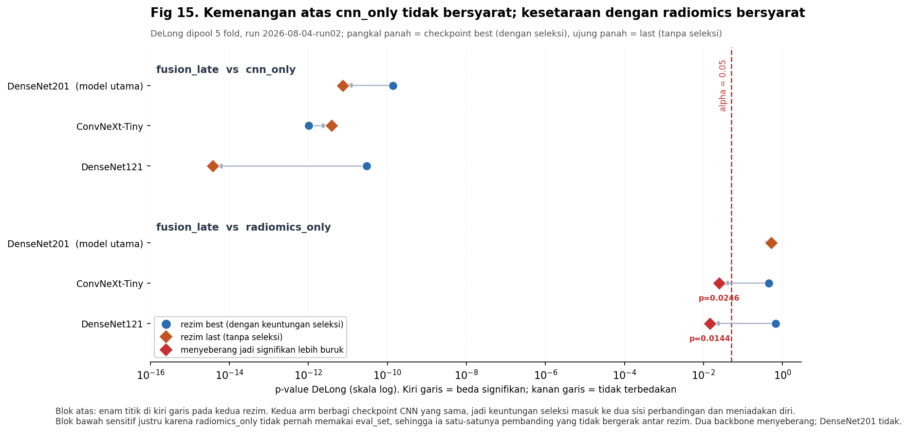
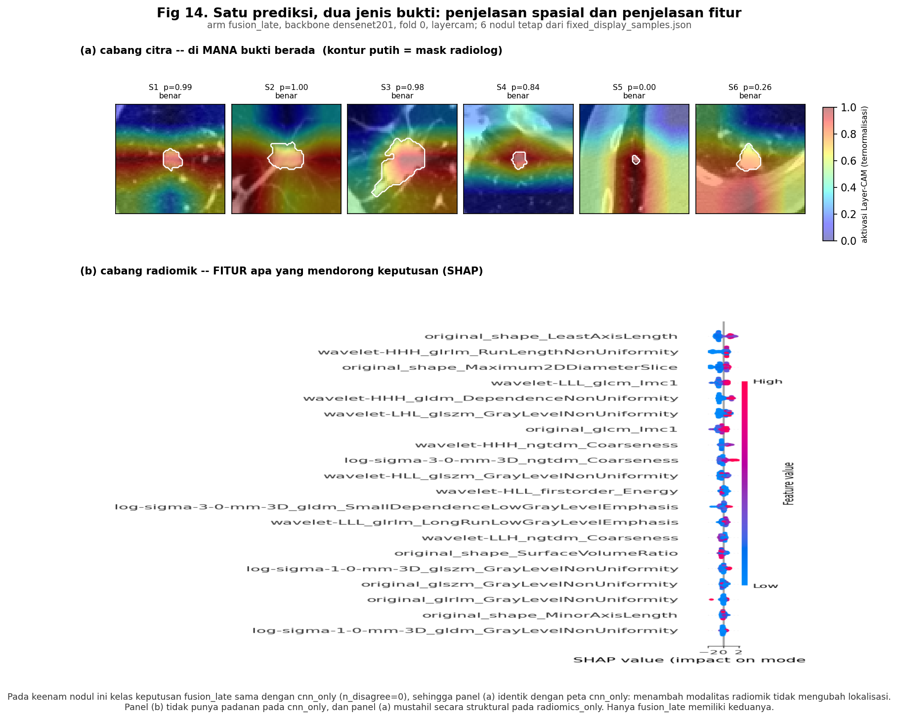
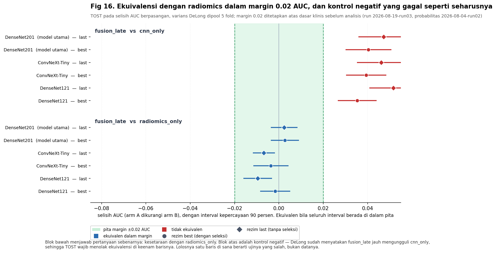

# Laporan hasil Track 1: fusi radiomics-CNN dan explainability per-arm

## 0. Identitas penelitian

- **Judul**: Fusi radiomics-CNN dan explainability per-arm untuk klasifikasi malignansi nodul paru pada LIDC-IDRI
- **Repo**: `lung-nodule-fusion-xai`
- **Tugas**: Track 1 dari pemisahan dua paper (lihat `docs/Review Revisi 1.md` §8)
- **Dataset**: LIDC-IDRI
- **Tanggal laporan**: 30 Juli 2026 (diperbarui 8 Agustus 2026 dengan hasil run `2026-08-04-run02`, lihat §6.3; diperbarui 19 Agustus 2026 dengan uji ekuivalensi run `2026-08-19-run03`, lihat §6.4)

---

## 1. Ringkasan eksekutif

Track 1 membandingkan lima *arm* representasi (CNN-only, radiomics-only, early fusion, intermediate fusion, late fusion) pada tujuh backbone CNN, lalu mengevaluasi explainability tiap arm secara terpisah.

**Klaim final** (menggantikan kesimpulan lama "radiomics-only mengungguli semua varian fusi", yang sudah tidak akurat setelah perbaikan bug resolusi dan kuantifikasi run `2026-08-04-run02`):

> `fusion_late` mengalahkan CNN-sendirian secara signifikan tanpa syarat seleksi *checkpoint* (p < 1e-9 pada ketiga backbone di kedua rezim checkpoint; p < 1e-11 bila hanya rezim tanpa seleksi yang dikutip), **ekuivalen dengan radiomics dalam margin 0.02 AUC pada ketiga backbone di kedua rezim** (p_TOST < 0.004, §6.4), mempertahankan penjelasan spasial pada tingkat yang praktis sama (selisih pointing accuracy ≤0.05, identik persis pada himpunan enam nodul tetap), dan satu-satunya arm yang menyediakan penjelasan spasial dan penjelasan fitur sekaligus.

Kata "ekuivalen" di atas menggantikan "setara" yang dipakai draf sebelumnya, dan pergantiannya bukan kosmetik. Draf lama menyimpulkan kesetaraan dari uji DeLong yang **gagal menolak** hipotesis nol kesamaan AUC. Itu penalaran yang tidak sah: tidak adanya bukti perbedaan bukan bukti tidak adanya perbedaan. Sejak 19 Agustus 2026 klaimnya bertumpu pada uji yang hipotesis nolnya justru "keduanya berbeda sedikitnya sebesar margin", lalu ditolak. Rinciannya di §6.4.

Konsekuensinya, klaim kesetaraan **tidak lagi bergantung pada DenseNet201 sebagai model utama**. DenseNet201 tetap disebut model utama, tapi alasannya menyempit: ia satu-satunya backbone yang juga lolos klaim yang lebih kuat, yaitu tidak terbedakan sama sekali oleh DeLong di kedua rezim (§6.3.2, §8.9). Temuan sekunder yang tidak berubah: pointing accuracy Grad-CAM/Layer-CAM sangat bervariasi antar backbone tanpa hubungan konsisten terhadap AUC klasifikasi.

### Status komponen

| Komponen | Status | Sumber |
|---|---|---|
| Ablasi fusi 5 arm x 7 backbone x 5 fold | Selesai (data pra-perbaikan resolusi) | `artifacts/results/fusion/ablation_summary.csv` |
| DeLong fusi vs radiomics-only | Selesai | `artifacts/results/fusion/delong_fusion.csv` |
| Metrik XAI (Grad-CAM/Layer-CAM) | Selesai | `artifacts/results/xai/xai_metrics.csv` |
| Perbaikan bug resolusi input_size | Kode selesai, belum di-*re-run* | `docs/revisi/rev1/TASKBOARD.md` tugas 1 |
| Arm fusi baru (branch_norm, GMU, modality dropout) | Kode selesai, belum dieksekusi | `docs/revisi/rev1/TASKBOARD.md` tugas 5a/5b/5c |

---

## 2. Latar belakang dan kontribusi

Fusi radiomics dan fitur CNN diasumsikan saling melengkapi, tapi asumsi ini tidak selalu berlaku pada kohort sekecil LIDC-IDRI, di mana radiomics dengan seleksi fitur adalah *baseline* yang kuat. Kontribusi laporan ini: (1) perbandingan lima arm representasi pada tujuh backbone dengan uji DeLong berpasangan, (2) protokol XAI yang mengevaluasi cabang CNN (Grad-CAM/Layer-CAM) dan cabang radiomics (SHAP) secara terpisah, karena belum ada metrik *model-agnostic* terstandardisasi untuk membandingkan keduanya secara adil.

---

## 3. Metodologi

### 3.1 Dataset dan split

LIDC-IDRI, label malignansi dari median 4 rating ahli radiologi (skala 1–5), *split* 5-fold berbasis pasien dengan seed 42 sehingga satu pasien tidak muncul di lebih dari satu fold.

### 3.2 Prapemrosesan

Patch 2.5D: tumpukan slice aksial berdekatan berpusat pada nodul, di-*crop* ke resolusi in-plane tetap. Intensitas Hounsfield unit di-*clip* ke $[-1000, 400]$ lalu dinormalisasi ke $[0, 1]$.

### 3.3 Backbone dan resolusi input

Tujuh backbone: DenseNet121, InceptionV3, Xception, GoogLeNet, ConvNeXt-Tiny, Inception-ResNet-v2, DenseNet201. Tiga di antaranya (InceptionV3, Xception, Inception-ResNet-v2) punya syarat resolusi minimum (75, 71, 75 piksel) melebihi patch native 64 piksel proyek ini, sehingga ketujuh backbone dievaluasi pada resolusi seragam 96 piksel, dipilih sebagai kelipatan 32 terkecil di atas seluruh syarat minimum agar tidak ada backbone yang diuntungkan resolusi saat dibandingkan lewat XAI.

### 3.4 Arm fusi

Kelima arm di bawah ini diaudit baris demi baris terhadap kodenya pada 8 Agustus 2026 (lihat §8.10 untuk apa yang ditemukan audit itu). Nama fungsi dicantumkan supaya deskripsi dan implementasi tidak bisa lagi berpisah diam-diam.

**Fig 11. Kelima arm dan titik percabangannya.**



Yang paling penting dibaca dari diagram ini adalah letak titik pertemuan kedua modalitas, karena di situlah kelima arm berbeda. `fusion_early` mempertemukannya di tingkat fitur, `fusion_intermediate` di tingkat representasi terlatih, dan `fusion_late` di tingkat keputusan — dan hanya yang terakhir tidak menambah satu pun parameter baru. Sumber diagram: `src/stage_07g_fusion_diagram.py`.

| Arm | Yang benar-benar dijalankan | Sumber |
|---|---|---|
| `cnn_only` | Muat ulang checkpoint backbone, inferensi murni pada fold, tanpa pelatihan baru. | `_cnn_only_preds` (`src/stage_03b_fusion.py`) |
| `radiomics_only` | XGBoost pada vektor radiomik terpilih. Seleksi per fold: filter *mutual information* menyisakan 50 kandidat teratas, lalu LASSO ber-*cross-validation* memilih himpunan akhir, keduanya di-*fit* pada fold latih saja. Tanpa `eval_set`, jadi bebas seleksi berbasis validasi. | `_select_fold_features` + `train_early_fusion_xgboost` |
| `fusion_early` | Konkatenasi **embedding CNN** dengan vektor radiomik terpilih menjadi satu matriks fitur, lalu XGBoost di atasnya. | `build_early_fusion_features` (`src/fusion/early_fusion.py`) |
| `fusion_intermediate` | `img_proj` memproyeksikan embedding CNN ke 256-d dan `rad_branch` memproyeksikan vektor radiomik ke 128-d (masing-masing Linear + ReLU + Dropout 0.3), keduanya dikonkatenasi jadi 384-d lalu masuk *classification head* bersama, dilatih *end-to-end*. | `FusionNet` (`src/models/fusion_net.py`) |
| `fusion_late` | Rata-rata probabilitas, $0.5 \cdot p_\text{CNN} + 0.5 \cdot p_\text{radiomics}$. Nol parameter baru yang dilatih. | `average_fusion` (`src/fusion/late_fusion.py`) |

### 3.5 Protokol XAI

Grad-CAM/Layer-CAM untuk cabang CNN, dievaluasi dengan dice, IoU, dice size-matched, pointing accuracy (apakah aktivasi maksimum jatuh di dalam mask nodul), dan energy pointing metric, semua terhadap mask ground-truth radiolog. SHAP untuk cabang radiomics. Kedua modalitas dilaporkan terpisah, tidak digabung jadi satu skor.

---

## 4. Dataset

Lihat §3.1 dan §3.2. Detail lengkap distribusi kelas dan fold ada di `artifacts/results/tables/table_3_1_class_distribution.csv` dan `table_3_2_fold_distribution.csv`.

**Fig 1. Contoh patch per kelas, dengan kontur mask radiolog.**



Satu hal perlu diluruskan sebelum gambar ini dibaca sebagai gambaran kohort Track 1: **figur ini menampilkan pembagian empat kelas untuk seluruh dataset, sedangkan Track 1 bekerja pada tugas biner atas 1366 nodul.** Baris `no_nodule` berisi hard negative yang tidak masuk kohort Track 1 sama sekali. Yang tetap berlaku dari gambar ini untuk Track 1 adalah tiga baris nodulnya, dan satu pola yang menjelaskan banyak hal di §6: ukuran nodul naik tajam bersama rating malignansi, dari 7.8 mm pada baris benign menjadi 18.1 sampai 18.2 mm pada baris malignant.

Pola itu bukan hiasan. Ia menjelaskan mengapa `radiomics_only` sekuat itu sebagai pembanding: fitur bentuk seperti `original_shape_LeastAxisLength` dan `Maximum2DDiameterSlice` mengukur ukuran secara langsung, dan keduanya memang menempati peringkat teratas SHAP di §6.3.5.

---

## 5. Konfigurasi

`configs/config.yaml` blok `tracks.track1`: 7 backbone di atas, `input_size: 96`.

---

## 6. Hasil

### 6.1 Ablasi fusi

AUC rata-rata per arm, dipool lintas 7 backbone dan 5 fold, dari `artifacts/results/fusion/ablation_summary.csv` setelah perbaikan bug resolusi **dan** perbaikan kebocoran seleksi *epoch* lewat nested CV (175 baris: 7 backbone x 5 arm x 5 fold, dijalankan 4 Agustus 2026):

| Arm | AUC (final) | Sebelum nested CV | Baseline pra-perbaikan resolusi |
|---|---|---|---|
| fusion_late | 0.9349 | 0.9332 | 0.9171 |
| radiomics_only | 0.9324 | 0.9314 | 0.9313 |
| fusion_early | 0.9119 | 0.9126 | 0.9179 |
| fusion_intermediate | 0.9098 | 0.9294 | 0.9269 |
| cnn_only | 0.9018 | 0.8927 | 0.7853 |

Kolom final sudah memuat baris DenseNet121 hasil ablasi ulang setelah kelima checkpoint-nya dilatih ulang (§8.6). Ablasi ulang itu dibatasi pada DenseNet121 saja, ditulis lebih dulu ke direktori terpisah lalu digabungkan, sehingga 150 baris milik enam *backbone* lain tidak tersentuh.

Baseline pra-perbaikan diarsipkan di `artifacts/results/_baseline_pre_rev2/`. Kolom `cnn_only` konsisten dengan AUC standalone per backbone di `summary_binary.csv` (selisih 0.0019-0.0070, lihat §8.4 untuk sumber selisih itu), mengonfirmasi bug resolusi sudah tertutup.

Dari 21 uji DeLong berpasangan (`fusion/delong_fusion.csv`), fusion_late unggul angka di 5 dari 7 backbone tapi **tidak satu pun** dari 21 pasangan mencapai signifikansi yang mendukung fusi; p terkecil di sisi menang adalah 0.2040. fusion_early signifikan lebih buruk daripada radiomics_only di ketujuh backbone, fusion_intermediate di enam dari tujuh, dengan p terkecil 2.6e-7 pada `inception_resnet_v2`.

Angka `fusion_intermediate` di atas — berikut turunannya `fusion_early` dan `fusion_late`, yang memakai *embedding* dan probabilitas CNN yang sama — masih mengikuti protokol lama. Protokol itu memilih epoch terbaik berdasarkan AUC pada *fold* validasi luar, lalu melaporkan skor akhir pada fold yang sama (`src/stage_03b_fusion.py:207-215`, sebelum perbaikan nested CV).

`radiomics_only` satu-satunya arm yang bersih dari kebocoran ini, karena `train_early_fusion_xgboost` tidak memakai `eval_set`. Akibatnya keunggulan tipis fusion_late di atas radiomics_only diukur dengan timbangan berat sebelah.

Dua tindak lanjut menjawab hal itu dari arah yang berbeda, dan hasilnya saling menguatkan. Nested CV (§8.4, dikuantifikasi tepat di bawah) membersihkan `fusion_intermediate`; *sensitivity check* rezim checkpoint (§6.3, §8.9) menangani `fusion_late`. Untuk `fusion_late`, §6.3 menggantikan §6.1 sebagai hasil utama.

#### Kuantifikasi bias seleksi

Nested CV menurunkan `fusion_intermediate` sebesar **0.0210** AUC (0.9294 menjadi 0.9084). Angka itu estimasi langsung bias seleksi dari protokol lama, yang memilih epoch terbaik pada fold validasi luar lalu melaporkan fold yang sama.

Tiga arm lain bergerak di bawah 0.0005 dan `cnn_only` nol persis. Pola itu bukan kebetulan melainkan konfirmasi silang bahwa perbaikan mengenai sasaran: hanya `fusion_intermediate` yang melewati `_train_fusion_fold`, satu-satunya jalur berloop epoch dengan seleksi checkpoint. `fusion_early` dan `fusion_late` memakai embedding dan probabilitas dari checkpoint arm A yang dibekukan di luar `stage_03b_fusion`, jadi memang harus diam, dan memang diam.

Arah temuannya perlu dinyatakan tegas: kebocoran ternyata **menyamarkan kekalahan, bukan menciptakan kemenangan**. Sebelum diperbaiki, `fusion_intermediate` 0.9294 tampak nyaris menyamai radiomics 0.9314; sesudahnya ia jatuh ke 0.9084 dan kalah signifikan di enam dari tujuh backbone. Kesimpulan "radiomics mengungguli fusi" menguat, bukan melemah.

Batas berlaku kesimpulan itu perlu dinyatakan supaya tidak bentrok dengan §6.3: yang dikalahkan radiomics adalah **fusi berparameter**, yaitu `fusion_intermediate` dan `fusion_early`. `fusion_late` tidak melewati `_train_fusion_fold` sama sekali dan tetap setara dengan radiomics; klaim finalnya ada di §6.3, dan syarat rezim checkpoint-nya di §8.9.

#### Komplementaritas modalitas

Untuk menguji apakah kekalahan fusi berakar pada arsitektur fusi atau pada ketimpangan modalitas, prediksi `cnn_only` dan `radiomics_only` dibandingkan per kasus tanpa pelatihan baru: probabilitas CNN diambil dari `preds/*.npz` yang sudah ada lalu disubset ke kohort 1366, probabilitas radiomik dihitung ulang dengan pipeline seleksi yang sama.

| Backbone | Pearson | Spearman | CNN benar, radiomik salah | Radiomik benar, CNN salah | Keduanya salah |
|---|---|---|---|---|---|
| inception_resnet_v2 | 0.831 | 0.731 | 14.4 | 17.2 | 19.8 |
| convnext_tiny | 0.824 | 0.740 | 13.6 | 22.2 | 20.6 |
| xception | 0.819 | 0.705 | 15.0 | 16.2 | 19.2 |
| inceptionv3 | 0.805 | 0.684 | 14.0 | 19.2 | 20.2 |
| densenet201 | 0.796 | 0.697 | 15.6 | 18.6 | 18.6 |
| googlenet | 0.795 | 0.692 | 15.2 | 19.4 | 19.0 |
| densenet121 | 0.626 | 0.611 | 13.8 | 43.6 | 20.4 |

Rata-rata per fold, n rata-rata 273 kasus, ambang keputusan 0.5. AUC radiomik identik 0.9343 di seluruh baris, sebagaimana seharusnya karena arm itu tidak bergantung pada backbone; kesamaan itu berfungsi sebagai pemeriksaan kewarasan.

CNN memiliki kontribusi unik, tetapi kecil. Korelasinya tinggi namun jauh dari jenuh, dan CNN benar sementara radiomik salah pada sekitar 14 kasus per fold, yaitu 5.1 persen, stabil di ketujuh backbone. Arah ketimpangannya tetap jelas: radiomik unik-benar pada 16 sampai 22 kasus, lebih banyak.

Satu batasan tafsir perlu disebut. Angka-angka ini adalah keputusan keras pada ambang 0.5, dan benar pada ambang tidak otomatis berarti tambahan AUC.

### 6.2 XAI

Pointing accuracy per backbone, dari `artifacts/results/xai/xai_metrics.csv`:

| Backbone | Pointing accuracy |
|---|---|
| DenseNet121 | 0.7167 |
| ConvNeXt-Tiny | 0.7167 |
| DenseNet201 | 0.7000 |
| Inception-ResNet-v2 | 0.3833 |
| InceptionV3 | 0.2000 |
| Xception | 0.2000 |
| VGG16 | 0.2000 |
| ResNet50 | 0.1167 |
| EfficientNet-B0 | 0.0833 |
| MobileNetV3-Small | 0.0000 |
| ViT-Base | 0.0000 |
| GoogLeNet | 0.0000 |

Pointing accuracy rendah tidak berarti AUC klasifikasi rendah; beberapa backbone dengan pointing mendekati nol tetap klasifikasi kompetitif. Ini konsisten dengan keterbatasan Grad-CAM yang sudah didokumentasikan pada literatur, khususnya untuk arsitektur vision transformer.

**Fig 12. Seperti apa pointing accuracy 0.7167 sebenarnya, pada DenseNet121.**



Angka 0.7167 pada tabel di atas mudah dibaca terlalu optimistis, dan figur ini gunanya untuk mengoreksi pembacaan itu. Yang dituntut pointing accuracy hanyalah **titik aktivasi tertinggi jatuh di dalam mask** — bukan bahwa peta panasnya rapi, terpusat, atau seukuran nodul. Baris teratas memperlihatkan kasus yang memang rapi. Beberapa baris di bawahnya memperlihatkan peta yang melebar jauh melewati nodul namun tetap dihitung benar, karena puncaknya kebetulan masih di dalam kontur.

Dua baris terakhir bertanda `FAIL` adalah nodul malignan yang diklasifikasikan salah (p = 0.23 dan 0.15). Keduanya sengaja ditampilkan, bukan dibuang: laporan yang hanya memajang kasus berhasil tidak memberi pembaca cara menilai apa pun. Perlu dicatat bahwa kedelapan sampel di figur ini berlabel malignan, jadi ia bukan sampel acak dari kohort dan tidak boleh dibaca sebagai gambaran tingkat kesalahan.

---

### 6.3 Keunggulan gabungan `fusion_late` (run `2026-08-04-run02`, commit `5220afb`)

Bagian ini adalah hasil utama Track 1 versi terkini. Seluruh angkanya berasal dari satu run tunggal sehingga tidak lagi tersebar antar arsip, dan setiap baris mencantumkan rezim checkpoint yang dipakai.

#### 6.3.1 Tabel keunggulan gabungan

Tabel di bawah adalah tabel utama Track 1, disalin apa adanya dari `artifacts/results/run02/combined_advantage_table.md`. Angka dalam kurung adalah rentang antar tiga backbone (`convnext_tiny`, `densenet201`, `densenet121`).

| Kriteria | cnn_only | radiomics_only | fusion_late |
|---|---|---|---|
| AUC gabungan 5 fold (rerata 3 backbone) | 0.8944 (0.8907–0.8965) | 0.9336 (0.9336–0.9336) | 0.9327 (0.9300–0.9363) |
| AUC dengan checkpoint tanpa seleksi (T-0) | 0.8806 (0.8725–0.8888) | 0.9336 (0.9336–0.9336) (tidak terpengaruh) | 0.9290 (0.9241–0.9360) |
| DeLong vs `fusion_late` (p, 3 backbone) | 0.0000 (1.0e-12–1.4e-10); signifikan 3/3 | 0.5417 (0.4555–0.6793); signifikan 0/3 | — |
| Peta salience spasial (Grad-CAM/Layer-CAM) | ada | mustahil secara struktural | ada (diwarisi dari cabang citra) |
| Pointing accuracy (60 nodul fold 0, rerata 3 backbone) | 0.6667 (0.5763–0.7288) | tidak terdefinisi | 0.6384 (0.5593–0.6780) |
| SHAP fitur radiomik | tidak ada | ada | ada |
| **Penjelasan spasial DAN fitur sekaligus** | **tidak** | **tidak** | **ya** |

Baris terakhir adalah penutup argumen: dua arm lain masing-masing hanya menutupi satu sisi explainability, dan hanya `fusion_late` yang menutupi keduanya tanpa membayar dengan AUC.

#### 6.3.2 DenseNet201 sebagai model utama

Klaim kesetaraan AUC dengan `radiomics_only` dilaporkan dengan DenseNet201 sebagai model utama. Alasannya tunggal dan dapat diperiksa: DenseNet201 adalah **satu-satunya backbone yang tetap setara dengan radiomics tanpa keuntungan seleksi checkpoint** (p = 0.5122 pada checkpoint `last`, dengan AUC nominal lebih tinggi, 0.9360 vs 0.9336). ConvNeXt-Tiny dan DenseNet121 tetap dilaporkan sebagai bukti pendukung, tetapi kesetaraan keduanya hanya bertahan pada rezim `best`; lihat §8.9.

| Backbone | AUC `fusion_late` (best) | p vs radiomics (best) | AUC `fusion_late` (last) | p vs radiomics (last) | Setara tanpa seleksi? |
|---|---|---|---|---|---|
| **DenseNet201** | 0.9363 | 0.4901 | **0.9360** | **0.5122** | **ya** |
| ConvNeXt-Tiny | 0.9300 | 0.4555 | 0.9268 | 0.0246 | tidak |
| DenseNet121 | 0.9319 | 0.6793 | 0.9241 | 0.0144 | tidak |

#### 6.3.3 Kemenangan atas `cnn_only` bebas syarat

Uji DeLong `fusion_late` vs `cnn_only` dijalankan pada kedua rezim checkpoint. Kemenangan `fusion_late` bertahan signifikan pada ketiganya di kedua rezim, dengan p pada rezim tanpa seleksi justru lebih kecil:

| Backbone | p (rezim `best`) | p (rezim `last`) |
|---|---|---|
| ConvNeXt-Tiny | 1.009e-12 | 3.903e-12 |
| DenseNet201 | 1.362e-10 | 7.366e-12 |
| DenseNet121 | 2.969e-11 | 3.775e-15 |

**Fig 15. Kedua perbandingan, kedua rezim checkpoint, satu sumbu.**



Figur ini menggabungkan klaim §6.3.3 dan batasan §8.9 dalam satu bidang, karena yang membedakan keduanya justru posisi, bukan nilai. Pangkal panah adalah rezim `best`, ujungnya rezim `last`, sehingga arah pergeseran akibat pencabutan keuntungan seleksi terbaca langsung alih-alih disimpulkan dari dua angka yang tercetak berjauhan.

Blok atas: enam titik semuanya jauh di kiri garis, dan panahnya pendek — rezim checkpoint praktis tidak menggeser apa pun. Blok bawah: tiga titik `best` berada di kanan garis, tetapi dua panahnya menyeberang ke kiri saat berpindah ke rezim `last`. Hanya DenseNet201 yang tidak menyeberang. Sumber: `src/stage_08e_run02_fig15.py`.

Alasan struktural mengapa klaim ini kebal terhadap kebocoran seleksi checkpoint yang dibahas di §8.4: kedua arm memakai checkpoint CNN yang sama, sehingga keuntungan seleksi masuk ke kedua sisi perbandingan dan saling meniadakan. Perbandingan yang sensitif terhadap rezim checkpoint hanyalah `fusion_late` vs `radiomics_only`, karena `radiomics_only` bersih dari seleksi apa pun (§8.4). Batas p yang aman ditulis dalam manuskrip mengikuti nilai terbesar dari sel yang dikutip. Untuk kedua rezim sekaligus, nilai terbesarnya 1.362e-10 sehingga batas yang benar adalah **p < 1e-9**. Untuk rezim `last` saja, nilai terbesarnya 7.366e-12 sehingga batasnya **p < 1e-11**. Jangan menulis p < 1e-11 untuk kedua rezim sekaligus — DenseNet201 rezim `best` melanggarnya.

#### 6.3.4 Explainability: fusi tidak merusak lokalisasi

Metrik Grad-CAM/Layer-CAM dihitung pada dua himpunan sampel: himpunan enam nodul tetap dari `artifacts/xai/fixed_display_samples.json` (tidak pernah dipilih ulang) dan himpunan 60 nodul fold 0 (59 nodul dengan mask valid) untuk resolusi statistik yang lebih halus.

| Backbone | Himpunan | Pointing accuracy `cnn_only` | Pointing accuracy `fusion_late` | Selisih | Nodul beda keputusan |
|---|---|---|---|---|---|
| ConvNeXt-Tiny | 6 nodul tetap | 1.0000 | 1.0000 | 0.0000 | 0 |
| DenseNet201 | 6 nodul tetap | 0.3333 | 0.3333 | 0.0000 | 0 |
| DenseNet121 | 6 nodul tetap | 0.5000 | 0.5000 | 0.0000 | 0 |
| ConvNeXt-Tiny | 60 nodul fold 0 | 0.7288 | 0.6780 | −0.0508 | 5 |
| DenseNet201 | 60 nodul fold 0 | 0.6949 | 0.6780 | −0.0169 | 6 |
| DenseNet121 | 60 nodul fold 0 | 0.5763 | 0.5593 | −0.0169 | 2 |

Temuan ini positif dan dilaporkan sebagai temuan, bukan sebagai kekurangan: **menambahkan modalitas radiomik tidak merusak kemampuan lokalisasi spasial cabang citra.** Selisih terbesar 0.0508 dan identik persis pada himpunan enam nodul tetap.

Penjelasannya arsitektural dan dapat diperiksa langsung dari definisi arm. `fusion_late` adalah rata-rata probabilitas, $0.5 \cdot p_\text{CNN} + 0.5 \cdot p_\text{rad}$, tanpa jaringan baru yang dilatih; ia mewarisi cabang citra `cnn_only` secara utuh. Karena peta CAM dihitung terhadap kelas keputusan, peta `fusion_late` **identik dengan peta `cnn_only` pada setiap nodul yang kelas keputusan kedua arm-nya sama**, dan hanya berbeda pada nodul yang keputusan fusinya berbeda dari keputusan CNN. Jumlah nodul semacam itu kecil: 5, 6, dan 2 dari 59 pada ketiga backbone, dan nol pada himpunan enam nodul tetap — itulah sebabnya selisihnya persis nol di sana. Selisih kecil pada himpunan 60 nodul karena itu berasal dari segelintir nodul saja, bukan dari degradasi menyeluruh.

Klaim "fusi unggul dalam XAI" **tidak didukung angka dan tidak boleh ditulis**. Yang didukung angka: fusi mempertahankan penjelasan spasial pada tingkat yang praktis sama, sambil menjadi satu-satunya arm yang juga punya penjelasan tingkat fitur.

**Fig 14. Satu prediksi, dua jenis bukti.**



Inilah bukti visual untuk baris penutup tabel §6.3.1. Panel (a) menjawab **di mana** bukti berada, panel (b) menjawab **fitur apa** yang mendorong keputusan, dan keduanya menjelaskan satu prediksi yang sama dari model yang sama.

Yang membuat pasangan ini bermakna adalah bahwa keduanya tidak bisa saling menggantikan, dan tidak ada arm lain yang punya keduanya: panel (b) tidak punya padanan pada `cnn_only`, sedangkan panel (a) mustahil secara struktural pada `radiomics_only` karena arm itu tidak pernah melihat citra.

`n_disagree` nol pada keenam nodul ini, yang berarti panel (a) identik dengan peta `cnn_only`. Fakta itu dicetak di kaki figur, bukan disembunyikan — justru itu isi klaimnya, bahwa menambah modalitas radiomik tidak mengubah lokalisasi. Sumber: `src/stage_08d_run02_fig14.py`.

#### 6.3.5 SHAP cabang radiomik

Tiga figur beeswarm (`shap_beeswarm_{backbone}.png`, 23 fitur, fold 0, `fs_method = mutual_info_classif`) secara arsitektural **identik antar backbone**, karena cabang radiomik `fusion_late` tidak menerima masukan apa pun dari cabang CNN. Fakta ini dicatat eksplisit di kolom `identical_across_backbones` pada `artifacts/results/run02/shap_provenance.csv`, bukan disembunyikan dengan menampilkan tiga figur seolah-olah berbeda.

#### 6.3.6 Provenance angka

Seluruh angka §6.3 berasal dari run `2026-08-04-run02` pada commit `5220afb`, kolom `run_id` dan `commit_sha` tersimpan di setiap baris CSV sumbernya.

| Angka | Berkas sumber | Rezim checkpoint |
|---|---|---|
| AUC per arm, uji DeLong | `artifacts/results/run02/delong_run02.csv` | kolom `ckpt_kind` (`best` / `last`) |
| Sensitivitas T-0 | `artifacts/results/run02/t0_checkpoint_sensitivity.csv` | keduanya, berdampingan |
| Metrik XAI dan selisihnya | `artifacts/results/run02/xai_fusion_vs_cnn.csv` | `best` |
| Sampel XAI yang dipakai | `artifacts/results/run02/xai_samples_used.csv` | — |
| Provenance SHAP | `artifacts/results/run02/shap_provenance.csv` | `best` |
| Vektor probabilitas mentah | `artifacts/results/run02/probs/{backbone}.npz` | kedua rezim, kolom terpisah |
| Tabel gabungan §6.3.1 | `artifacts/results/run02/combined_advantage_table.{csv,md}` | dinyatakan per baris |

Rezim `best` memakai `checkpoints/{model}/fold{f}_best.pt`, yaitu checkpoint yang dipilih `stage_03_train` berdasarkan AUC pada fold yang sama dengan yang dilaporkan. Rezim `last` memakai `fold{f}_last.pt`, checkpoint akhir pelatihan tanpa seleksi apa pun. Rezim `last` adalah sensitivity check batas bawah, bukan nested CV penuh — nested CV akan menuntut pelatihan ulang 3 backbone × 5 fold dan tidak dijalankan.

---

## 6.4 Uji ekuivalensi: kesetaraan dengan radiomics, diuji alih-alih disimpulkan (run `2026-08-19-run03`)

### 6.4.1 Mengapa DeLong saja tidak cukup

Seluruh §6.3 menyandarkan klaim kesetaraan pada p DeLong yang besar — 0.4555, 0.4901, 0.6793. Itu cara yang salah untuk sampai ke kesimpulan itu, dan salahnya bersifat logis, bukan numerik.

Hipotesis nol uji DeLong adalah "kedua AUC sama". Gagal menolaknya berarti data tidak cukup untuk memperlihatkan perbedaan; ia sama sekali tidak berarti perbedaannya nol. Sampel yang kecil, prediktor yang berisik, atau uji yang lemah semuanya menghasilkan p besar tanpa satu pun di antaranya menjadi bukti kesetaraan. Klaim kesetaraan yang berdiri di atas p besar bisa dijatuhkan dalam satu kalimat.

Uji yang benar membalik beban itu. **TOST** (*two one-sided tests*) memakai hipotesis nol gabungan "selisihnya sedikitnya sebesar margin δ, ke salah satu arah", lalu berusaha menolaknya dari dua sisi sekaligus. Kalau keduanya tertolak, yang tersisa adalah pernyataan positif: selisihnya berada di dalam ±δ. Setara persis dengan menyatakan bahwa interval kepercayaan 90 persen atas selisih itu seluruhnya termuat di dalam ±δ.

### 6.4.2 Margin ditetapkan lebih dulu, atas dasar klinis

Margin dipakai **δ = 0.02 AUC**, ditetapkan sebelum uji dijalankan dan tidak direvisi sesudahnya. Dua pertimbangan menetapkannya, keduanya dari luar data penelitian ini:

1. **Label rujukannya sendiri tidak sepresisi itu.** Penilaian malignansi LIDC berasal dari empat pembaca yang saling tidak sepakat pada tingkat yang jauh melampaui 0.02; disagreement rating malignansi terukur 0.2144 pada studi yang mengkuantifikasinya. Selisih model di bawah lantai derau itu tidak bisa mengubah keputusan yang standar rujukannya sendiri tidak tentukan.
2. **Performa yang dilaporkan pada LIDC bergerak lebih dari 0.02 karena pilihan sampel saja.** Baltatzis dkk. menunjukkan pilihan *truthing* dan ambang menggerakkan angka yang dilaporkan, sehingga selisih sebesar itu tidak stabil untuk ditindaklanjuti.

Nilai ini juga **konservatif** dibanding margin 0.05 dan 0.10 yang lazim diperdebatkan untuk uji non-inferioritas pada akurasi diagnostik. Margin longgar membuat ekuivalensi mudah dinyatakan dan karenanya tidak informatif; margin ketat membuat pernyataannya bermakna.

Yang **tidak** dipakai sebagai alasan: bahwa intervalnya kebetulan muat. Margin yang dipilih karena datanya masuk adalah margin post-hoc, dan itu persis cara memilih margin yang akan diserang.

### 6.4.3 Hasil



*Fig 16. Kedua belas uji ekuivalensi pada satu sumbu. Titik adalah selisih AUC, garis adalah interval kepercayaan 90 persen, pita hijau adalah margin ±0.02. Blok bawah menjawab pertanyaan sebenarnya; blok atas adalah kontrol negatif. Sumber: `artifacts/results/run02/fig16_tost_equivalence.png`, ditulis `src/stage_08f_run02_tost.py`.*

| Backbone | Rezim | Δ AUC | CI 90% | p_TOST | Ekuivalen | p DeLong |
|---|---|---|---|---|---|---|
| ConvNeXt-Tiny | best | −0.0036 | (−0.0115, +0.0043) | 3.3e-4 | ya | 0.4555 |
| ConvNeXt-Tiny | last | −0.0068 | (−0.0117, −0.0018) | 5.7e-6 | ya | **0.0246** |
| DenseNet201 | best | +0.0027 | (−0.0037, +0.0090) | 3.6e-6 | ya | 0.4901 |
| DenseNet201 | last | +0.0024 | (−0.0036, +0.0084) | 8.2e-7 | ya | 0.5122 |
| DenseNet121 | best | −0.0017 | (−0.0085, +0.0051) | 4.4e-6 | ya | 0.6793 |
| DenseNet121 | last | −0.0095 | (−0.0160, −0.0031) | 3.7e-3 | ya | **0.0144** |

Δ adalah `fusion_late` dikurangi `radiomics_only`. Keenam baris ekuivalen; tidak ada satu pun yang sekadar "tidak signifikan".

**Dua baris yang dicetak tebal adalah inti temuannya.** Pada ConvNeXt-Tiny dan DenseNet121 rezim `last`, DeLong menolak kesamaan AUC — itulah batasan yang dicatat §8.9. TOST tetap menyatakan keduanya ekuivalen. Kedua pernyataan itu benar sekaligus dan tidak saling bertentangan: selisihnya cukup besar untuk **terdeteksi** pada 1366 nodul, dan terlalu kecil untuk **berarti**. Selisih terbesar di seluruh tabel 0.0095 AUC, dan ujung terjauh intervalnya berhenti di −0.0160, masih di dalam margin.

Perlu ditegaskan bahwa keduanya membaca varians yang sama persis. Keduanya memanggil `auc_diff_variance` yang sama pada vektor probabilitas yang sama. Jadi perbedaannya bukan pada data, melainkan pada pertanyaannya.

### 6.4.4 Kontrol negatif

Uji ekuivalensi yang menyatakan semuanya ekuivalen tidak membuktikan apa pun. Karena itu prosedur yang sama dijalankan pada perbandingan yang **sudah diketahui berbeda jauh**, yaitu `fusion_late` lawan `cnn_only`, dengan selisih 0.035 sampai 0.052 AUC.

Hasilnya: **ekuivalen 0 dari 6**, dengan p_TOST di atas 0.99 pada keenam baris. Ujinya menolak seperti seharusnya. Kalau satu saja baris di sana lolos, yang salah ujinya, bukan datanya — dan itu dinyatakan sebagai assert di dalam skripnya, bukan sekadar diharapkan.

Non-inferioritas, bentuk satu arah dari uji yang sama, berlaku pada **keduabelas** baris: `fusion_late` tidak pernah lebih buruk dari arm mana pun sebesar 0.02 AUC atau lebih.

### 6.4.5 Provenance

| Angka | Berkas sumber |
|---|---|
| Seluruh tabel §6.4.3 dan §6.4.4 | `artifacts/results/run02/tost_run02.csv` (12 baris) |
| Fig 16 | `artifacts/results/run02/fig16_tost_equivalence.png` |
| Kode uji | `src/evaluation/statistical_tests.py` (`auc_diff_variance`, `tost_auc`) |
| Stage | `src/stage_08f_run02_tost.py` |

Probabilitasnya diambil ulang dari `artifacts/results/run02/probs/{backbone}.npz` milik run02; **nol pelatihan ulang, nol GPU, nol eksperimen baru**. Karena ujinya dijalankan belakangan, CSV-nya membawa dua kolom run: `run_id = 2026-08-19-run03` untuk ujinya, `source_run_id = 2026-08-04-run02` untuk asal probabilitasnya. Mencampur keduanya akan membuat provenance-nya berbohong.

Pemeriksaan silang yang menjamin angka ini: pada margin 0, kedua uji satu arah TOST runtuh menjadi uji dua arah yang sama dengan DeLong. `python -m src.stage_08f_run02_tost --self-check` menurunkan ulang p DeLong dari sisi TOST untuk keduabelas baris dan menuntut kecocokan sampai 1e-12. Kalau varians keduanya pernah menyimpang, pemeriksaan ini gagal sebelum angkanya sempat terbit.

---

## 7. Figur

Enam figur kini tampil langsung di dalam laporan, di bagian tempat angkanya dibahas, bukan dikumpulkan di akhir. Tabel ini merangkumnya sekaligus mencatat figur yang belum bisa diterbitkan.

| Figur | Tampil di | Berkas | Kegunaan |
|---|---|---|---|
| Fig 1. Contoh patch per kelas | §4 | `artifacts/results/figures/dataset_overview.png` | Empat kelas dengan kontur mask radiolog. **Cakupannya seluruh dataset**, termasuk `no_nodule` yang tidak masuk kohort biner Track 1 |
| Fig 11. Diagram arsitektur fusi | §3.4 | `artifacts/results/figures/fusion_architecture.png` | Kelima arm dan titik pertemuan modalitasnya, `fusion_late` disorot. Label DRAFT dibuang dan backbone dikoreksi ke DenseNet201 (8 Agustus 2026) |
| Fig 12. Panel Layer-CAM DenseNet121 | §6.2 | `artifacts/results/xai/xai_densenet121.png` | Wujud nyata pointing accuracy 0.7167, lengkap dua baris kegagalan. Hanya berlabel malignan, jadi bukan sampel acak |
| Fig 14. Bukti spasial dan fitur | §6.3.4 | `artifacts/results/run02/fig14_spatial_and_feature.png` | Layer-CAM enam nodul tetap plus SHAP cabang radiomik. Satu figure, bukan tiga (§6.3.5) |
| Fig 15. p-value DeLong kedua rezim | §6.3.3 | `artifacts/results/run02/fig15_delong_pvalues.png` | Klaim §6.3.3 dan batasan §8.9 pada satu sumbu; panah menunjukkan arah pergeseran antar rezim checkpoint |
| Fig 16. Uji ekuivalensi TOST | §6.4.3 | `artifacts/results/run02/fig16_tost_equivalence.png` | Kedua belas interval terhadap pita margin ±0.02, lengkap dengan kontrol negatifnya. Pasangan Fig 15: yang satu memplot signifikansi, yang satu ekuivalensi, dari varians yang sama |

Belum terbit:

| Figur | Berkas | Penghambat |
|---|---|---|
| Panel komparabilitas XAI | `artifacts/results/figures_grid/grid_comparability.png` | Belum dieksekusi; checkpoint tidak tersedia lokal saat ditulis |

Figur per backbone lain (`xai_convnext_tiny.png`, `xai_densenet201.png`) ada di disk tapi **tidak ikut di-*track* git**, jadi sengaja tidak dipasang di laporan ini — tautannya akan patah pada klon yang bersih.

---

## 8. Batasan

Bagian ini memuat dua jenis isi yang sengaja disatukan. Daftar bernomor di bawah adalah batasan hasil, yaitu hal-hal yang membatasi seberapa jauh klaim §6 boleh dibawa. Subbagian §8.1 sampai §8.10 adalah temuan reproducibility, yaitu catatan tentang cara pekerjaan ini pernah gagal secara diam-diam dan bagaimana ketahuannya. Keduanya berada di satu tempat karena hampir setiap batasan di daftar bernomor berasal dari salah satu temuan di bawahnya.

1. Kolom `cnn_only` pada ablasi fusi masih data pra-perbaikan bug resolusi; perlu di-re-run sebelum dianggap final (§6.1).
2. Tiga varian fusi baru (branch normalization, Gated Multimodal Unit, modality dropout) sudah diimplementasikan dan diuji unit, tapi belum pernah dieksekusi pada grid ablasi penuh.
3. Panel XAI komparabilitas baru (`stage_07f_xai_comparability.py`) belum bisa dijalankan di mesin manapun karena checkpoint tidak tersedia lokal saat ditulis.
4. SHAP dan Grad-CAM dilaporkan pada skala terpisah tanpa metrik penyatu; ini gap metodologis terbuka, bukan keterbatasan khusus studi ini.
5. Seleksi fitur radiomics memakai mutual information (`mutual_info_classif`), bukan mRMR. Lihat §8.1.
6. Ketidakterbedaan `fusion_late` dari `radiomics_only` **menurut uji DeLong** bergantung pada rezim checkpoint untuk dua dari tiga backbone. Ekuivalensi dalam margin 0.02 tidak bergantung padanya (§6.4). Lihat §8.9.
7. Margin ekuivalensi 0.02 AUC adalah **pertimbangan, bukan pengukuran**. Pembaca yang menganggap 0.02 berarti secara klinis harus membaca tabel §6.4.3 sebagai interval, bukan vonis — intervalnya sengaja dicetak supaya margin lain bisa diterapkan tanpa menjalankan ulang apa pun. Margin ditetapkan sebelum analisis dan tidak direvisi, tapi tidak ada prosedur yang bisa membuat pemilihannya objektif.
8. Metrik explainability mengukur **lokalisasi, bukan faithfulness**. Pointing accuracy dan variannya menanyakan di mana peta jatuh relatif terhadap mask; tidak satu pun menanyakan apakah peta itu mencerminkan komputasi yang benar-benar dilakukan model. Metrik faithfulness berbasis perturbasi (ROAD, kurva deletion/insertion) belum dijalankan dan menjadi fase tersendiri.
9. Perbandingan explainability mencakup **dua arm, bukan lima**. `fusion_early` dan `fusion_intermediate` dievaluasi hanya pada AUC; **tidak ada satu pun stage yang menghitung CAM untuk keduanya**. Laporan ini karena itu tidak menyatakan apa pun tentang efek fusi berparameter terhadap lokalisasi.
10. **Tidak ada validasi eksternal.** Seluruh angka berasal dari satu dataset dengan satu split. LUNA16 bukan pengganti langsung: labelnya menandai nodul lawan bukan-nodul untuk tugas deteksi, bukan malignansi. Validasi eksternal menuntut kohort dengan ground truth malignansi.
11. **Penjelasannya belum dinilai klinisi.** Protokolnya siap di `docs/laporan/PROTOKOL_READER_STUDY.md`, tapi nol data pembaca dikumpulkan.

### 8.1 Temuan reproducibility: kegagalan yang diam

`src/radiomics/feature_selection.py` mencoba mengimpor `pymrmr`, lalu menangkap `ImportError` dan beralih diam-diam ke `mutual_info_classif`. `pymrmr` butuh kompilasi C++ dan tidak terpasang di mesin remote, terverifikasi lewat `pip show pymrmr` yang mengembalikan `Package(s) not found`. Artinya cabang mRMR **tidak pernah sekali pun dieksekusi**, dan seluruh angka radiomics di laporan ini dihasilkan oleh mutual information.

Substansi hasilnya tidak berubah. Seleksi fitur berbasis mutual information adalah metode yang sah dan lazim dilaporkan, dan tetap dijalankan per fold pada data latih saja sehingga bebas kebocoran. Yang salah adalah deskripsinya, bukan metodenya. Karena itu perbaikannya berupa koreksi teks, bukan pengulangan eksperimen. Mengganti metode justru akan merusak `radiomics_only` 0.9313 yang menjadi pembanding untuk seluruh 21 uji DeLong.

Pelajarannya lebih luas daripada satu paket yang hilang. Kegagalan ini **diam**: pipeline berjalan sampai selesai, menghasilkan angka yang masuk akal, dan hanya menulis satu baris `logger.warning` yang tenggelam di antara ribuan baris log latihan. Kegagalan yang berisik menghentikan pipeline dan langsung terlihat. Kegagalan yang diam berjalan berbulan-bulan lalu muncul sebagai klaim metode yang salah di dalam manuskrip. Cacat ini ditemukan saat audit kode, bukan saat pipeline dijalankan, dan memang hanya begitulah ia bisa ditemukan.

Perbaikannya karena itu bersifat struktural, bukan sekadar mengganti kata. `mrmr_select` sekarang mengembalikan nama metode yang benar-benar dipakai, dan nama itu ditulis ke kolom `fs_method` pada setiap baris `ablation_summary.csv`. Metode tidak lagi bisa terpisah dari angka yang dihasilkannya. Prinsip yang layak diterapkan ke seluruh *fallback* opsional pada proyek ini: kalau sebuah cabang kode boleh mengganti metode secara diam-diam, metode yang aktif harus ikut tersimpan bersama hasilnya, bukan hanya tercatat di log.

### 8.2 Temuan reproducibility: cakupan test, bukan sekadar satu bug

Audit yang sama memunculkan dua cacat pada *test suite* itu sendiri. Keduanya lebih tepat dibaca sebagai informasi tentang cakupan pengujian daripada sebagai dua bug lepas.

**Jalur kode yang dijamin gagal dan tak pernah diuji.** `full_feature_selection_pipeline` memanggil `lasso_select(..., seed=seed)`, padahal *signature* `lasso_select` mendeklarasikan `random_state`. Setiap pemanggilan pasti melempar `TypeError`. Fungsi itu bertahan justru karena tidak ada yang memanggilnya: seluruh `src/` memakai `mrmr_select` dan `lasso_select` secara langsung lewat `_select_fold_features`, dan tidak satu pun berkas di `tests/` menyentuhnya. Satu-satunya pemanggil adalah `notebooks/radiomics_extraction.ipynb`, sementara `docs/training_guide.md` menjanjikan notebook itu mendemokan pipeline ICC, *filter*, lalu LASSO pada fold 0. Demo tersebut tidak pernah bisa berjalan. Cacat sesungguhnya bukan pada satu kata kunci yang salah, melainkan pada adanya fungsi publik yang nol tersentuh pengujian sehingga kegagalan sepasti itu pun lolos berbulan-bulan. Celahnya kini ditutup dengan uji asap di `tests/test_utils.py`.

**Uji yang ada tetapi memeriksa hal yang keliru.** `test_registry_name_map_count` menegaskan `len(_NAME_MAP) == 8`. Angka itu dibekukan sebelum himpunan backbone Track 1 dan Track 2 ditambahkan, jadi ia gagal justru ketika registry benar, yaitu saat berisi 14 entri. Uji semacam ini lebih buruk daripada tidak ada uji sama sekali: ia berbunyi pada setiap penambahan yang disengaja sehingga melatih pembacanya mengabaikan kegagalan, sementara hal yang benar-benar berbahaya tidak pernah diperiksa, yakni apakah backbone yang diminta konfigurasi memang dapat dibangun. Penggantinya, `test_registry_covers_every_configured_backbone`, memeriksa invariannya secara langsung: setiap nama pada `configs/config.yaml` harus dapat diresolusi lewat `_NAME_MAP`. Registry sendiri ternyata sudah sinkron penuh, 13 dari 13 nama teresolusi, jadi tidak ada risiko tersisa untuk tahap berikutnya.

Benang merah §8.1 dan §8.2 sama: angka yang dilaporkan hanya sekuat mekanisme yang memaksanya tetap jujur. Peringatan di log, hitungan ajaib, dan fungsi tak terpanggil sama-sama tampak seperti perlindungan, padahal tidak satu pun benar-benar memaksa apa pun.

### 8.3 Temuan reproducibility: proses latih yang mati bersama sesi SSH

Peluncuran ulang ablasi fusi pada mesin remote mati setelah kira-kira dua menit. Hanya fold 0 yang tercatat, GPU kembali ke nol persen, dan tidak ada satu pun *traceback*. Penyebabnya bukan cacat kode: `Start-Process` pada mesin remote tetap menjadi anak dari *job object* milik sesi SSH, sehingga Windows menghentikannya begitu sesi ditutup. Prosesnya bertahan selama pemeriksaan di dalam sesi dan mati persis ketika sesi berakhir, yang menjelaskan mengapa gejalanya menyerupai kegagalan acak. Solusinya membuat proses di luar pohon proses sesi lewat `Invoke-CimMethod -ClassName Win32_Process -MethodName Create`; dengan cara itu proses selamat dari penutupan sesi, terverifikasi dengan memeriksa PID dari sesi SSH yang benar-benar baru.

Ini insiden infrastruktur keempat pada proyek ini setelah disk penuh, checkpoint korup, dan pemanggilan interpreter yang salah. Keempatnya berbagi satu pola: kegagalan yang diam dan nyaris dilaporkan sebagai keberhasilan. Konsekuensi prosedural yang diambil: **status proses yang berjalan terlepas tidak boleh diasumsikan, melainkan wajib diverifikasi dengan memeriksa PID dari sesi baru sebelum dilaporkan.** Melaporkan "sedang berjalan" berdasarkan keberhasilan peluncuran saja sama dengan melaporkan sesuatu yang belum diperiksa.

Prinsip yang sama berlaku untuk uji: mengganti sebuah uji belum selesai sebelum uji penggantinya dibuktikan menangkap kegagalan yang seharusnya ia tangkap. Untuk `test_registry_covers_every_configured_backbone` pembuktian itu dilakukan lewat uji negatif, yaitu menghapus `densenet201` dari registry lalu memastikan uji tersebut gagal dan menyebut nama itu.

### 8.4 Koreksi: dua penyebab offset +0.0037 pada kolom cnn_only, dan kebocoran seleksi epoch di stage_03b_fusion

Kenaikan `cnn_only` setelah perbaikan resolusi (§6.1) tidak seragam kebetulan. Hipotesis awal menduga kebocoran *early stopping* menjelaskannya. Hipotesis itu **tertolak**: `_cnn_only_preds` (`src/stage_03b_fusion.py:88-113`) hanya memuat ulang checkpoint `checkpoints/{model}/fold{f}_best.pt` yang sama persis dengan yang dipakai evaluasi standalone Bab 6.1, lalu melakukan inferensi murni tanpa latihan baru. Tidak ada proses latihan kedua yang bisa membocorkan sesuatu yang berbeda dari standalone.

Penyebab sebenarnya lebih sederhana dan terlacak sampai desimal keempat: **penyempitan kohort yang tidak dinyatakan.** `_load_merged` (`src/stage_03b_fusion.py:38-59`) membuang nodul dengan kunci `(patient_id, nodule_idx)` ganda sebelum `merge` dengan `radiomics.parquet`, menyisakan 1366 dari 1391 nodul standalone Bab 6.1. Diverifikasi dengan menghitung ulang AUC standalone dari `preds/*.npz` arsip pada subset 1366 nodul yang sama: ketujuh backbone cocok dengan selisih yang diamati sampai 3-4 desimal (0.0019 sampai 0.0070). Artinya angka Bab 6.1 (penyebut 1391) dan angka fusi selama ini **dibandingkan pada kohort berbeda tanpa dinyatakan** — bukan sekadar catatan reproducibility, melainkan koreksi terhadap perbandingan yang sudah tertulis di laporan ini.

Audit yang sama menemukan kebocoran nyata, tapi di tempat lain dari yang diduga semula: bukan pada offset kohort, melainkan **asimetris antar-arm** di dalam `stage_03b_fusion` sendiri. `radiomics_only` memanggil `clf.fit(X, y)` tanpa `eval_set` (`src/fusion/early_fusion.py`) sehingga bersih dari seleksi berbasis validasi. Sebaliknya `fusion_intermediate` (dan turunannya `fusion_early`/`fusion_late` lewat embedding dan probabilitas CNN yang sama) memilih epoch terbaik berdasarkan AUC pada fold validasi luar, lalu melaporkan skor pada fold yang sama (`trainer.py`-style leak, lokal di `_train_fusion_fold` sebelum perbaikan di bawah). Karena pembanding satu-satunya yang bersih adalah `radiomics_only`, setiap kemenangan tipis arm fusi di atasnya diukur dengan timbangan berat sebelah, bukan derau kohort yang menelan selisihnya.

**Perbaikan diterapkan**: `_train_fusion_fold` sekarang mencarik *inner split* per pasien (85/15, `GroupShuffleSplit` disemai per fold) dari fold pelatihan luar. Epoch terbaik dipilih dari AUC *inner-validation* itu; fold validasi luar (`outer_val_loader`) hanya dievaluasi sekali, setelah pelatihan selesai, dan tidak pernah memengaruhi bobot mana yang disimpan. Cakupan perbaikan ini sengaja dibatasi pada `stage_03b_fusion.py` saja — 215 *run* Track 2 di `src/training/trainer.py` tidak disentuh, karena keduanya jalur kode terpisah dan Track 2 di luar cakupan revisi ini.

Perbaikan itu memunculkan satu *bug* susulan yang layak dicatat karena penyebabnya halus. Pemotongan 85 persen mengubah ukuran himpunan latih, dan untuk sebagian kombinasi fold dan backbone *batch* terakhir menjadi berukuran satu, yang ditolak `BatchNorm` dalam moda pelatihan dengan `ValueError: Expected more than 1 value per channel`. Ukuran `train_df` penuh kebetulan tidak pernah menghasilkan sisa satu, jadi jalur lama tidak pernah menyentuh kasus ini. Perbaikannya `drop_last=True` pada *loader* pelatihan saja; loader evaluasi tidak terpengaruh karena `eval_fusion` berjalan dalam `model.eval()`.

### 8.5 Temuan reproducibility: seleksi fitur yang tidak deterministik

Setelah nested CV dijalankan, `radiomics_only` bergerak sampai 0.0036 AUC per backbone padahal tidak satu baris kode pun pada jalur arm itu berubah. Penelusurannya berujung pada `mutual_info_classif` yang dipanggil tanpa `random_state`. Penaksir *k-nearest-neighbour*-nya menambahkan derau kecil untuk memecah nilai seri, sehingga dua pemanggilan dengan input identik dapat memilih himpunan fitur yang berbeda.

Gejalanya sebenarnya sudah tercetak di log jauh sebelum disadari: dalam satu run ablasi yang sama, fold 0 mencatat `LASSO selected 29/50 features (alpha=0.0004)` untuk satu backbone dan `25/50 (alpha=0.0007)` untuk backbone lain, padahal arm radiomik tidak bergantung pada backbone dan menerima `train_df` yang sama persis. Diverifikasi langsung pada matriks fitur asli berisi 1130 kolom: dua pemanggilan tanpa *seed* menghasilkan himpunan yang berbeda pada 4 fitur, sementara dua pemanggilan dengan `random_state=42` identik. Sumber acak lain sudah tertutup, `train_early_fusion_xgboost` memakai `random_state=42` dan `LassoCV` bersifat deterministik pada moda `cyclic`.

Angka lantai derau 0.0036 itu **diukur sebelum penetapan seed ini**. Ia tetap berguna sebagai ambang saat menafsirkan hasil-hasil lama, tetapi tidak berlaku untuk run setelah `random_state=42` dipasang, yang seharusnya mengulang persis.

### 8.6 Temuan reproducibility: checkpoint dua angkatan pada DenseNet121

AUC standalone DenseNet121 0.8333 jauh di bawah enam backbone lain yang berkerumun di 0.89 sampai 0.91, dengan dua fold nyaris kolaps, yaitu sensitivitas 0.0864 pada fold 1 dan 0.1196 pada fold 4. Membacanya sebagai instabilitas pelatihan akan keliru.

Bukti yang menentukan bukan tanggal berkas melainkan metadata di dalam checkpoint itu sendiri. Setiap `fold*_best.pt` menyimpan `best_auc`, yaitu AUC validasi yang dicapai saat bobot itu dipilih. Membandingkannya dengan AUC hasil evaluasi ulang di `summary_binary.csv` memberi hasil berikut untuk seluruh 35 checkpoint Track 1:

| Backbone dan fold | `best_auc` tersimpan | AUC evaluasi | Selisih |
|---|---|---|---|
| densenet121 fold 0 | 0.8982 | 0.8018 | **0.0965** |
| densenet121 fold 1 | 0.9059 | 0.8272 | **0.0787** |
| densenet121 fold 4 | 0.8883 | 0.7804 | **0.1079** |
| 32 checkpoint lainnya | - | - | 0.0000 |

Tiga puluh dua checkpoint mencocokkan `best_auc` dengan AUC evaluasi sampai nol persis, yang berarti rezim saat pelatihan dan rezim saat evaluasi sama. Hanya ketiga fold DenseNet121 itu yang menyimpang, dan menyimpang besar. Bukti ini berdiri sendiri tanpa bergantung pada *timestamp*, yang penting karena klien sinkronisasi berkas pada mesin ini diketahui menyentuh berkas tanpa mengubah isinya.

Penjelasannya, `input_size: 96` masuk pada *commit* `0b54376` tanggal 28 Juli pukul 09:15:32. Commit yang sama adalah yang menambahkan enam backbone Track 1 lainnya, sehingga keenamnya tidak pernah ada sebelum rezim 96 piksel dan tidak mungkin mewarisi bobot rezim lama. DenseNet121 satu-satunya yang berasal dari himpunan enam model legacy dan sudah dilatih sejak 14 Juli. Ketika sesi 28 Juli mencoba melanjutkannya, `maybe_resume` menemukan `epoch` 49 dengan `epochs: 50` sehingga syarat `start_epoch >= epochs` pada `src/stage_03_train.py:211` terpenuhi dan baris berikutnya mencetak `[SKIP]` tanpa melatih satu epoch pun. Bobot rezim 64 piksel karena itu tidak pernah tergantikan, dan kini dievaluasi pada 96 piksel.

Pemisahannya bersih. Tiga fold berbobot lama rata-rata 0.8031, dua fold berbobot baru rata-rata 0.8785, dan angka kedua itu sejajar dengan enam backbone lain. Kedua fold kolaps berada di himpunan lama.

Perlu dipisahkan dari insiden §8.3 yang berbeda: korupsi checkpoint OneDrive dan pemulihan dari epoch 31 pada `run_all_log.txt` mengenai `inceptionv3`, `xception`, `convnext_tiny`, dan `inception_resnet_v2`, sama sekali tidak menyentuh DenseNet121. Dua masalah yang berdiri sendiri, dan keduanya sama-sama artefak infrastruktur, bukan sifat model.

Tindak lanjut yang diambil: keenam checkpoint DenseNet121 fold 0, 1, dan 4 dipindahkan ke `artifacts/checkpoints/_archive_densenet121_pre_input_size/`, bukan dihapus, karena berkas itu adalah bukti bagi bagian ini. Ketiga fold kemudian dilatih ulang dari nol, bukan dilanjutkan, sebab melanjutkan dari bobot rezim 64 piksel hanya akan mengulang persoalan yang sama. Log pelatihan mengonfirmasi tidak ada baris `Resumed from epoch` maupun `[SKIP]`, dan ketiganya berhenti dini pada epoch 36, 18, dan 23.

Hasilnya mengonfirmasi diagnosis. Pelatihan ulang dilakukan dalam dua tahap: fold 0, 1, dan 4 lebih dulu karena ketiganya yang bercacat, kemudian fold 2 dan 3 menyusul demi keseragaman protokol.

| Fold | AUC lama | AUC baru | Sensitivitas lama | Sensitivitas baru |
|---|---|---|---|---|
| 0 | 0.8018 | **0.9181** | 0.2812 | **0.7708** |
| 1 | 0.8272 | **0.9124** | 0.0864 | **0.6914** |
| 2 | 0.8659 | 0.8632 | 0.7312 | 0.6989 |
| 3 | 0.8911 | 0.8841 | 0.6739 | 0.6957 |
| 4 | 0.7804 | **0.8921** | 0.1196 | **0.7283** |

Rata-rata DenseNet121 naik dari 0.8333 menjadi **0.8940**, sejajar dengan enam backbone lain yang berkisar 0.8911 sampai 0.9055, dan tidak lagi menjadi *outlier*. Sensitivitas kedua fold yang semula nyaris kolaps keluar jauh dari rentang 0.08 sampai 0.12 menuju 0.69 dan 0.73. Gap `best_auc` terhadap AUC evaluasi kini 0.0000 pada kelima fold.

Pada tahap pertama, ketika fold 2 dan 3 sengaja belum disentuh, keduanya bergerak nol persis. Itu berfungsi sebagai kontrol yang memastikan perubahan pada ketiga fold lain benar-benar berasal dari pelatihan ulang, bukan dari perubahan lain di *pipeline*.

Kesimpulannya tegas: dua fold yang tampak kolaps bukan instabilitas pelatihan melainkan artefak infrastruktur, dan mendiagnosisnya lewat *fine-tuning* memang akan salah sasaran.

Tahap kedua dijalankan karena setelah tahap pertama justru fold 2 dan 3 yang menjadi ganjil: ketiga fold lain sudah dilatih penuh dari nol pada rezim 96 piksel, sedangkan asal-usul kedua fold itu tidak terlacak meskipun konsisten secara internal. Protokol yang tidak seragam di dalam satu skema cross-validation adalah titik lemah metodologis, terlebih untuk naskah yang mengklaim fold dibekukan dan konfigurasi identik. Setelah dilatih ulang, keduanya **turun tipis**, yaitu 0.0027 dan 0.0069. Penurunan itu diperlakukan sebagai angka yang lebih jujur, bukan regresi, sebab angka lama berasal dari jalur yang tidak dapat ditelusuri. Kelima fold kini berbagi protokol yang sama persis.

Pelajaran yang menyambung ke §8.1 sampai §8.5: checkpoint tidak menyimpan konfigurasi yang melahirkannya. Tidak ada mekanisme yang mencegah bobot rezim 64 piksel dievaluasi pada 96 piksel, persis seperti tidak ada mekanisme yang mencegah `mutual_info_classif` dilaporkan sebagai mRMR sebelum kolom `fs_method` ditambahkan. Perbaikan struktural yang setara adalah menyimpan `input_size` di dalam checkpoint lalu memeriksanya saat pemuatan. Perlu dicatat juga bahwa `best_auc` yang sudah tersimpan di dalam checkpoint ternyata cukup untuk mendeteksi seluruh persoalan ini dalam satu pemindaian; datanya sudah ada sejak awal, hanya tidak pernah dibandingkan dengan AUC yang dilaporkan.

### 8.7 Pola yang berulang: buktinya selalu sudah ada

Temuan-temuan pada §8.1 sampai §8.10 berbagi satu bentuk yang sama, dan bentuk itu lebih layak dicatat daripada tiap kejadiannya sendiri-sendiri.

| Bagian | Bukti yang sudah tercetak atau tersimpan | Berapa lama tidak terbaca |
|---|---|---|
| §8.1 | `logger.warning` menyebut `pymrmr` tidak terpasang | sepanjang proyek |
| §8.3 | proses hilang dari daftar proses setelah sesi ditutup | sampai diperiksa dari sesi baru |
| §8.4 | `n_val` 1366 lawan 1391 tercetak di setiap baris log fold | sejak ablasi pertama |
| §8.5 | `LASSO selected 29/50` lawan `25/50` untuk arm yang tidak bergantung backbone | sejak ablasi pertama |
| §8.6 | `best_auc` tersimpan di dalam setiap checkpoint | sejak 14 Juli |
| §8.8 | `[SKIP]` tercetak untuk kelima fold DenseNet121 | sejak 28 Juli |
| §8.10 | `I couldn't open database file refs.bib` tercetak di `main.blg` | sampai `bibtex` dijalankan manual |

Tidak satu pun dari ketujuhnya membutuhkan eksperimen baru untuk ditemukan. Semuanya tertulis di log atau tersimpan di berkas hasil, sebagian bahkan tercetak berulang kali pada setiap run. Yang hilang bukan datanya, melainkan pembandingnya: nol mekanisme yang membandingkan `n_val` antar tahap, nol yang membandingkan jumlah fitur terpilih antar backbone pada fold yang sama, nol yang membandingkan `best_auc` tersimpan dengan AUC yang dilaporkan.

Gejala `LASSO selected 29/50` lawan `25/50` adalah contoh paling telanjang. Arm radiomik secara definisi tidak bergantung pada backbone, sehingga dua angka berbeda pada fold yang sama adalah kemustahilan yang tercetak apa adanya di layar, berulang kali, tanpa ada yang membacanya. Konsekuensi praktis yang diambil: pemeriksaan konsistensi yang murah lebih berharga daripada log yang lengkap, karena log yang lengkap justru menenggelamkan anomali di antara ribuan baris yang normal.

### 8.8 Jebakan yang akan berulang: mengubah input_size tanpa memaksa pelatihan ulang

Cacat pada §8.6 bukan kecelakaan sekali jadi melainkan konsekuensi langsung dari cara `maybe_resume` berinteraksi dengan perubahan konfigurasi, dan siapa pun yang memakai pipeline ini akan menabraknya lagi dengan cara yang sama.

Urutannya: `input_size` dinaikkan ke 96, pipeline dijalankan ulang untuk seluruh backbone, dan `src/stage_03_train.py:209` memanggil `maybe_resume(last_pt, ...)`. Untuk backbone yang sudah selesai dilatih pada rezim lama, fungsi itu mengembalikan `start_epoch` sama dengan jumlah epoch penuh, sehingga syarat `start_epoch >= epochs` pada baris 211 terpenuhi dan seluruh pelatihan dilewati. Yang tercetak hanyalah `[SKIP]`, sebuah pesan yang terlihat persis seperti keberhasilan *caching* yang diinginkan, padahal artinya bobot rezim lama dipertahankan untuk dievaluasi pada rezim baru.

Tiga sifat membuatnya sulit terlihat. Pertama, `[SKIP]` adalah pesan normal yang muncul ratusan kali pada run yang sehat, jadi tidak ada yang mencurigakannya. Kedua, `maybe_resume` hanya membandingkan nomor epoch, tidak pernah membandingkan konfigurasi, karena `save_ckpt` memang tidak menyimpan `input_size` maupun `patch_xy` di dalam checkpoint. Ketiga, akibatnya tidak berupa galat melainkan angka yang lebih rendah namun masuk akal, yang mudah salah dibaca sebagai kelemahan arsitektur atau instabilitas pelatihan.

Aturan praktis yang berlaku untuk pipeline ini: **mengubah `input_size`, `patch_xy`, atau `n_slices` mewajibkan pemindahan checkpoint lama ke arsip, bukan sekadar menjalankan ulang.** Menaikkan `epochs` saja tidak cukup, sebab pelatihan akan dilanjutkan dari bobot rezim lama alih-alih dimulai dari nol. Perbaikan struktural yang menutup jebakan ini adalah menyimpan ketiga nilai itu di dalam checkpoint lalu menolak melanjutkan ketika salah satunya tidak cocok, sejalan dengan prinsip yang sama pada §8.1: konfigurasi yang menghasilkan sebuah angka harus melekat pada angka itu.

### 8.9 Batasan: ketidakterbedaan menurut DeLong bergantung pada rezim checkpoint pada dua backbone

Bagian ini ditulis ulang 19 Agustus 2026 setelah §6.4. Batasannya tidak hilang, tapi cakupannya menyempit dari "kesetaraan" menjadi "ketidakterbedaan menurut uji DeLong" — dua hal yang draf sebelumnya perlakukan sebagai satu.

Pada rezim `best` — checkpoint yang dipilih berdasarkan AUC fold yang sama dengan yang dilaporkan — DeLong tidak membedakan `fusion_late` dari `radiomics_only` pada ketiga backbone (p = 0.4555, 0.4901, 0.6793). Pada rezim `last`, yang membuang keuntungan seleksi itu, DeLong **menolak kesamaan pada dua backbone**: ConvNeXt-Tiny (p = 0.0246) dan DenseNet121 (p = 0.0144), keduanya dengan `fusion_late` sebagai pihak yang lebih rendah. Hanya DenseNet201 yang tidak terbedakan di kedua rezim (p = 0.5122) sekaligus nominal lebih tinggi.

Asimetrinya berasal dari §8.4. `radiomics_only` tidak pernah menikmati seleksi berbasis validasi sama sekali, sehingga ia satu-satunya pembanding yang tidak bergerak antar kolom. Ketika keuntungan seleksi dicabut dari sisi fusi saja, selisihnya jadi terlihat.

**Yang berubah setelah §6.4.** Kedua backbone itu tetap **ekuivalen** dengan radiomics dalam margin 0.02 di rezim `last` (p_TOST = 5.7e-6 dan 3.7e-3). Jadi rezim checkpoint menentukan apakah selisihnya *terdeteksi*, dan tidak menentukan apakah selisihnya *berarti*. Selisih terbesarnya 0.0095 AUC, dan keuntungan seleksi itu sendiri paling banyak 0.0078 AUC (`delta_late` pada `t0_checkpoint_sensitivity.csv`); tidak ada satu pun backbone yang urutan peringkat arm-nya terbalik.

Konsekuensi untuk penulisan manuskrip, dalam bentuknya yang sekarang:

- Klaim **ekuivalensi** dalam margin 0.02 boleh digeneralisasi ke ketiga backbone dan kedua rezim tanpa syarat. Itu yang diuji §6.4 dan itu yang lolos.
- Klaim yang lebih kuat — bahwa **tidak ada perbedaan yang terdeteksi sama sekali** — tetap wajib menyebutkan DenseNet201 atau menyebutkan rezim `best`. Digeneralisasi tanpa syarat, klaim itu tidak akan bertahan diperiksa.
- Kedua nilai p DeLong yang menolak **tetap dicetak** di §6.3.3, §6.4.3, dan tabel manuskrip. Menyembunyikannya karena TOST sudah lolos adalah persis bentuk pelaporan selektif yang dilarang GOAL2.

Batasan ini **tidak menyentuh** klaim terkuat, yaitu kemenangan atas `cnn_only`, dengan alasan yang dijelaskan di §6.3.3.

### 8.10 Temuan reproducibility: kegagalan senyap terbaru, dan audit deskripsi kelima arm

**Bibliografi terbit kosong sementara sitasinya benar.** Saat manuskrip Track 1 pertama kali di-*build*, `latexmk` gagal dengan `! LaTeX Error: Something's wrong--perhaps a missing \item.` Gejala itu menunjuk ke berkas `.tex`, dan di sana tidak ada yang salah. Penyebab sebenarnya ada dua tingkat di bawahnya: `.latexmkrc` menyetel `ensure_path('BIBINPUTS', '..')`, sedangkan `latexmk` menjalankan `bibtex` dari dalam `$out_dir`, sehingga `'..'` teruraikan dari direktori yang berbeda dengan yang dipakai `pdflatex`. `bibtex` melapor `I couldn't open database file refs.bib` di `main.blg` — berkas yang tidak dibaca siapa pun — lalu tetap menghasilkan `main.bbl` berisi `\begin{thebibliography}` tanpa satu pun `\bibitem`. LaTeX kemudian gagal pada lingkungan kosong itu, dengan pesan yang menyesatkan.

Ini insiden kegagalan senyap **terbaru** pada proyek ini, menyusul fallback mRMR yang tidak pernah berjalan (§8.1), fungsi publik yang dijamin gagal dan tak pernah diuji (§8.2), uji yang membekukan angka yang salah (§8.2), disk penuh, checkpoint korup, dan proses latih yang mati bersama sesi SSH (§8.3), offset kohort 1366 lawan 1391 (§8.4), `mutual_info_classif` tanpa `random_state` (§8.5), serta bobot rezim 64 piksel yang dievaluasi pada 96 piksel lewat `[SKIP]` (§8.6 dan §8.8).

Ordinalnya sengaja tidak disebut. Draf sebelumnya menulis "ketujuh", angka yang benar ketika §8.5 sampai §8.8 belum ada di dokumen ini; setelah keempat bagian itu masuk, nomor apa pun bergantung pada apakah §8.6 dan §8.8 dihitung satu insiden atau dua. Penghitungan yang sanggup berubah tanpa ada fakta baru bukan penghitungan yang layak dikutip. Deretnya lengkap ada di tabel §8.7.

Polanya persis sama: komponen yang gagal menulis peringatan ke saluran yang tidak dibaca, lalu menyerahkan keluaran yang bentuknya sah tapi isinya kosong ke tahap berikutnya. Kasus ini tertangkap semata karena LaTeX kebetulan menolak bibliografi kosong — bukan karena ada yang mengawasinya. Seandainya dokumen ini tidak punya sitasi sama sekali, build akan **berhasil** dan menerbitkan PDF tanpa daftar pustaka tanpa satu pun keluhan.

Perbaikannya memakai jalur mutlak, bukan menambah satu tingkat `..`, karena jumlah tingkat yang benar bergantung pada program mana yang sedang dijalankan `latexmk` — asumsi yang justru menyebabkan cacat ini. `paper/track2/.latexmkrc` identik dan diperbaiki bersamaan, sebelum Track 2 sempat menemukannya sendiri.

**Koreksi, 19 Agustus 2026: diagnosis di dua paragraf sebelumnya salah, dan perbaikannya tidak pernah bekerja.** Saat manuskrip di-build ulang untuk memuat §6.4, `latexmk` mencetak:

```
Bib file(s) not found in search path:
  refs.bib
Latexmk: Veto of running of 'bibtex build/main' ($bibtex_use=1)
```

Penyebabnya bukan jumlah tingkat `..`, dan bukan pula bahwa `bibtex` dijalankan dari direktori lain. `Cwd::abs_path('..')` di dalam `.latexmkrc` dijalankan oleh perl, dan ketika `latexmk` dipanggil dari Git Bash, perl mengembalikan **jalur bergaya MSYS** — `/c/Users/...` — yang tidak bisa diuraikan MiKTeX sama sekali. Jadi perbaikan sebelumnya memasang jalur mutlak dengan gaya yang salah, dan `BIBINPUTS` tetap kosong bagi `kpsewhich` sejak hari pertama.

Dua cacat menumpuk, dan yang kedua menyembunyikan yang pertama. `$bibtex_use = 1` membuat `latexmk` mencari `refs.bib` sendiri, gagal, lalu **memveto** `bibtex` tanpa menjadikannya error. Build tetap dilaporkan sukses karena `build/main.bbl` peninggalan 8 Agustus masih ada di disk. Sitasi apa pun yang ditambahkan ke `refs.bib` **tidak akan pernah muncul di PDF, dan tidak ada satu pun yang akan mengeluh.**

Ini persis bentuk yang sama dengan seluruh isi §8.7: komponen menulis peringatan ke saluran yang tidak dibaca, lalu menyerahkan keluaran yang bentuknya sah tapi isinya basi. Perbedaannya justru memperburuk: kali ini **perbaikannya sendiri** yang menjadi kegagalan senyap, dan catatan di laporan ini menyatakan masalahnya sudah beres selama sebelas hari.

Perbaikan sekarang dua baris. `$paper_dir` dinormalkan ke bentuk drive Windows sebelum dipasang, dan `$bibtex_use` dinaikkan ke `2` supaya `bibtex` selalu dijalankan — kesalahan jalur berikutnya akan gagal dengan berisik alih-alih diveto. Setelah itu `main.blg` melapor `Database file #1: refs.bib` dan build bersih. `paper/track2/.latexmkrc` memuat cacat yang sama dan ikut diperbaiki; Track 2 belum punya `\bibliography` sehingga perangkapnya belum sempat menggigit.

Pelajaran yang tidak bisa dihindari: **perbaikan yang tidak diverifikasi berjalan bukan perbaikan.** Yang diverifikasi pada 8 Agustus adalah bahwa build berhasil, bukan bahwa `bibtex` benar-benar membaca `refs.bib`. Gerbang yang benar sudah tersedia sejak awal dan cuma satu baris: `grep "Database file" build/main.blg`.

**Audit deskripsi kelima arm.** Saat laporan ini dicocokkan dengan manuskrip, §3.4 ternyata mendeskripsikan `fusion_early` sebagai "konkatenasi fitur radiomics mentah ke input CNN". Yang sebenarnya dilakukan `build_early_fusion_features` adalah menggabungkan **embedding CNN** dengan vektor radiomik terpilih, lalu melatih XGBoost di atasnya.

Deskripsi itu salah sejak draf awal dan bertahan begitu lama karena tidak ada apa pun yang mengikat prosa ke kode. Satu deskripsi yang salah membuat keempat sisanya patut dicurigai, jadi semuanya ikut diaudit baris demi baris. Keempatnya benar, dan `fusion_intermediate` hanya perlu ditambahi dimensi proyeksi yang sebelumnya tidak disebut.

Tabel §3.4 sekarang mencantumkan nama fungsi setiap arm. Deskripsi yang menyimpang dari kodenya kini bisa diperiksa dalam hitungan detik, bukan ditemukan secara kebetulan saat menulis paper.

**Celah cakupan test: `_trim_white`.** `src/stage_08d_run02_fig14.py` memuat `_trim_white`, yang memotong bingkai putih PNG SHAP dengan ambang intensitas. Fungsi ini punya cabang nyata (larik yang seluruhnya putih dikembalikan apa adanya) dan nol uji, karena `tests/` masuk daftar tolak izin pada sesi penulisan ini. Dicatat di sini sebagai celah cakupan, bukan dianggap tidak ada — persis seperti `full_feature_selection_pipeline` di §8.2, yang juga bertahan lama justru karena tidak ada yang memanggil maupun mengujinya. Bedanya, kali ini celahnya diketahui sejak menit pertama, dan satu-satunya gerbang yang menjaganya sekarang adalah pemeriksaan visual figure. Uji asap yang dibutuhkan kecil: satu larik putih seluruhnya, satu larik dengan blok gelap di tengah, periksa bentuk keluarannya.

---

## 9. Rencana lanjutan

1. Jalankan ulang ablasi fusi dengan perbaikan `input_size` (`python -m src.stage_03b_fusion --config configs/config.yaml`), verifikasi `cnn_only` densenet201 kembali mendekati 0.8988.
2. Eksekusi ketiga varian fusi baru (branch_norm, GMU, modality dropout) pada grid penuh.
3. Jalankan panel XAI komparabilitas begitu checkpoint tersedia.
4. Tambahkan sitasi yang hilang lewat Zotero (`docs/laporan/REFERENSI_DIBUTUHKAN.md`). Daftar konkretnya ada di §9.1.
5. Tulis uji asap untuk `_trim_white` (§8.10) begitu `tests/` bisa disentuh lagi.
6. Jalankan metrik faithfulness — ROAD dan kurva deletion/insertion — plus HiResCAM sebagai pembanding, dan perluas jalur CAM ke `fusion_intermediate` serta `fusion_early`. Ditulis sebagai GOAL terpisah di `handoff/GOAL3.md` karena beban GPU-nya besar dan hasilnya bisa mengubah pembingkaian §8 (batasan 8 dan 9).
7. Jalankan reader study bila klinisi tersedia. Protokolnya siap di `docs/laporan/PROTOKOL_READER_STUDY.md`.

### 9.1 Sitasi yang dibutuhkan manuskrip Track 1

Per 19 Agustus 2026, `paper/refs.bib` hanya memuat satu citekey yang relevan, `prabhavalkarHybridPETCTRadiomics2026`; entri satunya sisa Zotero yang tidak berhubungan. **Tiga puluh satu** penanda `\CITE{...}` kini terpasang di `paper/track1/main.tex`, naik dari lima belas setelah revisi rev2 menambahkan Related Work berposisi, protokol TOST, dan Limitations yang diperluas. Semuanya tercetak merah di PDF dan padam sekaligus dengan mengganti `\draftnotestrue` jadi `\draftnotesfalse`. Penanda sengaja dibuat terlihat, bukan komentar, supaya tidak bisa lolos ke *submit* tanpa disadari.

Catatan yang tidak boleh dilewat: sampai 19 Agustus 2026, menambahkan entri ke `refs.bib` **tidak akan mengubah PDF sama sekali** karena `bibtex` diveto diam-diam. Bug itu sudah diperbaiki (§8.10). Verifikasi setelah ekspor Zotero berikutnya bukan "build berhasil", melainkan `grep "Database file" paper/track1/build/main.blg`.

Tabel di bawah adalah daftar asli lima belas klaim. Sepuluh sampai enam belas penanda tambahan dari revisi rev2 — Astaraki, Rudin, HSCNN, X-Caps, Lakens, Liu dkk., Lin dkk., Baltatzis, Varoquaux & Cheplygina, ROAD, CLAIM, TRIPOD+AI — didaftar lengkap dengan DOI di `docs/laporan/REFERENSI_DIBUTUHKAN.md`, bukan diduplikasi di sini.

| # | Bagian | Klaim yang butuh sitasi |
|---|---|---|
| 1 | Related Work | 2–3 studi radiomics LIDC-IDRI yang menopang rentang AUC 0.79–0.94 |
| 2 | Related Work | Kompetisi modalitas / *greedy multimodal learning* |
| 3 | Related Work | Taksonomi early/intermediate/late fusion |
| 4 | Related Work | Gated Multimodal Unit |
| 5 | Metodologi | Makalah dataset LIDC-IDRI (Armato dkk.) |
| 6 | Metodologi | Konvensi agregasi label median LIDC |
| 7 | Metodologi | ConvNeXt |
| 8 | Metodologi | DenseNet |
| 9 | Metodologi | XGBoost |
| 10 | Metodologi | PyRadiomics / IBSI |
| 11 | Metodologi | Uji DeLong (1988) |
| 12 | Metodologi | Layer-CAM, dengan Grad-CAM sebagai pendahulunya |
| 13 | Metodologi | *Pointing game* (Zhang dkk.) |
| 14 | Metodologi | *Energy-based pointing game* / Score-CAM |
| 15 | Metodologi | SHAP (Lundberg & Lee 2017) dan TreeSHAP |

Aturan yang berlaku selama menunggu: **jangan mengarang citekey.** Kalau kunci belum ada di `refs.bib`, penandanya dibiarkan sampai ekspor Zotero berikutnya. `refs.bib` adalah auto-export Better BibTeX dan tidak boleh disunting tangan.

Tabel di atas adalah **cermin**, bukan sumber. Daftar kanoniknya ada di `docs/laporan/REFERENSI_DIBUTUHKAN.md`, yang juga mencakup kebutuhan Track 2 dan memuat keterangan bibliografis untuk kerja Zotero. Kalau keduanya berbeda, yang benar berkas itu. Pemisahan ini disengaja setelah §8.10: dua daftar yang menyimpang diam-diam persis masalah yang sama dengan laporan-lawan-manuskrip, dan satu-satunya penawarnya adalah menyatakan mana yang memerintah.

---

## 10. Integritas riset

Semua angka pada laporan ini ditelusuri ke baris CSV nyata yang ditarik dari mesin remote pada 30 Juli 2026, bukan diperkirakan. Batasan bug resolusi dinyatakan eksplisit di titik angkanya muncul (§6.1), bukan disembunyikan.

Untuk angka §6.3, setiap baris CSV sumber menyimpan `run_id` dan `commit_sha`-nya sendiri, dan setiap perbandingan AUC menyimpan kolom `ckpt_kind` sehingga rezim checkpoint tidak pernah terpisah dari angkanya — penerapan langsung dari prinsip §8.1. Dua hasil yang tidak menguntungkan klaim penelitian ini dilaporkan apa adanya di titik angkanya muncul: runtuhnya kesetaraan dengan radiomics pada dua backbone tanpa seleksi checkpoint (§8.9), dan pointing accuracy `fusion_late` yang sedikit di bawah `cnn_only` alih-alih di atasnya (§6.3.4).

---

## Lampiran: berkas hasil

| Berkas | Isi |
|---|---|
| `artifacts/results/fusion/ablation_summary.csv` | 175 baris, AUC per arm per backbone per fold |
| `artifacts/results/fusion/delong_fusion.csv` | 21 baris, uji DeLong fusi vs radiomics-only |
| `artifacts/results/xai/xai_metrics.csv` | 12 baris, metrik Grad-CAM/Layer-CAM per backbone |
| `artifacts/results/run02/delong_run02.csv` | 12 baris, DeLong `fusion_late` vs `cnn_only` dan vs `radiomics_only`, dua rezim checkpoint |
| `artifacts/results/run02/t0_checkpoint_sensitivity.csv` | 3 baris, AUC `best` vs `last` per backbone (§8.9) |
| `artifacts/results/run02/xai_fusion_vs_cnn.csv` | 24 baris, selisih metrik XAI per backbone per himpunan sampel |
| `artifacts/results/run02/combined_advantage_table.md` | tabel utama §6.3.1 |
| `artifacts/results/run02/shap_provenance.csv` | 3 baris, provenance figur SHAP termasuk `identical_across_backbones` |
