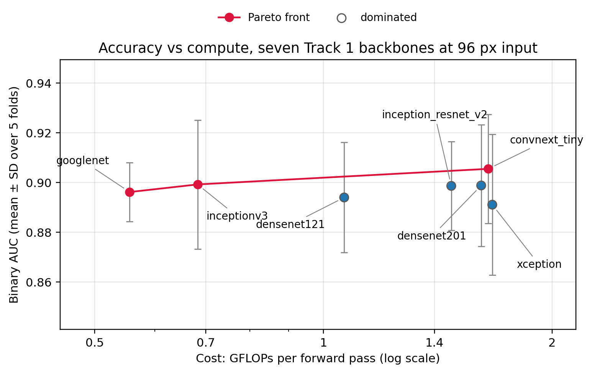
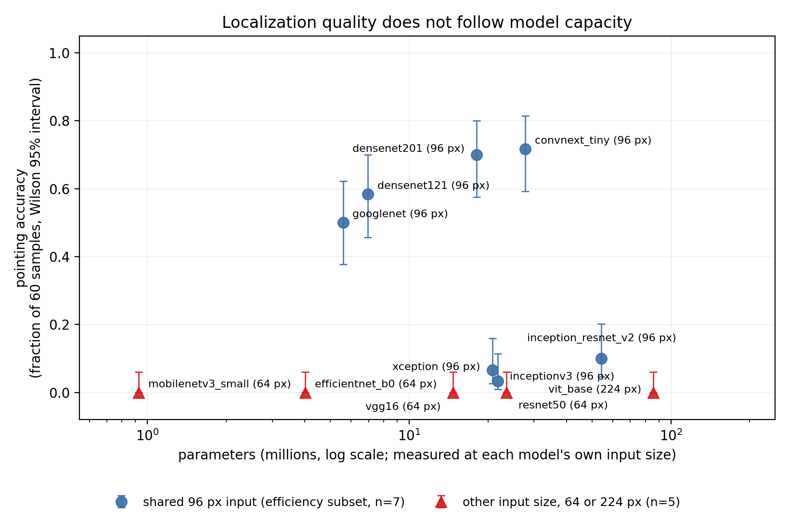
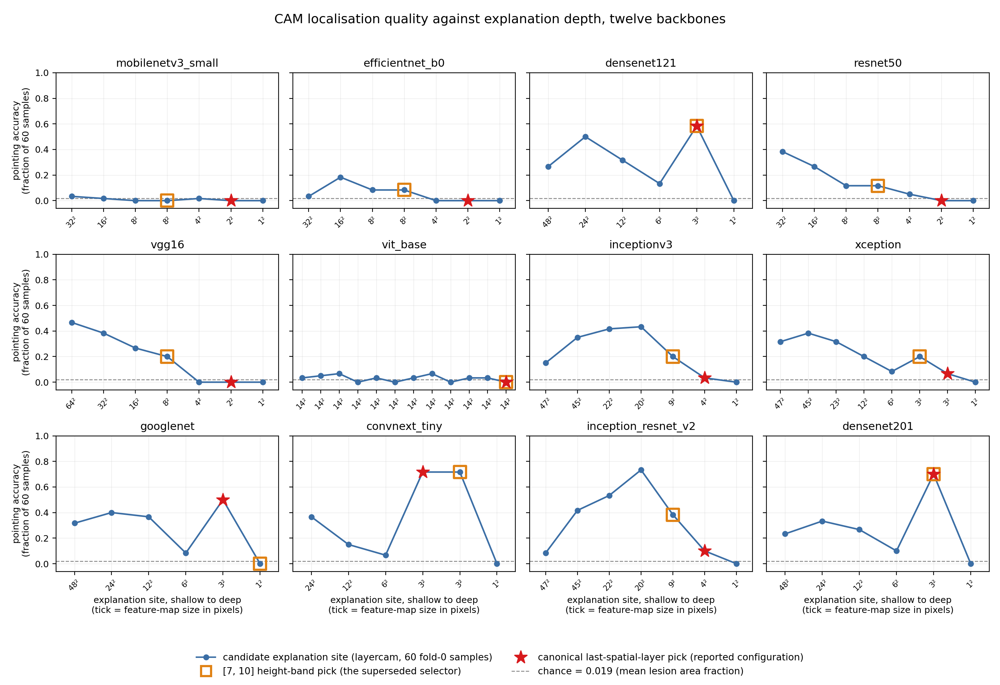
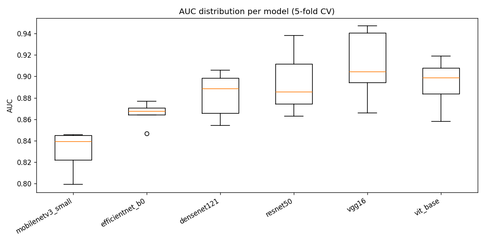
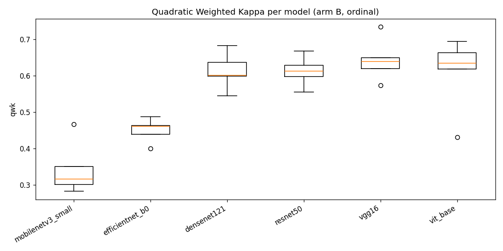

# Laporan hasil Track 2: explanation site, kapasitas, dan optimizer pada komparasi dua belas backbone

*Judul sebelumnya: "komparasi backbone, stabilitas hyperparameter, dan granularitas label". Materi lama tidak dibuang; ia menjadi sumbu optimizer (§6.1, §6.2) dan sumbu granularitas label (§6.3) di dalam kerangka yang lebih luas.*

## 0. Identitas penelitian

- **Judul (versi lama)**: Komparasi backbone, stabilitas hyperparameter, dan pengaruh granularitas label untuk klasifikasi malignansi nodul paru pada LIDC-IDRI
- **Judul manuskrip rev2**: *Where You Explain Decides What You See: Explanation Site, Capacity, and Optimizer in a Twelve-Backbone Comparison on LIDC-IDRI* (`paper/track2/main.tex`)
- **Repo**: `lung-nodule-fusion-xai`
- **Tugas**: Track 2 dari pemisahan dua paper (lihat `docs/Review Revisi 1.md` §8)
- **Dataset**: LIDC-IDRI
- **Tanggal laporan**: 30 Juli 2026 (diperbarui 20 Agustus 2026 dengan run `2026-08-20-run04`: sumbu lokalisasi dua belas backbone, sweep kedalaman 86 site, sensus silent failure, sumbu efisiensi tujuh backbone, dan diagnosis GoogLeNet — lihat §6.4 sampai §6.10)
- **Provenance run 20 Agustus 2026**: `run_id` seragam `2026-08-20-run04`; `commit_sha` **berbeda per berkas** karena tahapannya dijalankan berurutan — `4f939a2` (`target_layer_audit.csv`, `googlenet_layer_sweep.csv`, `googlenet_cam_methods.csv`, `googlenet_sanity.csv`), `0784156` (`cam_12.csv`, `cam_12_persample.csv`, `track1_guard.csv`), `f81ba0d` (`depth_sweep_12.csv`), `e580d77` (`efficiency_7.csv`), `2f7cea5` (`depth_curve_summary.csv`, `silent_failure_census.csv`, `joint_master_table.{csv,md}`, `joint_correlations.csv`). Seluruhnya di `artifacts/results/track2rev/`.
- **Catatan kecil integritas kolom**: `track1_guard.csv` menuliskan `commit_sha` sebagai `784156`, sedangkan `cam_12.csv` dari commit yang sama menuliskan `0784156`. Nol di depan hilang karena kolomnya terbaca sebagai bilangan, bukan string. Tidak berdampak pada satu angka pun, tapi dicatat karena persis begitulah cara sebuah kolom provenance berhenti bisa dicocokkan otomatis.

---

## 1. Ringkasan eksekutif

Track 2 sekarang berdiri di atas satu pertanyaan payung, dan pertanyaan itulah yang menyatukan seluruh bagian di bawah: **di antara kapasitas model, optimizer, dan keluarga arsitektur, mana yang menentukan performa dan mana yang menentukan interpretability pada sebuah komparasi backbone?**

Jawabannya: **tidak satu pun dari ketiganya.** Yang menentukan kualitas lokalisasi adalah *explanation site*, yaitu layer tempat class-activation map diambil. Empat angka menopang jawaban itu, dan keempatnya berasal dari run `2026-08-20-run04`:

1. **Sumbu lokalisasi (12 backbone).** Sweep 86 *candidate site* memperlihatkan pointing accuracy bergerak sampai **0.7333** di dalam satu jaringan beku yang sama (Inception-ResNet-v2, dari 0.1000 di canonical site ke 0.7333 di site 20x20). Rentang di dalam satu model itu **melebihi** seluruh selisih antar-backbone pada site tetap, yang paling lebar 0.7167. Aturan *canonical* (modul terdalam yang masih punya spatial extent) hanya menjadi pilihan terbaik pada **4 dari 12** backbone, dan **tidak satu pun** dari dua belas kurva memuncak di site terdalamnya. Lihat §6.5 dan §6.6.
2. **Silent failure pada pemilih target layer.** Dari 86 site, **17** memancarkan CAM identik nol pada sedikitnya satu dari 60 sampel dan **12** pada seluruh 60 sampel, tersebar di **seluruh dua belas** backbone. Peta konstan tetap menghasilkan dice hingga (0.0350) dan pointing accuracy (0.0000) yang terhingga, jadi *selector* yang mendarat di sana melaporkan angka masuk akal, bukan error. Lihat §6.7.
3. **Sumbu efisiensi (7 backbone pada 96 px).** Rentang parameter 9,7 kali lipat (5.602 M sampai 54.31 M) hanya membeli 0.0144 AUC (0.8911 sampai 0.9055), dan enam dari tujuh backbone punya simpangan baku antar-fold yang lebih besar daripada rentang itu. Kapasitas dilaporkan sebagai **konfirmasi domain**, bukan temuan. Lihat §6.4.
4. **Sumbu optimizer (4 backbone).** ANOVA faktorial memberi optimizer eta-squared 0.4533 lawan weight decay 0.0002. Ini bagian §6.1 dan §6.2 yang lama, dipertahankan utuh tetapi dibaca ulang sebagai satu sumbu dari tiga, bukan sebagai bab tersendiri.

Ketiga sumbu itu **tidak bersandar pada himpunan model yang sama**, dan keanggotaannya dinyatakan eksplisit di §3.7 serta §6.10 supaya tidak ada pembaca yang menyangka satu klaim menopang klaim lainnya.

Konsekuensi praktis yang layak dikutip: **setiap angka explainability lintas arsitektur yang dilaporkan tanpa audit target layer tidak dapat ditafsirkan**, dan bisa jadi merupakan artefak *tooling* alih-alih sifat jaringan.

### Status komponen

| Komponen | Status | Sumber |
|---|---|---|
| Sweep 4 backbone x 3 optimizer x 3 weight_decay x 5 fold | Selesai, 180/207 run, 27 gagal di backbone lain | `artifacts/logs/runs.csv` |
| Uji varians Brown-Forsythe/Levene + ANOVA faktorial | Selesai, dijalankan ulang oleh laporan ini | `artifacts/results/track2_variance_brown_forsythe.csv`, `track2_anova_eta_sq.csv` |
| Evaluasi common-subset 4 arm granularitas | Selesai | `artifacts/results/common_subset_auc.csv` |
| DeLong + Friedman/Nemenyi lintas arm | Selesai | `artifacts/results/delong_arms_common_subset.csv`, `friedman_ranks_common_subset.csv` |
| Sweep learning rate khusus SGD | Kode selesai, belum dieksekusi | `docs/revisi/rev1/TASKBOARD.md` tugas 7 |
| Evaluasi mobilenetv2 di `summary_binary.csv` | **Belum lengkap**, mobilenetv2 ada di `runs.csv` (45 run selesai) tapi hilang dari `summary_binary.csv` | lihat §8 butir 3 |
| Sumbu lokalisasi: Layer-CAM 12 backbone pada 60 nodul fold 0 | Selesai | `artifacts/results/track2rev/cam_12.csv`, `cam_12_persample.csv` |
| Sweep kedalaman 86 candidate site | Selesai | `depth_sweep_12.csv`, `depth_sweep_12_persample.csv`, `depth_curve_summary.csv` |
| Sensus silent failure target layer | Selesai | `silent_failure_census.csv`, `target_layer_audit.csv` |
| Sumbu efisiensi 7 backbone pada 96 px | Selesai | `efficiency_7.csv` |
| Diagnosis GoogLeNet (layer sweep, cross-method, sanity) | Selesai | `googlenet_layer_sweep.csv`, `googlenet_cam_methods.csv`, `googlenet_sanity.csv`, `googlenet_head_structure.txt` |
| Tabel gabungan tiga sumbu + korelasi | Selesai | `joint_master_table.{csv,md}`, `joint_correlations.csv` |
| Guard: angka XAI Track 1 tidak bergeser | Selesai | `track1_guard.csv` |
| Friedman/Nemenyi dan DeLong per-arm yang dikutip manuskrip | **Tanpa CSV di disk**, dibawa dari draf sebelumnya tanpa verifikasi | lihat §8 butir 12 |

---

## 2. Latar belakang dan kontribusi

Pemilihan backbone, optimizer, dan granularitas label adalah tiga keputusan desain yang jarang dikuantifikasi kontribusinya secara terpisah pada dataset dan split yang sama. Kontribusi laporan ini: (1) sweep hyperparameter penuh dengan uji varians formal untuk klaim stabilitas, bukan perbandingan titik estimasi CV semata, (2) dekomposisi ANOVA yang memisahkan efek optimizer dari weight decay, (3) perbandingan granularitas label pada subset kasus identik dengan kolaps probabilitas, bukan argmax.

**Tambahan rev2 (20 Agustus 2026).** Ketika komparasi backbone ditanya sebagai pertanyaan payung — kapasitas, optimizer, atau keluarga arsitektur — tiga variabel bergerak serentak setiap kali backbone ditukar, dan satu angka akurasi per backbone tidak bisa memisahkan ketiganya. Kontribusi tambahan: (4) sweep *explanation site* per backbone yang menjadikan tiap kurva kontrolnya sendiri, sehingga variasi lokalisasi dapat diatribusikan ke site alih-alih ke keluarga arsitektur; (5) sensus *silent failure* pemilihan target layer otomatis berikut laju kejadiannya atas 86 site, dengan mekanisme kenapa kegagalan itu diam; (6) diagnosis satu backbone terdampak secara penuh — layer sweep, cross-check antar metode CAM, cascading weight randomisation, dan class-flip probe — berikut pernyataan tegas di titik mana diagnosis itu berhenti dan **tidak** menjadi klaim faithfulness; (7) pelaporan sumbu kapasitas dan sumbu optimizer pada kohort yang sama dengan keanggotaan subset yang dinyatakan, supaya ketiga klaim tidak terbaca seolah bersandar pada model yang sama.

Laporan ini sengaja lebih rinci daripada manuskrip. Manuskrip memuat klaim yang lolos; laporan memuat *provenance*-nya, narasi kegagalannya, dan hal-hal yang dicoba lalu tidak berhasil.

---

## 3. Metodologi

### 3.1 Dataset dan split

Sama dengan Track 1: LIDC-IDRI, split 5-fold berbasis pasien seed 42, patch 2.5D. Empat arm label dilatih: biner, ordinal (1–5), 3-kelas (benign/malignant/indeterminate), 4-kelas (3-kelas plus kelas no-nodule).

### 3.2 Backbone

Empat backbone: MobileNetV2 dan EfficientNet-B0 (ringan, mobile-oriented), ResNet50 dan VGG16 (berat, deep convolutional klasik), dipilih untuk mengontraskan dua filosofi arsitektur dan dua rezim jumlah parameter yang tegas berbeda. Semua dievaluasi pada resolusi native 64 piksel, tanpa upsampling.

### 3.3 Sweep hyperparameter

Tiga optimizer (SGD momentum 0.9, Adam, AdamW), tiga weight decay per optimizer (default PyTorch ±1 orde besaran), lima fold. Grid penuh: 4 backbone x 3 optimizer x 3 weight_decay x 5 fold = 180 run.

### 3.4 Uji stabilitas

CV dilaporkan deskriptif. Untuk klaim "backbone X lebih stabil dari Y" secara formal, dipakai uji Brown-Forsythe (varian Levene berbasis median, lebih tahan skew) pada varians AUC tiap pasangan backbone, dengan koreksi Holm lintas 6 pasangan. ANOVA faktorial atas backbone, optimizer, weight_decay, fold melaporkan eta-squared per faktor.

### 3.5 Perbandingan granularitas label

Tiap arm dikolaps ke probabilitas benign-vs-malignant lewat renormalisasi, bukan argmax, karena renormalisasi mempertahankan skor kontinu yang dibutuhkan AUC. Arm biner pakai probabilitas malignant langsung. Arm ordinal dipetakan lewat probabilitas kumulatif rating di atas 3. Arm 3-kelas direnormalisasi $P(malignant)/(P(benign)+P(malignant))$. Arm 4-kelas dibatasi ke subset nodul dulu (buang kelas no-nodule) baru direnormalisasi sama seperti 3-kelas. Pembatasan ini pertahanan terhadap inflasi AUC dari negatif mudah. Semua arm dievaluasi pada 1391 nodul biner-eligible yang identik per fold. Uji DeLong berpasangan membandingkan tiap pasang arm pada subset ini. Uji Friedman dengan post-hoc Nemenyi memberi peringkat omnibus lintas arm.

### 3.6 Metrik ordinal-native

QWK, MAE, dan akurasi one-off untuk arm ordinal pada skala penuh 1–5.

### 3.7 Himpunan backbone dan tiga subset

Ketiga sumbu tidak bersandar pada himpunan model yang sama, dan **subsetnya tidak bersarang**. Namanya ditetapkan sekali di sini lalu dipakai konsisten.

- **localization12** — dua belas backbone dengan pengukuran Layer-CAM: MobileNetV3-Small, EfficientNet-B0, ResNet50, VGG16 (input 64 px); DenseNet121, DenseNet201, GoogLeNet, InceptionV3, Inception-ResNet-v2, Xception, ConvNeXt-Tiny (96 px); ViT-Base (224 px).
- **efficiency7** — tujuh dari dua belas itu yang berjalan pada input 96 px yang sama. Hanya ketujuhnya yang membawa kolom biaya, karena GFLOPs, latency, dan peak memory semuanya berskala dengan ukuran input.
- **optimizer4** — MobileNetV2, EfficientNet-B0, ResNet50, VGG16, yaitu himpunan §6.1 dan §6.2. **MobileNetV2 tidak muncul di subset lain mana pun**, sehingga optimizer4 bukan bagian dari localization12.

Resolusi input diperlakukan sebagai variabel arsitektural, bukan *nuisance parameter*, karena beberapa dari dua belas backbone tidak dapat menerima input bersama tanpa upsampling yang justru akan mengubah petanya. Ongkos keputusan itu dinyatakan di §8 butir 10.

### 3.8 Protokol lokalisasi

Class-activation map dihitung dengan Layer-CAM pada himpunan tetap 60 nodul fold 0 bermask radiolog, identik untuk kedua belas backbone. Peta di-*upsample* ke grid input, dinormalisasi min-max, lalu diambang pada persentil ke-80 energi peta untuk metrik tumpang tindih. Dilaporkan dice, IoU, *dice size-matched* (varian yang membuang ketergantungan dice mentah pada rasio luas peta terhadap luas lesi), *pointing accuracy* (apakah maksimum peta jatuh di dalam mask), dan *energy pointing metric* (fraksi energi peta di dalam mask).

**Laju kebetulan** pointing accuracy adalah 0.0189, yaitu rerata fraksi luas lesi atas 60 sampel yang sama. Pointing accuracy di sekitar nilai itu berarti peta tidak membawa informasi lokalisasi sama sekali.

Interval: pointing accuracy memakai interval skor Wilson 95% atas 60 percobaan Bernoulli; dice memakai *percentile bootstrap* 95% atas 60 baris per sampel, B=10000, seed 20260820. Interval aproksimasi normal **tidak dipakai di mana pun**, karena beberapa backbone bernilai persis nol dan interval normal berdegenerasi di sana.

### 3.9 Explanation site: sweep dan dua aturan pemilih

Untuk tiap backbone, seluruh modul yang memancarkan aktivasi spasial dienumerasi dan diurutkan dari dangkal ke dalam menurut `exec_index_norm`, menghasilkan **86 candidate site** atas dua belas backbone (6 sampai 12 per backbone; 12 pada ViT-Base yang seluruh bloknya memancarkan grid token 14x14). Layer-CAM dihitung ulang di tiap site dengan bobot, 60 sampel, dan metrik yang sama, sehingga kurva kualitas lokalisasi terhadap kedalaman **menjadi kontrolnya sendiri**: tidak ada yang berubah sepanjang kurva itu selain site-nya.

Dua aturan otomatis diuji terhadap kurva tersebut, keduanya aturan yang benar-benar dipakai proyek ini:

| Aturan | Definisi | Implementasi |
|---|---|---|
| *canonical* | Modul terdalam yang masih punya spatial extent — default "last convolutional layer" yang direkomendasikan literatur CAM | `_auto_target_layer` jalur `last_spatial` |
| *band* | Modul terdalam yang tinggi feature map-nya jatuh di rentang `[7,10]` | `_get_target_layer` jalur `band_7_10`, plus tabel tangan sebagai *fallback* |

Untuk setiap satu dari 86 site dicatat berapa dari 60 peta yang identik nol, dan apakah site itu pilihan canonical, pilihan band, atau site di balik baris yang pernah kami terbitkan sendiri.

### 3.10 Protokol diagnosis untuk site yang dicurigai degenerate

Pointing accuracy persis nol diperlakukan sebagai **dugaan artefak implementasi sampai terbantahkan**, bukan sebagai sifat jaringan. Empat pemeriksaan dijalankan pada backbone terdampak: (i) *layer sweep*, untuk menetapkan apakah ada site lain di jaringan yang sama dengan bobot yang sama memulihkan lokalisasi di atas laju kebetulan; (ii) cross-check antar metode CAM di site yang pulih — Layer-CAM lawan HiResCAM, Grad-CAM, dan Score-CAM yang bebas gradien — untuk menyingkirkan artefak khas rata-rata gradien; (iii) *cascading weight randomisation* dari classifier ke belakang, melaporkan korelasi peringkat Spearman antara peta asli dan peta model yang diacak progresif; (iv) *class-flip probe*, menghitung peta untuk kelas yang tidak diprediksi lalu korelasi peringkatnya terhadap peta asli.

Vonis **artifact** menuntut ketiganya sekaligus, dan kriterianya ditulis di kolom `criterion` pada `googlenet_sanity.csv` sebelum ujinya dijalankan: site yang teresolusi memancarkan peta serba nol pada seluruh sampel; ada site kandidat yang memulihkan pointing accuracy di atas laju kebetulan plus dua galat baku tanpa satu pun peta nol; dan korelasi peringkat rata-rata peta yang pulih itu terhadap peta model yang teracak penuh berada di bawah 0.5.

### 3.11 Pengukuran efisiensi

Untuk tujuh backbone pada 96 px dilaporkan jumlah parameter, GFLOPs per forward pass, median latency CPU dengan IQR, median latency GPU, dan peak memory GPU. Latency diukur *wall-clock* dengan *warm start*, batch size 1, atas 7 repeat berisi 50 forward pass, median antar repeat yang dilaporkan. Perangkat: CPU Intel64 family 6 model 151, GPU NVIDIA GeForce RTX 3060, PyTorch 2.3.0+cu121, CUDA 12.1, Windows. Dilaporkan juga akurasi per juta parameter dan *Pareto front* AUC terhadap GFLOPs.

FLOPs adalah proksi yang buruk untuk latency dinding, dan keduanya bergantung pada perangkat keras serta batch size, jadi kedua kolom biaya dibaca bersama-sama, bukan salah satunya saja. Kenapa kolom latency lama tidak dipakai sama sekali dijelaskan di §8 butir 11 — itu satu kegagalan diam tersendiri.

---

## 4. Dataset

Lihat §3.1. Split dan preprocessing identik dengan Track 1.

---

## 5. Konfigurasi

`configs/config.yaml` blok `tracks.track2`: 4 backbone di atas, `input_size: null` (native). Blok `track2_sweep`: 3 optimizer, weight decay per optimizer.

---

## 6. Hasil

### 6.1 Sumbu optimizer (1): komparasi backbone pada optimizer4

Bagian ini dan §6.2 adalah **sumbu optimizer**, satu dari tiga sumbu §1, bukan bab yang berdiri sendiri. Seluruh angkanya tidak berubah dan tetap berlaku; yang berubah hanya cara membacanya. Himpunan modelnya adalah `optimizer4` (§3.7), yang hanya berbagi tiga backbone dengan `localization12` dan karena itu **tidak boleh** dipakai menopang klaim sumbu lokalisasi atau sumbu efisiensi.

AUC rata-rata per backbone, dipool lintas sweep 3x3 dan 5 fold (45 run per backbone), dari `artifacts/logs/runs.csv`:

| Backbone | AUC rata-rata | CV |
|---|---|---|
| VGG16 | 0.8966 | 0.0400 |
| ResNet50 | 0.8553 | 0.0792 |
| MobileNetV2 | 0.8262 | 0.0615 |
| EfficientNet-B0 | 0.8241 | 0.0865 |

### 6.2 Sumbu optimizer (2): stabilitas hyperparameter Track 2

Uji Brown-Forsythe berpasangan dengan koreksi Holm lintas 6 pasangan backbone (`track2_variance_brown_forsythe.csv`): **hanya satu** pasangan signifikan, ResNet50 vs VGG16 ($p_{holm}=0.0426$). VGG16 vs EfficientNet-B0, yang sebelumnya diklaim sebagai bukti "VGG16 paling stabil", **tidak lolos koreksi** ($p_{holm}=0.0840$).

#### Batasan pada klaim stabilitas

Klaim umum "VGG16 backbone paling stabil" **tidak didukung** uji ini pada level pasangan individual. Yang bisa dinyatakan secara defensibel hanya perbedaan varians ResNet50 vs VGG16.

ANOVA faktorial (`track2_anova_eta_sq.csv`) melaporkan eta-squared: optimizer 0.4533, backbone 0.2060, fold 0.0684, weight_decay 0.0002, residual 0.1827. Efek optimizer terhadap varians AUC lebih dari 200 kali efek weight decay pada dekomposisi ini, rasio jauh lebih ekstrem dari perbandingan delta AUC mentah (0.1457 vs 0.0218) yang dipakai sebelumnya.

#### Koreksi, 20 Agustus 2026: "lebih dari 200 kali" benar tetapi terlalu rendah satu orde

Kalimat "lebih dari 200 kali" di paragraf sebelumnya dipertahankan apa adanya karena memang tidak salah, tetapi ia dihitung dari `weight_decay` yang sudah dibulatkan ke 0.0002. Nilai yang tersimpan di `track2_anova_eta_sq.csv` adalah **0.00018883638962321973**, sehingga rasio sebenarnya `0.4533098175327022 / 0.00018883638962321973` = **2401**. Manuskrip (`paper/track2/main.tex`, §Results) menulis angka 2400 itu; laporan ini menyetujuinya dan mencatat bahwa pernyataan lama benar namun terlalu rendah satu orde besaran. Pembulatan pada laporan yang lalu adalah penyebabnya, bukan perbedaan data — sumber, run, dan berkasnya sama persis.

Nilai p pendamping, langsung dari berkas yang sama: optimizer $p=1.099\times10^{-45}$, model $p=4.635\times10^{-27}$, fold $p=8.249\times10^{-11}$, weight_decay $p=0.9965$. Nilai p weight decay yang praktis 1 itu adalah pembacaan yang lebih jujur daripada rasio mana pun: pada grid ini weight decay **tidak menggerakkan AUC sama sekali**.

Sumber celah SGD, dikutip manuskrip dan dicatat di sini supaya laporan tidak lebih miskin dari manuskrip: pada satu learning rate yang sama untuk ketiga optimizer, SGD merugikan EfficientNet-B0 sebesar 0.146 AUC terhadap Adam (0.7287 lawan 0.8744) dan ResNet50 sebesar 0.126 (0.7720 lawan 0.8980), sedangkan Adam dan AdamW berselisih di bawah 0.006 pada tiap backbone. Ini menguatkan §8 butir 4: yang terukur adalah interaksi protokol, bukan peringkat optimizer.

### 6.3 Perbandingan granularitas label

Uji Friedman omnibus lintas 4 arm (`friedman_ranks_common_subset.csv`) signifikan: $\chi^2=43.96$, $p=1.5\times10^{-9}$. Peringkat rata-rata: 4-kelas 1.33 (terbaik), biner 2.40, 3-kelas 2.77, ordinal 3.50 (terburuk). Post-hoc Nemenyi (`nemenyi_arms_common_subset.csv`): semua pasangan signifikan kecuali biner vs 3-kelas ($p=0.69$).

#### Batasan pada klaim granularitas per model

Pada level model individual, uji DeLong berpasangan biner-vs-4-kelas (`delong_arms_common_subset.csv`) hanya signifikan pada **3 dari 6** model legacy (MobileNetV3-Small, VGG16, ViT-Base), tidak signifikan untuk DenseNet121, EfficientNet-B0, ResNet50 ($p=0.055$–$0.17$). Klaim "granularitas label memengaruhi performa" berlaku agregat lintas model dan fold, **tidak** seragam per model individual.

Metrik ordinal-native (`ordinal_native_metrics.csv`): QWK 0.5451, MAE 0.6433, akurasi one-off 0.9155.

#### Celah provenance pada §6.3, dicatat 20 Agustus 2026

Seluruh angka §6.3 — Friedman $\chi^2=43.96$, peringkat 1.33/2.40/2.77/3.50, Nemenyi $p=0.69$, DeLong per-arm 3 dari 6 dengan $p=0.055$–$0.17$, dan trio ordinal-native 0.5451/0.6433/0.9155 — **tidak punya CSV di disk**. Diperiksa langsung: `common_subset_auc.csv`, `delong_arms_common_subset.csv`, `friedman_ranks_common_subset.csv`, `nemenyi_arms_common_subset.csv`, dan `ordinal_native_metrics.csv` tidak ada satu pun di `artifacts/results/`. Yang ada di sana hanyalah `delong_matrix.csv`, `summary_ordinal.csv`, dan `efficiency_table_ordinal.{csv,md}`, yang bukan berkas-berkas itu.

Angka-angka tersebut **dibawa ke `paper/track2/main.tex` tanpa verifikasi**, diwarisi dari draf sebelumnya. Angkanya tidak dihapus dan tidak diubah di sini — tidak ada bukti angkanya salah, hanya tidak ada bukti angkanya benar. Statusnya dicatat sebagai celah provenance terbuka di §8 butir 12, dan cara menutupnya ada di §9 butir 6. Prinsipnya sama dengan §10: angka yang tidak bisa ditelusuri ke baris CSV harus dinyatakan begitu di tempat angkanya muncul, bukan dibiarkan tampak sekelas dengan angka yang bisa.

---

### 6.4 Sumbu efisiensi: kapasitas mengonfirmasi, bukan menemukan

Himpunan `efficiency7`, tujuh backbone pada input 96 px yang sama, dari `efficiency_7.csv`:

| Backbone | Params (M) | GFLOPs | Latency CPU median (IQR) ms | Latency GPU median ms | Peak mem GPU (MB) | AUC rata-rata | SD antar-fold | AUC per M params | Pareto |
|---|---|---|---|---|---|---|---|---|---|
| GoogLeNet | 5.602 | 0.5558 | 8.315 (0.061) | 3.065 | 159.20 | 0.896160 | 0.011914 | 0.159971 | **ya** |
| DenseNet121 | 6.956 | 1.0649 | 17.344 (0.173) | 6.718 | 164.78 | 0.893976 | 0.022185 | 0.128519 | tidak |
| DenseNet201 | 18.097 | 1.6132 | 33.462 (0.500) | 11.324 | 207.90 | 0.898808 | 0.024488 | 0.049666 | tidak |
| Xception | 20.811 | 1.6683 | 14.769 (0.242) | 2.596 | 93.50 | 0.891076 | 0.028282 | 0.042818 | tidak |
| InceptionV3 | 21.790 | 0.6828 | 12.054 (0.072) | 5.021 | 222.14 | 0.899223 | 0.025964 | 0.041268 | **ya** |
| ConvNeXt-Tiny | 27.820 | 1.6486 | 12.703 (0.077) | 2.518 | 125.53 | 0.905506 | 0.021974 | 0.032549 | **ya** |
| Inception-ResNet-v2 | 54.310 | 1.4733 | 34.383 (0.265) | 14.023 | 346.78 | 0.898637 | 0.017818 | 0.016546 | tidak |

Rentang parameter 5.602 M sampai 54.31 M adalah **9,7 kali lipat**. Sepanjang rentang itu AUC hanya bergerak dari 0.891076 (Xception) ke 0.905506 (ConvNeXt-Tiny), yaitu **0.0144**. Enam dari tujuh backbone punya simpangan baku antar-fold yang **lebih besar** daripada rentang itu — hanya GoogLeNet (0.011914) yang di bawahnya. Seluruh efek kapasitas atas satu orde besaran parameter jadi lebih kecil daripada derau run-ke-run satu model, dan itulah alasan ketujuhnya **tidak diperingkat** berdasarkan AUC di laporan ini.

Model terbesar bukan model terbaik. ConvNeXt-Tiny 27.82 M meraih AUC tertinggi; Inception-ResNet-v2 54.31 M berhenti di 0.898637 sambil membayar 34.383 ms latency CPU dan 346.78 MB peak memory, terburuk di kedua sumbu biaya sekaligus. Akurasi per juta parameter bergerak satu orde ke arah berlawanan, dari 0.159971 (GoogLeNet) dan 0.128519 (DenseNet121) turun ke 0.016546 (Inception-ResNet-v2).

*Pareto front* atas AUC terhadap GFLOPs berisi tiga model: **GoogLeNet** (0.5558 GFLOPs, 0.896160), **InceptionV3** (0.6828, 0.899223), dan **ConvNeXt-Tiny** (1.6486, 0.905506). Empat sisanya terdominasi. GFLOPs dan latency dinding **tidak sejalan bahkan di dalam front**: InceptionV3 memakai 23 persen GFLOPs lebih banyak daripada GoogLeNet tetapi 45 persen waktu CPU lebih banyak, sementara Xception pada 1.6683 GFLOPs justru tercepat kedua di GPU (2.596 ms). Ini alasan konkret kenapa §3.11 menuntut kedua kolom biaya dibaca bersama.

**Fig T2-3. AUC terhadap GFLOPs, tujuh backbone pada 96 px.**

Yang perlu dibaca lebih dulu dari figur ini bukan posisi titiknya melainkan **rentang sumbu tegaknya**: seluruh bentangan vertikal plot ini 0.0144 AUC, lebih kecil daripada simpangan baku antar-fold enam dari tujuh model yang diplot. Jarak vertikal antar titik di gambar ini karena itu tidak boleh dibaca sebagai peringkat.

**Ketidakcocokan dengan manuskrip.** `paper/track2/main.tex` §Results menulis Inception-ResNet-v2 "fifth of seven" pada AUC. Diurutkan langsung dari `efficiency_7.csv`, urutannya ConvNeXt-Tiny 0.905506, InceptionV3 0.899223, DenseNet201 0.898808, Inception-ResNet-v2 0.898637, GoogLeNet 0.896160, DenseNet121 0.893976, Xception 0.891076 — Inception-ResNet-v2 **keempat**, bukan kelima. CSV yang menang. Selisihnya terhadap DenseNet201 hanya 0.000171, jauh di bawah derau antar-fold, sehingga peringkat itu memang tidak layak dikutip sama sekali; tetapi kalau tetap dikutip, angkanya harus empat.

---

### 6.5 Sumbu lokalisasi: dua belas backbone pada site terbitannya

Himpunan `localization12`, Layer-CAM pada 60 nodul fold 0 yang sama, diukur di site yang diresolusi otomatis untuk tiap backbone. Dari `joint_master_table.csv` dan `cam_12.csv`:

| Backbone | Input CAM (px) | Site | Spasial | `n_zero_cam` | Pointing acc [Wilson 95%] | Dice [bootstrap 95%] | Dice size-matched | Energy mean |
|---|---|---|---|---|---|---|---|---|
| ConvNeXt-Tiny | 96 | `features.0.7.2` | 3x3 | 0 | 0.7167 [0.5923, 0.8149] | 0.1091 [0.0749, 0.1485] | 0.4443 | 0.0478 |
| DenseNet201 | 96 | `features.0.norm5` | 3x3 | 0 | 0.7000 [0.5749, 0.8010] | 0.0970 [0.0665, 0.1331] | 0.4322 | 0.0315 |
| DenseNet121 | 96 | `features.0.norm5` | 3x3 | 0 | 0.5833 [0.4573, 0.6994] | 0.0622 [0.0401, 0.0900] | 0.3475 | 0.0248 |
| GoogLeNet | 96 | `features.15` | 3x3 | 0 | 0.5000 [0.3774, 0.6226] | 0.0901 [0.0580, 0.1282] | 0.2597 | 0.0309 |
| Inception-ResNet-v2 | 96 | `features.repeat_1.19` | 4x4 | 0 | 0.1000 [0.0466, 0.2015] | 0.1175 [0.0811, 0.1571] | 0.0713 | 0.0462 |
| Xception | 96 | `features.act4` | 3x3 | 0 | 0.0667 [0.0262, 0.1593] | 0.0286 [0.0060, 0.0591] | 0.0338 | 0.0197 |
| InceptionV3 | 96 | `features.14` | 4x4 | 0 | 0.0333 [0.0092, 0.1136] | 0.0955 [0.0624, 0.1335] | 0.0456 | 0.0435 |
| MobileNetV3-Small | 64 | `features.0.12.2` | 2x2 | 0 | 0.0000 [0.0000, 0.0602] | 0.0017 [0.0000, 0.0052] | 0.0018 | 0.0193 |
| EfficientNet-B0 | 64 | `features.0.8.2` | 2x2 | 0 | 0.0000 [0.0000, 0.0602] | 0.0013 [0.0000, 0.0038] | 0.0015 | 0.0188 |
| ResNet50 | 64 | `features.7.2` | 2x2 | 0 | 0.0000 [0.0000, 0.0602] | 0.0030 [0.0000, 0.0074] | 0.0020 | 0.0198 |
| VGG16 | 64 | `features.0.30` | 2x2 | 0 | 0.0000 [0.0000, 0.0602] | 0.0025 [0.0000, 0.0068] | 0.0019 | 0.0201 |
| ViT-Base † | 224 | `features.encoder.layers.encoder_layer_11.ln_1` | grid token | **53** | 0.0000 [0.0000, 0.0602] | 0.0357 [0.0201, 0.0557] | 0.0150 | 0.0074 |

† Jalur CAM ViT-Base **rusak, bukan sekadar lemah**: petanya identik nol pada 53 dari 60 sampel. Barisnya dipertahankan dengan anotasi ini, bukan dibuang. Alasannya di §8 butir 9.

**Lantai resolusi menjelaskan empat baris nol sekaligus.** Pada patch 96 px, lesi rata-rata menempati 1,9 persen bidang (laju kebetulan pointing 0.0189). Peta 2x2 membagi bidang itu menjadi empat sel masing-masing 25 persen, sehingga argmax-nya tidak mungkin jatuh di dalam mask 1,9 persen kecuali kebetulan — dan memang **keempat backbone yang site-nya 2x2 melaporkan persis 0.0000**. Ini bukan pernyataan tentang MobileNetV3-Small, EfficientNet-B0, ResNet50, atau VGG16 sebagai arsitektur.

**Family dan resolusi input terkonfound.** Lima backbone yang skor pointing-nya 0.0000 adalah **persis** lima backbone yang tidak dievaluasi pada 96 px: empat di 64 px dan ViT-Base di 224 px. Tidak ada apa pun dalam perbandingan lintas-backbone di tabel ini yang bisa memisahkan efek keluarga arsitektur dari efek ukuran input, dan laporan ini tidak mencoba memisahkannya. Sweep kedalaman §6.6 **tidak tersentuh** confound ini, karena tiap kurva membekukan jaringan, bobot, ukuran input, dan 60 sampelnya lalu hanya mengubah site — itulah yang membuat klaim utama tetap berdiri sementara pembacaan lintas-backbone tabel di atas tetap ambigu.

#### Korelasi kapasitas: keduanya tidak signifikan, ke arah mana pun

Dari `joint_correlations.csv`:

| Subset | x | y | n | Spearman rho | p | Signifikan pada alpha 0.05 |
|---|---|---|---|---|---|---|
| efficiency7 (input 96 px) | `params_M` | `auc_mean` | 7 | 0.5000 | 0.2532 | tidak |
| localization12 (input bebas) | `params_M_any_res` | `pointing_acc` | 12 | 0.1305 | 0.6860 | tidak |

Kolom `verdict` pada CSV itu berbunyi *"not significant at alpha=0.05 with n=7; no monotone association is demonstrated"*, dan kolom `interpretation_note` berbunyi *"descriptive, not inferential; n is small"*. Keduanya dikutip apa adanya karena persis di situ letak jebakannya.

**Ketidaksignifikanan bukan bukti ketiadaan efek.** Pada n=7 studi ini nyaris tidak punya daya untuk mendeteksi korelasi sedang, sehingga hasil null-nya tidak informatif tentang efek yang mendasarinya. Pertanyaan kapasitas **dibiarkan terbuka ke dua arah** oleh data ini, dan itu dinyatakan begitu dengan sengaja. Menulis "kapasitas tidak memengaruhi interpretability" berdasarkan $\rho=0.13$, $p=0.6860$ adalah kekeliruan yang sama persis dengan menulis "kedua arm setara" berdasarkan uji DeLong yang gagal menolak — kekeliruan yang sudah diperbaiki Track 1 di §6.4 laporannya.

**Fig T2-4. Pointing accuracy terhadap jumlah parameter, dua belas backbone.**

Figur ini gunanya justru untuk **membatalkan** pembacaan yang paling menggoda darinya. Lima titik yang duduk di nol bukan lima arsitektur yang gagal melokalisasi; mereka persis lima backbone yang tidak berada di 96 px, sehingga sumbu mendatarnya (kapasitas) dan variabel yang tak terplot (resolusi input) bergerak bersama. Spearman 0.1305 dengan $p=0.6860$ dicetak di gambar sebagai ringkasan deskriptif, bukan sebagai uji yang menyimpulkan apa pun.

---

### 6.6 Sweep kedalaman: site yang mendominasi, bukan arsitekturnya

Sweep atas **86 candidate site**, 6 sampai 12 per backbone, dari `depth_sweep_12.csv` yang diringkas `depth_curve_summary.csv`. Tiap kurva adalah kontrol dalam-model: hanya site-nya yang berubah.

| Backbone | Site | Spasial terbaik | Skor terbaik | Spasial canonical | Skor canonical | Terbaik − canonical | Skor band | Terbaik − band | Bentuk |
|---|---|---|---|---|---|---|---|---|---|
| MobileNetV3-Small | 7 | 32x32 | 0.0333 | 2x2 | 0.0000 | 0.0333 | 0.0000 | 0.0333 | flat |
| EfficientNet-B0 | 7 | 16x16 | 0.1833 | 2x2 | 0.0000 | 0.1833 | 0.0833 | 0.1000 | mid_peak |
| DenseNet121 | 6 | 3x3 | 0.5833 | 3x3 | 0.5833 | 0.0000 | 0.5833 | 0.0000 | mid_peak |
| ResNet50 | 7 | 32x32 | 0.3833 | 2x2 | 0.0000 | 0.3833 | 0.1167 | 0.2667 | shallow_peak |
| VGG16 | 7 | 64x64 | 0.4667 | 2x2 | 0.0000 | 0.4667 | 0.2000 | 0.2667 | shallow_peak |
| ViT-Base | 12 | 14x14 | 0.0667 | 14x14 | 0.0000 | 0.0667 | 0.0000 | 0.0667 | mid_peak |
| InceptionV3 | 7 | 20x20 | 0.4333 | 4x4 | 0.0333 | 0.4000 | 0.2000 | 0.2333 | mid_peak |
| Xception | 8 | 45x45 | 0.3833 | 3x3 | 0.0667 | 0.3167 | 0.2000 | 0.1833 | mid_peak |
| GoogLeNet | 6 | 3x3 | 0.5000 | 3x3 | 0.5000 | 0.0000 | 0.0000 | 0.5000 | mid_peak |
| ConvNeXt-Tiny | 6 | 3x3 | 0.7167 | 3x3 | 0.7167 | 0.0000 | 0.7167 | 0.0000 | mid_peak |
| Inception-ResNet-v2 | 7 | 20x20 | 0.7333 | 4x4 | 0.1000 | 0.6333 | 0.3833 | 0.3500 | mid_peak |
| DenseNet201 | 6 | 3x3 | 0.7000 | 3x3 | 0.7000 | 0.0000 | 0.7000 | 0.0000 | mid_peak |

Aturan bentuk kurva **dikutip apa adanya** dari kolom `shape_rule` pada `depth_curve_summary.csv`, bukan diparafrase, supaya tidak bisa bergeser diam-diam: *"sites ordered shallow to deep by exec_index_norm; score = pointing_acc; flat if max-min < 0.05; else shallow_peak if the best site is the first, deep_peak if it is the last, mid_peak otherwise"*. Ambang 0.05 itu setara tiga dari enam puluh sampel.

Empat pembacaan, berurutan dari yang paling kuat:

1. **Tidak satu pun kurva berbentuk `deep_peak`.** Sembilan `mid_peak`, dua `shallow_peak` (ResNet50 dan VGG16, keduanya terbaik di kandidat paling dangkal), satu `flat` (MobileNetV3-Small, seluruh rentangnya 0.0333). Pada nol dari dua belas backbone, site terdalam adalah site terbaik — kontradiksi empiris langsung terhadap default "last convolutional layer" sebagai optimum, bukan sekadar sebagai konvensi.
2. **Canonical terbaik hanya pada 4 dari 12** (DenseNet121, GoogLeNet, ConvNeXt-Tiny, DenseNet201), dan pada keempatnya ia **berimpit** dengan site terbaik, bukan mengalahkannya. Defisit terbesarnya 0.6333 pada Inception-ResNet-v2: 0.7333 di site 20x20 lawan 0.1000 di canonical 4x4.
3. **Band gagal dengan cara berbeda.** Di mana bandnya terisi, ia pilihan yang wajar; di mana tidak, ia bisa mendarat di site yang tidak memancarkan apa pun. Defisit terbesarnya 0.5000 pada GoogLeNet, tempat ia jatuh ke site degenerate §6.7, lalu 0.3500 pada Inception-ResNet-v2 dan 0.2667 pada ResNet50 maupun VGG16.
4. **Rentang dalam-model melampaui rentang antar-model.** Rentang terbesar di dalam satu jaringan beku adalah 0.7333 (Inception-ResNet-v2), sementara bentangan antar-backbone pada site terbitannya (§6.5) 0.7167. Site menggeser metrik setidaknya sejauh pemilihan jaringan menggesernya.

**Fig T2-2. Pointing accuracy terhadap kedalaman eksekusi ternormalisasi, 86 site, dua belas panel.**

Yang membuat figur ini bisa dipakai sebagai bukti dan bukan sekadar ilustrasi adalah bahwa **tiap panel adalah kontrolnya sendiri**: jaringan, bobot, ukuran input, dan keenam puluh sampelnya dibekukan, dan satu-satunya yang bergerak sepanjang sumbu mendatar adalah site-nya. Karena itu confound family-lawan-resolusi yang melumpuhkan pembacaan lintas panel tidak menyentuh pembacaan di dalam satu panel.

#### Catatan enumerasi: kenapa GoogLeNet punya dua angka terbaik yang berbeda

GoogLeNet muncul dengan skor terbaik 0.5000 di §6.6 dan 0.7666666666666667 di §6.8, dan keduanya benar. Penyebabnya himpunan kandidatnya berbeda, dan ini perlu dinyatakan supaya tidak terbaca sebagai angka yang bertabrakan.

Sweep kedalaman mengambil **satu site per ukuran spasial berbeda**, yaitu modul terdalam pada tiap ukuran. Untuk GoogLeNet keenam site itu `features.0` (48x48), `features.3` (24x24), `features.6` (12x12), `features.12` (6x6), `features.15` (3x3), `features.17` (1x1). `features.13`, sebuah `MaxPool2d` yang juga 3x3, **tidak masuk** karena `features.15` lebih dalam pada ukuran spasial yang sama. Sweep diagnosis §6.8 adalah enumerasi terpisah dan lebih halus yang sengaja memasukkan `features.13`, dan di sanalah 0.7666666666666667 muncul. Manuskrip mengutip kedua angka itu di dua bagian berbeda; keduanya sah, dan kalimat ini yang menjelaskan kenapa.

---

### 6.7 Sensus silent failure pada pemilihan target layer

Dari 86 candidate site, **17 memancarkan CAM identik nol** pada sedikitnya satu dari 60 sampel, dan **12 pada seluruh 60**. Sedikitnya satu site terdampak muncul di **seluruh dua belas backbone**, jadi ini sifat cara explanation site dienumerasi pada tugas ini, bukan sifat satu arsitektur. Sumber: `silent_failure_census.csv`.

| Kelas kegagalan | Jumlah site | Rincian |
|---|---|---|
| `all_samples_zero`, spasial 1x1 | 11 | `AdaptiveAvgPool2d` pada **sembilan** backbone (ConvNeXt-Tiny, DenseNet121, DenseNet201, EfficientNet-B0, Inception-ResNet-v2, MobileNetV3-Small, ResNet50, VGG16, Xception) dan `Dropout` pada dua (GoogLeNet `features.17`, InceptionV3 `features.19`) |
| `all_samples_zero`, spasial nyata | 1 | EfficientNet-B0 `features.0.6.0.block.0.2`, sebuah `SiLU` **4x4**, nol pada seluruh 60 sampel |
| `some_samples_zero` | 5 | Xception `features.conv4` 3x3 (9/60), MobileNetV3-Small `features.0.9.block.0.2` 4x4 (49/60), ViT-Base `encoder_layer_8` (27/60), `encoder_layer_10` (50/60), `encoder_layer_11` (53/60) |

Kesebelas kegagalan 1x1 memancarkan dice yang **sama persis**, 0.0349545091915225, dengan pointing accuracy 0.0000. Kelima kegagalan parsial memancarkan dice antara 0.0356918299619531 dan 0.0716375404408926. Semuanya angka terhingga, semuanya berada di rentang yang sama dengan angka sungguhan.

**Mekanismenya, dan kenapa kegagalannya diam.** Setiap operasi di hilir site degenerate bersifat total pada masukan degenerate. Normalisasi min-max atas peta konstan terdefinisi dan mengembalikan nol. Ambang persentil atas larik yang seluruh nilainya sama terdefinisi dan memilih **seluruh bingkai**. Dice antara seluruh bingkai dan mask kecil terdefinisi dan, pada himpunan sampel tetap, konstan — 0.0350 di sini. Pointing rate terdefinisi dan mengembalikan 0.0000. Tidak satu pun dari langkah-langkah itu punya masukan yang bisa ia tolak. Pipeline karena itu **mengubah kesalahan struktural menjadi angka di rentang yang sama dengan penjelasan yang memang buruk**, dan pembaca tabelnya tidak punya sinyal apa pun untuk membedakan keduanya.

**Dua pemilih terkena pada laju berbeda.** Aturan band meresolusi ke site bermuatan nol pada tiga backbone (GoogLeNet, ViT-Base, Xception); aturan canonical pada satu (ViT-Base). Yang satu itu adalah **baris yang pernah kami terbitkan sendiri**: resolver menempatkan ViT-Base di `encoder_layer_11.ln_1`, nol pada 53 dari 60 sampel, dan barisnya tetap melaporkan dice 0.0357 serta pointing accuracy 0.0000.

**Pemeriksaan ukuran saja tidak cukup.** EfficientNet-B0 gagal identik di site 4x4 yang punya extent spasial nyata. Karena itu kolom yang menanggung beban bukan ukuran spasial melainkan **cacah peta identik nol**, dan kolom itu yang wajib ikut dicetak di setiap tabel metrik CAM. Rekomendasi operasional yang murah: catat `n_zero_cam` dan ukuran spasial site yang teresolusi di samping setiap angka CAM, lalu perlakukan resolusi 1x1 atau `n_zero_cam` bukan-nol sebagai **run yang gagal**, bukan sebagai skor rendah.

**Kenapa selector mendarat di sana.** `target_layer_audit.csv` mencetak kolom `heights_seen` per backbone, dan di situ letak sebabnya. GoogLeNet pada input 96 px memancarkan tinggi feature map `1|3|6|12|24|48`; tidak satu pun jatuh di dalam band `[7,10]`, sehingga aturan itu **kehabisan kandidat** lalu jatuh ke tabel tangan yang menunjuk `features[-2]`, yaitu `Dropout` di belakang global average pool. Band `[7,10]` sama sekali bukan sifat jaringan: ia sifat **input 224 px**, tempat backbone ImageNet berakhir di 7x7. Patch proyek ini 96 dan 64 px, jadi prasyarat yang tidak pernah dinyatakan itu memang dilanggar. Lima dari dua belas backbone menempuh jalur `fallback` (`path_taken` pada `target_layer_audit.csv`): DenseNet121, ViT-Base, Xception, GoogLeNet, ConvNeXt-Tiny.

**Jatuh ke fallback tidak dengan sendirinya fatal.** Empat dari lima itu mendarat di site 3x3 yang tetap terpakai, dan DenseNet121, DenseNet201, serta ConvNeXt-Tiny justru mencapai skor terbaiknya sendiri di sana. Yang fatal adalah jatuh ke jaringan yang modul terminalnya pooling dan dropout, karena aturan fallback-nya diurutkan menurut kedalaman dan kedalaman persis arah tempat extent spasial menghilang.

---

### 6.8 Diagnosis GoogLeNet: satu site degenerate, dibedah

Satu baris tabel lokalisasi kami sendiri pernah melaporkan pointing accuracy **persis 0.0000** untuk GoogLeNet, bersama dice 0.0349545091915225, IoU 0.0188720703120392, dice size-matched 0.011328775427613, dan energy 0.0. Mengikuti §3.10, baris itu diperlakukan sebagai dugaan artefak sampai terbantahkan, dan diagnosisnya konklusif.

**Struktur head-nya, dicetak apa adanya** (`googlenet_head_structure.txt`, input 1x3x64x64 yang di-*resize* internal ke 96x96): indeks 15 `Inception` 1x1024x3x3, 16 `AdaptiveAvgPool2d` 1x1024x1x1, 17 `Dropout` 1x1024x1x1, 18 `Flatten` 1x1024. Cabang googlenet pada `_get_target_layer` mengembalikan `features[-2]`, yaitu `Dropout` itu, yang keluarannya 1x1 karena berada **di belakang** pool. Aktivasi 1x1 tidak punya struktur spasial untuk dibobot, sehingga Layer-CAM mengembalikan peta konstan, dan setelah normalisasi min-max peta konstan identik nol pada seluruh 60 sampel.

**Layer sweep** (`googlenet_layer_sweep.csv`), bobot dan sampel identik, laju kebetulan 0.0188720703125:

| Site | Kelas | Spasial | Dice | IoU | Dice size-matched | Pointing acc | Energy | `frac_zero_cam` | Terpakai |
|---|---|---|---|---|---|---|---|---|---|
| `features.17` | `Dropout` (hasil `_get_target_layer`) | 1x1 | 0.0350 | 0.0189 | 0.0113 | 0.0000 | 0.0000 | 1.0 | tidak |
| `features.16` | `AdaptiveAvgPool2d` | 1x1 | 0.0350 | 0.0189 | 0.0113 | 0.0000 | 0.0000 | 1.0 | tidak |
| `features.15` | `Inception` (inception5b) | 3x3 | 0.0901 | 0.0542 | 0.2597 | 0.5000 | 0.0309 | 0.0 | ya |
| `features.13` | `MaxPool2d` (maxpool4) | 3x3 | 0.1216 | 0.0775 | 0.5262 | **0.7667** | 0.0574 | 0.0 | ya |
| `features.12` | `Inception` (inception4e) | 6x6 | 0.1093 | 0.0646 | 0.0760 | 0.0833 | 0.0509 | 0.0 | ya |
| `features.3` | `BasicConv2d` (conv3) | 24x24 | 0.0889 | 0.0495 | 0.2101 | 0.4000 | 0.0424 | 0.0 | ya |

Modul tepat sebelumnya, `features.16`, juga 1x1 dan menghasilkan **angka yang persis sama** — konfirmasi bahwa yang diukur adalah bentuk site, bukan sifat modulnya.

**Cross-check antar metode CAM di `features.13`** (`googlenet_cam_methods.csv`), untuk menyingkirkan artefak khas rata-rata gradien:

| Metode | Dice | Dice size-matched | Pointing acc | `frac_zero_cam` | Detik per sampel |
|---|---|---|---|---|---|
| Layer-CAM | 0.1216 | 0.5262 | 0.7667 | 0.0 | 0.0253 |
| HiResCAM | 0.0864 | 0.3025 | 0.4167 | 0.0 | 0.0246 |
| Grad-CAM | 0.0837 | 0.2628 | 0.3833 | 0.0 | 0.0269 |
| Score-CAM (bebas gradien) | 0.0831 | 0.2833 | 0.4167 | 0.0 | 0.5329 |

Keempatnya jauh di atas laju kebetulan 0.0189, termasuk yang bebas gradien. Nilai 0.0000 yang terbit dulu karena itu **sifat tempat peta diambil**, bukan sifat jaringan, bukan sifat bobot, dan bukan sifat keluarga metode CAM. Ongkosnya: Score-CAM 0.5329 detik per sampel lawan 0.0253 untuk Layer-CAM, dua puluh satu kali lebih mahal untuk kesimpulan yang sama.

**Fig T2-1. Diagnosis site degenerate pada GoogLeNet.**

Yang paling penting dibaca dari figur ini adalah **koeksistensi dua hal di baris paling atas**: peta yang identik nol, dan angka dice yang tetap terhingga di sebelahnya. Itulah bentuk kegagalan diamnya, tergambar dalam satu baris. Sisa panelnya memperlihatkan bahwa jaringan yang sama dengan bobot yang sama memulihkan lokalisasi begitu petanya diambil di tempat yang punya extent spasial.

---

### 6.9 Sanity check: sebagian gagal, dan itu membatasi apa yang boleh diklaim

Memulihkan peta yang masuk akal **bukan** hal yang sama dengan memulihkan peta yang faithful, dan `googlenet_sanity.csv` tegas soal itu. Cascading randomisation GoogLeNet dari classifier ke belakang, korelasi Spearman antara peta asli di `features.13` dan peta model yang diacak progresif:

| Tahap yang diacak | Kumulatif | Spearman mean | Spearman median |
|---|---|---|---|
| classifier | `classifier` | 0.8499714022929861 | 0.8892286020283684 |
| `features.15` | `classifier\|features.15` | 0.801457498193512 | 0.8314606831297593 |
| `features.14` | `…\|features.14` | 0.7670552285932886 | 0.8426416858628019 |
| `features.12` | `…\|features.12` | 0.7087250582683798 | 0.7429682627936962 |
| `features.10` | `…\|features.10` | 0.003309596652187513 | −0.029932984216230737 |
| `features.8` | `…\|features.8` | −0.26587072560513275 | −0.2752619536202461 |
| `features.5` | `…\|features.5` | −0.29672093263055643 | −0.30453981261477103 |
| `features.0` | `…\|features.0` | −0.25497584665496953 | −0.2906680834626566 |

Class-flip probe, peta untuk kelas yang **tidak** diprediksi: Spearman mean **0.7712092188454759**, median 0.79674252861034.

Pembacaannya harus dinyatakan tanpa dihaluskan. Korelasi peringkat masih **sekitar 0,8 setelah classifier dan tiga blok terdalam diacak**, dan baru runtuh ke 0.0033 ketika `features.10` ikut diacak. Artinya peta itu **tidak sensitif terhadap parameter yang paling dekat dengan keputusan** — tanda khas penjelasan yang digerakkan aktivasi, bukan digerakkan keputusan. Class-flip probe menunjuk ke arah yang sama: menjelaskan kelas yang tidak diprediksi menghasilkan peta yang berkorelasi 0.7712 dengan peta aslinya, jadi petanya hanya lemah membedakan kelas.

Vonis otomatis pada baris `VERDICT` berbunyi **`artifact`**, dan ketiga kriteria pra-registrasinya memang terpenuhi (`C1_resolved_layer_all_zero=True|C2_layer_recovers_localisation=True|C3_randomisation_changes_cam=True`). Tapi vonis itu menjawab pertanyaan yang sempit — apakah 0.0000 yang terbit dulu sebuah artefak — dan **tidak** menyatakan bahwa peta yang pulih itu faithful. Pointing accuracy tinggi di laporan ini harus dibaca sebagai bukti tentang explanation site, **bukan** sebagai bukti bahwa model memperhatikan lesi.

---

### 6.10 Tabel gabungan, keanggotaan subset, dan pasangan berukuran hampir sama

Tabel gabungan ketiga sumbu ada di `joint_master_table.md` dan `.csv`, dengan kolom `subsets` plus tiga bendera bilangan bulat sehingga **tidak ada pembaca yang harus menyimpulkan sendiri** klaim mana ditopang model mana. Dua belas baris membawa lokalisasi; hanya tujuh yang membawa kolom efisiensi, dan lima sel kosong itu **kosong secara sengaja**, bukan karena kelalaian: GFLOPs, latency, dan peak memory berskala dengan ukuran input, jadi memasukkan pengukuran 64 px dan 224 px ke satu kolom justru mengundang perbandingan yang kolom itu ada untuk menopangnya. `params_M_any_res` memang tersedia untuk kedua belas backbone, tetapi dipisahkan dari blok efisiensi karena diukur pada ukuran input masing-masing model dan hanya dipakai sebagai sumbu mendatar Fig T2-4, **tidak pernah** sebagai angka biaya.

#### Kontras GoogLeNet lawan DenseNet121 yang tidak lagi ada

*Positioning brief* proyek ini menyarankan memimpin dengan satu kontras kuasi-terkontrol: GoogLeNet 5.602 M lawan DenseNet121 6.956 M — selisih 1.354 M, rasio 1,24, dua keluarga arsitektur berbeda, kualitas CAM yang berlawanan.

**Kontras itu tidak lagi ada.** Di bawah resolver yang dikoreksi, pointing accuracy GoogLeNet 0.5000 [0.3774, 0.6226] lawan DenseNet121 0.5833 [0.4573, 0.6994]: selisih 0.0833 dengan **interval Wilson yang bertumpang tindih**. Angka terbitan lama punya selisih 0.7167. Dice-nya 0.0901 lawan 0.0622. Site penjelasannya kini `features.15` 3x3 lawan `features.0.norm5` 3x3.

Ini dilaporkan sebagai **temuan, bukan kehilangan**. Dua model berukuran hampir sama dari keluarga berbeda kini berperilaku serupa begitu keduanya dijelaskan di site yang punya extent spasial — persis yang diramalkan tesis "site, bukan family". Kontras pada angka terbitan lama ternyata sifat **tempat peta diambil**, bukan sifat keluarganya. Menuliskannya sebagai kerugian akan berarti menyesali hilangnya sebuah artefak.

---

## 7. Figur

**Fig T2-1. Sebaran AUC per model, 5-fold, kombinasi default.**

Dua hal terbaca sekaligus, dan yang kedua lebih penting daripada yang pertama. Peringkat median memang naik dari `mobilenetv3_small` ke `vgg16`, tetapi **lebar kotaknya berbeda-beda jauh**, dan `vgg16` yang medianya tertinggi justru punya sebaran terlebar. Membaca peringkat median tanpa melihat lebar kotak akan melahirkan klaim "model X terbaik" yang tidak bertahan begitu fold-nya diganti. Inilah alasan §6.2 memakai uji ragam, bukan sekadar membandingkan rerata.

**Fig T2-2. Quadratic Weighted Kappa per model pada arm ordinal.**

Metrik ordinal-native memisahkan model jauh lebih tegas daripada AUC biner. Pada Fig T2-1 keenam model berdesakan dalam rentang 0.84 sampai 0.91; pada QWK, `mobilenetv3_small` tertinggal di sekitar 0.32 sementara empat model teratas berkerumun di 0.60 sampai 0.64. Model yang tampak hanya sedikit lebih lemah pada tugas biner ternyata jauh lebih lemah begitu jarak antar tingkat malignansi ikut diperhitungkan.

**Belum bisa dipasang.** Tiga figur berikut dirujuk versi laporan sebelumnya tetapi **tidak ikut di-*track* git**, sehingga tautannya patah pada klon yang bersih. Dicatat di sini alih-alih dipasang sebagai tautan mati.

| Figur | Berkas | Keadaan |
|---|---|---|
| AUC per optimizer | `artifacts/results/figures/track2_auc_by_optimizer.png` | Ada di disk, tidak tracked |
| Heatmap AUC | `artifacts/results/figures/track2_auc_heatmap.png` | Ada di disk, tidak tracked |
| Kurva training Track 2 | `artifacts/results/figures/curves_track2.png` | Ada di disk, tidak tracked |

Ketiganya justru figur yang paling relevan untuk §6.2, jadi menjadikannya tracked adalah pekerjaan lanjutan yang murah dan berdampak.

### 7.1 Empat figur rev2, seluruhnya tracked

Keempat figur di bawah sudah tampil di dalam §6 pada bagian tempat angkanya dibahas, dan **keempatnya sudah di-*track* git** — diperiksa dengan `git ls-files artifacts/results/track2rev/` — sehingga tautannya tidak akan patah pada klon yang bersih. Salinannya juga ada di `paper/figures/` untuk `graphicspath` manuskrip.

| Figur | Tampil di | Berkas | Kegunaan |
|---|---|---|---|
| Fig T2-1. Diagnosis GoogLeNet | §6.8 | `artifacts/results/track2rev/fig_t2_1_googlenet_diagnosis.png` | Peta identik nol berdampingan dengan dice terhingga di baris yang sama; site bervolume spasial di jaringan dan bobot yang sama memulihkan lokalisasi |
| Fig T2-2. Sweep kedalaman, 86 site | §6.6 | `artifacts/results/track2rev/fig_t2_2_depth_sweep.png` | Dua belas panel, tiap panel kontrolnya sendiri; pilihan canonical dan band ditandai; nol panel memuncak di site terdalam |
| Fig T2-3. Pareto AUC terhadap GFLOPs | §6.4 | `artifacts/results/track2rev/fig_t2_3_pareto.png` | Front berisi GoogLeNet, InceptionV3, ConvNeXt-Tiny. Bentangan tegak seluruh plot 0.0144, lebih kecil dari SD antar-fold enam dari tujuh model |
| Fig T2-4. Pointing accuracy terhadap parameter | §6.5 | `artifacts/results/track2rev/fig_t2_4_pointing_vs_params.png` | Spearman 0.1305, $p=0.6860$, n=12. Lima titik di nol adalah persis lima backbone di luar 96 px — dipasang untuk membatalkan pembacaan kausalnya, bukan menopangnya |

Dua figur lama pada §7 (`auc_boxplot.png`, `qwk_boxplot.png`) menampilkan enam model legacy dan tetap berlaku untuk sumbu optimizer serta granularitas label. Keduanya **tidak** boleh dibaca sebagai bukti untuk sumbu lokalisasi maupun sumbu efisiensi, karena himpunan modelnya berbeda (§3.7).

---

## 8. Batasan

1. Klaim "VGG16 paling stabil" tidak didukung uji Brown-Forsythe pada level pasangan individual; hanya ResNet50 vs VGG16 signifikan (§6.2).
2. Klaim "granularitas label memengaruhi performa" berlaku agregat, tidak seragam per model (§6.3).
3. **`mobilenetv2` sudah punya 45 run selesai di `runs.csv` tapi hilang dari `summary_binary.csv`.** Ini bukan masalah data eksekusi, tapi `stage_04_evaluate` belum di-*rerun* untuk memasukkannya ke tabel evaluasi. Perlu ditindaklanjuti sebelum tabel §6.1 dianggap lengkap untuk seluruh 4 backbone Track 2 di semua metrik evaluasi (bukan hanya AUC dari `runs.csv`).
4. Sweep learning rate khusus SGD (§Rencana lanjutan butir 1) belum dieksekusi; efek optimizer yang dominan pada §6.2 kemungkinan mencerminkan mismatch learning rate SGD, bukan properti optimizer itu sendiri.
5. Perbandingan granularitas label baru mencakup 6 model legacy dengan checkpoint ordinal dan 4-kelas; belum diperluas ke 4 backbone Track 2.

Butir 6 sampai 14 ditambahkan 20 Agustus 2026 dan menyangkut ketiga sumbu rev2. Butir 1 sampai 5 di atas tidak berubah.

6. **Ukuran sampel dan desain studi.** Dua belas backbone, tujuh model berprofil biaya, dan empat model di grid optimizer adalah sampel kecil. Seluruh perbandingan di sini bersifat observasional, tidak satu pun eksperimen terkontrol atas arsitektur, dan studinya *hypothesis-generating* dari awal sampai akhir.
7. **Kedua korelasi kapasitas tidak signifikan, ke dua arah.** $\rho=0.5000$ pada n=7 dengan $p=0.2532$ untuk parameter lawan AUC, dan $\rho=0.1305$ pada n=12 dengan $p=0.6860$ untuk parameter lawan pointing accuracy. Tidak satu pun memperlihatkan asosiasi monoton, dan — ini bagian yang paling mudah keliru — tidak satu pun menjadi bukti bahwa asosiasinya tidak ada. Pertanyaan kapasitas dibiarkan terbuka ke dua arah (§6.5).
8. **Tiga sumbu di atas tiga subset yang tidak sama besar dan tidak bersarang.** `localization12`, `efficiency7`, dan `optimizer4` berbeda ukuran dan keanggotaan; MobileNetV2 hanya ada di `optimizer4`. Kesimpulan satu sumbu tidak berpindah ke model sumbu lain (§3.7, §6.10).
9. **Jalur CAM ViT-Base rusak, bukan sekadar lemah, dan belum diperbaiki.** Di site terbitannya `encoder_layer_11.ln_1`, petanya identik nol pada 53 dari 60 sampel, dan degenerasinya **memburuk monoton dengan kedalaman** lintas encoder layer 8, 10, dan 11 (27, 50, dan 53 peta nol). Layer-CAM pada arsitektur grid token dengan blok pre-norm bukan konfigurasi tervalidasi, dan hasil kami tidak boleh dibaca sebagai pernyataan tentang interpretability ViT. Barisnya dipertahankan dengan anotasi, bukan dibuang: tabel yang baris canggungnya dihapus diam-diam adalah persis yang akan ditanyakan reviewer.
10. **Family dan resolusi input terkonfound lintas dua belas backbone.** Lima backbone yang skor pointing-nya 0.0000 adalah persis lima yang tidak dievaluasi pada 96 px. Tidak ada apa pun dalam perbandingan lintas-backbone yang bisa memisahkan efek keluarga dari efek ukuran input. Sweep kedalaman §6.6 **tidak** terkena karena tiap kurva adalah kontrolnya sendiri.
11. **Sanity check hanya lolos sebagian, dan itu membatasi klaimnya.** Korelasi peringkat masih sekitar 0,8 setelah classifier dan tiga blok terdalam diacak (0.8499714022929861, 0.801457498193512, 0.7670552285932886, 0.7087250582683798), dan class-flip probe 0.7712092188454759. Peta ini digerakkan aktivasi lebih daripada digerakkan keputusan. Pointing accuracy tinggi adalah bukti tentang explanation site, bukan bukti bahwa model memperhatikan lesi (§6.9). Metrik faithfulness berbasis perturbasi belum dijalankan.
12. **Celah provenance: Friedman/Nemenyi dan DeLong per-arm tidak punya CSV di disk.** Angka-angka §6.3 dibawa ke `paper/track2/main.tex` dari draf sebelumnya **tanpa verifikasi**, dan berkas sumbernya tidak ada di `artifacts/results/`. Angkanya tidak dihapus; statusnya dinyatakan. Ini celah terbuka, bukan cacat yang sudah diketahui salah.
13. **Kolom latency pada `summary_binary.csv` tidak dapat dipakai.** Dua cacat, dan keduanya perlu dipisahkan. Cacat pertama ada di fungsinya: `measure_latency` dahulu tidak melakukan sinkronisasi CUDA di sekeliling wilayah terukurnya, sehingga **setiap** pemanggil dengan `device="cuda"` mengukur waktu mengantre kernel, bukan mengeksekusinya (diperbaiki pada commit `2f7cea5`; tanda tangan fungsi dan jalur CPU tidak berubah). Cacat kedua ada di datanya: angka pada `summary_binary.csv` berasal dari **satu panggilan tunggal tanpa repeat** yang dijalankan inline saat evaluasi sementara pekerjaan lain berjalan. Akibatnya kolom itu bertentangan dengan laporan *journey* untuk model dan jalur kode yang sama — DenseNet201 118.02826999919489 ms lawan 90,5 ms — dan **bahkan tidak benar secara peringkat**: `summary_binary.csv` menempatkan DenseNet201 lebih lambat daripada Inception-ResNet-v2, sementara pengukuran tenang atas tujuh repeat di `efficiency_7.csv` membalikkannya (33.462 lawan 34.383 ms, IQR di bawah setengah milidetik). Kolom `params_M` dan `gflops` pada berkas yang sama **cocok persis** dengan `efficiency_7.csv`, yang melokalisasi cacatnya pada pengukuran waktu di bawah kontensi, bukan pada berkasnya secara keseluruhan. Seluruh angka biaya §6.4 diambil dari `efficiency_7.csv`. Rinciannya sebagai kegagalan diam dicatat di §8.10 laporan Track 1.
14. **Satu baris lokalisasi terbitan tidak bereproduksi karena checkpoint-nya, bukan karena site-nya.** `checkpoint_mtime` DenseNet121 adalah 2026-08-04 16:42, enam jam **sesudah** `published_mtime` 2026-08-04 10:25 metrik yang mengklaimnya: modelnya dilatih ulang setelah angkanya ditulis. Sebelas backbone lain punya checkpoint yang mendahului metrik terbitannya, sehingga selisih mereka dapat diatribusikan ke koreksi site. Rinciannya di §6.2 laporan Track 1.

---

## 9. Rencana lanjutan

1. Jalankan sweep learning rate khusus SGD (`{1e-3, 1e-2, 1e-1}`) untuk menguji apakah defisit SGD adalah mismatch learning rate (kode sudah siap, `stage_03c_sweep.py`).
2. Jalankan ulang `stage_04_evaluate` untuk memasukkan mobilenetv2 ke `summary_binary.csv`.
3. Perluas perbandingan granularitas label ke 4 backbone Track 2.
4. Tambahkan sitasi yang hilang lewat Zotero (`docs/laporan/REFERENSI_DIBUTUHKAN.md`).

Butir 5 sampai 11 ditambahkan 20 Agustus 2026, diurutkan dari yang paling murah.

5. **Jadikan `n_zero_cam` dan ukuran spasial site kolom wajib** pada setiap keluaran metrik CAM, lalu perlakukan resolusi 1x1 atau `n_zero_cam` bukan-nol sebagai run gagal alih-alih skor rendah. Ini gerbang termurah yang menutup seluruh kelas kegagalan §6.7, dan ongkosnya dua kolom.
6. **Tutup celah provenance §6.3** dengan menjalankan ulang evaluasi common-subset sehingga `common_subset_auc.csv`, `delong_arms_common_subset.csv`, `friedman_ranks_common_subset.csv`, `nemenyi_arms_common_subset.csv`, dan `ordinal_native_metrics.csv` benar-benar ada di disk. Sampai itu terjadi, angka §6.3 di manuskrip berdiri tanpa sumber.
7. **Perbaiki modul `stage_07f_xai_comparability`** beserta ujinya: nilai `POINTING_ACC` yang di-*hardcode* sudah usang, resolusi target layer-nya memakai fungsi yang sudah digantikan, dan captionnya masih memerikan band `[7,10]`. Belum dikerjakan pada pass ini; rinciannya di §8.2 laporan Track 1.
8. **Perbaiki jalur CAM ViT-Base** — varian CAM yang sadar attention, atau *reshaping* alternatif atas barisan token. Selama belum, baris ViT-Base tetap tampil dengan anotasi.
9. **Jalankan metrik faithfulness berbasis perturbasi** (ROAD, kurva deletion/insertion) supaya §6.9 tidak berhenti pada sanity check yang lolos sebagian.
10. **Perluas sweep kedalaman ke `optimizer4`**, khususnya MobileNetV2 yang saat ini tidak muncul di subset mana pun selain optimizer, sehingga ketiga sumbu punya irisan yang lebih besar.
11. Jadikan tiga figur §7 yang belum tracked ikut tracked.

---

## 10. Integritas riset

Semua angka pada laporan ini ditelusuri ke baris CSV nyata yang ditarik dari mesin remote pada 30 Juli 2026 dan dianalisis ulang secara lokal (`stage_04b_stability.py` dijalankan langsung terhadap `runs.csv` yang baru ditarik). Klaim yang tidak lolos uji formal (stabilitas VGG16, granularitas per model) dinyatakan eksplisit sebagai tidak didukung, bukan disembunyikan atau dihaluskan.

Untuk angka rev2 tertanggal 20 Agustus 2026, prinsip yang sama diterapkan dengan tiga tambahan yang layak dinyatakan tersurat.

**Pertama, angka yang tidak bisa ditelusuri dinyatakan begitu di tempat angkanya muncul.** Celah provenance §6.3 dicetak di dalam §6.3, bukan hanya di daftar batasan, karena pembaca yang mengutip $\chi^2=43.96$ akan membacanya di sana dan bukan di §8.

**Kedua, di mana laporan dan manuskrip berbeda, CSV yang menang, dan selisihnya dicetak.** Tiga ketidakcocokan tercatat: peringkat AUC Inception-ResNet-v2 (§6.4, manuskrip menulis kelima, CSV memberi keempat), cacah backbone ber-`AdaptiveAvgPool2d` di antara kegagalan 1x1 (§6.7, manuskrip menulis delapan, `silent_failure_census.csv` memberi sembilan), dan rasio eta-squared optimizer terhadap weight decay (§6.2, laporan lama menulis "lebih dari 200 kali", nilai tersimpan memberi 2401). Tidak satu pun dari ketiganya mengubah kesimpulan mana pun; ketiganya dicetak justru karena itu — koreksi yang tidak mengubah kesimpulan adalah koreksi yang paling mudah tidak dilaporkan.

**Ketiga, hasil yang tidak menguntungkan dilaporkan apa adanya di titik angkanya muncul.** Empat di antaranya: sanity check yang hanya lolos sebagian sehingga peta yang pulih tidak boleh diklaim faithful (§6.9); confound family-lawan-resolusi yang membuat pembacaan lintas-backbone tabel lokalisasi tetap ambigu (§6.5); kedua korelasi kapasitas yang tidak signifikan dan karena itu tidak menyelesaikan pertanyaan kapasitas ke arah mana pun (§6.5); dan hilangnya kontras GoogLeNet lawan DenseNet121 yang semula direncanakan menjadi pembuka (§6.10). Yang terakhir itu dilaporkan sebagai temuan yang konsisten dengan tesis "site, bukan family", bukan sebagai kerugian — tetapi tetap dilaporkan bahwa ia semula direncanakan lain.

---

## Lampiran: berkas hasil

| Berkas | Isi |
|---|---|
| `artifacts/logs/runs.csv` | 332 baris, log run-level lengkap sweep Track 2 dan training Track 1 |
| `artifacts/results/track2_stability.csv` | AUC rata-rata, SD, CV per kombinasi backbone/optimizer/weight_decay |
| `artifacts/results/track2_variance_brown_forsythe.csv` | Uji varians berpasangan antar backbone |
| `artifacts/results/track2_anova_eta_sq.csv` | Dekomposisi varians ANOVA faktorial |
| `artifacts/results/common_subset_auc.csv` | 120 baris, AUC per model/fold/arm pada subset biner-eligible |
| `artifacts/results/delong_arms_common_subset.csv` | 36 baris, DeLong berpasangan lintas arm per model |
| `artifacts/results/friedman_ranks_common_subset.csv` | Peringkat Friedman lintas arm |
| `artifacts/results/nemenyi_arms_common_subset.csv` | Post-hoc Nemenyi berpasangan |
| `artifacts/results/ordinal_native_metrics.csv` | QWK, MAE, akurasi one-off arm ordinal |

Lima baris di atas — `common_subset_auc.csv`, `delong_arms_common_subset.csv`, `friedman_ranks_common_subset.csv`, `nemenyi_arms_common_subset.csv`, dan `ordinal_native_metrics.csv` — **tidak ada di disk per 20 Agustus 2026**. Barisnya dipertahankan sebagai catatan tentang berkas apa yang seharusnya ada, bukan sebagai klaim bahwa berkasnya ada. Lihat §6.3 dan §8 butir 12.

### Lampiran B: berkas hasil rev2 (`artifacts/results/track2rev/`)

Seluruhnya di-*track* git, `run_id` `2026-08-20-run04`.

| Berkas | Isi |
|---|---|
| `cam_12.csv` | 12 baris, metrik Layer-CAM per backbone di site terbitannya, lengkap dengan kolom `_published` dan `_delta` terhadap angka lama, plus `checkpoint_mtime`, `published_mtime`, dan `n_zero_cam` |
| `cam_12_persample.csv` | Metrik per sampel yang menjadi dasar interval bootstrap |
| `depth_sweep_12.csv` | 86 baris, satu per candidate site, dengan `exec_index_norm`, `is_band_pick`, `is_canonical_pick`, dan `n_zero_cam` |
| `depth_sweep_12_persample.csv` | Metrik per sampel untuk seluruh 86 site |
| `depth_curve_summary.csv` | 12 baris, ringkasan kurva per backbone plus kolom `shape_rule` yang mendefinisikan aturan bentuk |
| `silent_failure_census.csv` | 17 baris, satu per site bermuatan CAM nol, dengan `failure_class`, `dice_emitted`, dan `pointing_acc_emitted` |
| `target_layer_audit.csv` | 12 baris, `path_taken` (`auto` / `fallback`), `heights_seen`, dan band `[7,10]` per backbone |
| `efficiency_7.csv` | 7 baris, params, GFLOPs, latency CPU/GPU dengan IQR, peak memory, AUC, dan bendera `pareto`, lengkap dengan kolom perangkat keras dan versi |
| `googlenet_head_structure.txt` | Cetakan satu baris per anak langsung `features`, dengan bentuk keluarannya |
| `googlenet_layer_sweep.csv` | 9 baris, sweep diagnosis GoogLeNet (6 site) dan DenseNet121 (3 site), dengan `chance_pointing` dan bendera `usable` |
| `googlenet_cam_methods.csv` | 4 baris, Layer-CAM / HiResCAM / Grad-CAM / Score-CAM di `features.13` |
| `googlenet_sanity.csv` | 10 baris, cascading randomisation, class-flip probe, dan baris `VERDICT` berikut kolom `criterion` pra-registrasinya |
| `joint_master_table.{csv,md}` | Tabel gabungan tiga sumbu dengan kolom `subsets` dan tiga bendera keanggotaan |
| `joint_correlations.csv` | 2 baris, Spearman kapasitas lawan AUC dan kapasitas lawan pointing accuracy, dengan `verdict` dan `interpretation_note` |
| `track1_guard.csv` | 6 baris, sidik jari CAM Track 1 sebelum dan sesudah perubahan resolver — lihat §6.2 laporan Track 1 |
| `fig_t2_1` … `fig_t2_4` `.png` | Keempat figur §7.1, salinannya di `paper/figures/` |
