# LungFuseNet — Research Journey & Progress Report (FILLED)

> Auto-generated by `src/stage_07f_journey_report.py`. Re-run the script any time results change; this file is overwritten in full each run. Template: `docs/laporan/RESEARCH_JOURNEY_REPORT.md`.

---

## 0. IDENTITAS PENELITIAN

- **Judul**: Explainable Radiomics–Deep Learning Fusion for Lung Nodule Malignancy Classification on LIDC-IDRI CT Scans
- **Repo**: https://github.com/Kruwpuck/lung-nodule-fusion-xai
- **Tugas**: Klasifikasi keganasan (malignancy) nodul paru dari CT scan
- **Dataset utama**: LIDC-IDRI (+ LUNA16 untuk hard-negative)
- **Peneliti**:
  - Ihab Hasanain Akmal (103032330054)
  - Siti Nurhayati Syafaningrum (101012330012)
- **Pembimbing**: Felix Corputty
- **Periode**: 2026-06-27 s/d 2026-07-20 (dari git log)

---

## 1. RINGKASAN EKSEKUTIF

Penelitian ini membangun pipeline klasifikasi malignancy nodul paru pada LIDC-IDRI dengan dua track: (1) **Track 2** membandingkan 6 backbone CNN/ViT (lightweight vs heavyweight) pada 4 framing label (binary/ordinal/grade3/grade4), dan (2) **Track 1** menggabungkan fitur radiomics (PyRadiomics) dengan embedding CNN lewat 3 skema fusion (early/intermediate/late), dilengkapi XAI dua alat (Grad-CAM/Layer-CAM untuk CNN, SHAP untuk radiomics).

Status sekarang: **kedua track sudah menghasilkan hasil lengkap** — Track 2 (120 run: 6 backbone x 4 arm x 5 fold) dan Track 1 (fusion ablation 5 arm x 5 fold + SHAP + cross-modality figure) sudah selesai dieksekusi dan dievaluasi.

Temuan utama: backbone **vgg16** meraih AUC binary tertinggi (0.9103 +- 0.0336), tapi **mobilenetv3_small** paling efisien (AUC/M params=0.8946). Di Track 1, **radiomics-only mengalahkan semua varian fusion** (lihat Bab 6.3) — temuan negatif yang dilaporkan apa adanya sesuai decision rule pre-registered. Di XAI, kualitas lokalisasi Grad-CAM **tidak mengikuti kapasitas model** — vit_base (86M params) nyaris tidak melokalisasi nodul (pointing_acc=0), sementara vgg16 terbaik (pointing_acc=0.20).

**Tabel status cepat:**

| Komponen | Status | Output |
|---|---|---|
| Track 2 — 6 backbone x 4 arm x 5 fold (120 run) | Selesai | checkpoint + CSV log + summary_*.csv |
| XAI Track 2 (Grad-CAM/Layer-CAM) | Selesai | Grid A, Grid B, xai_metrics.csv |
| Distribusi data + dataset overview | Selesai | Table 3.1-3.3 + dataset_overview.png |
| Track 1 — Fusion + SHAP | Selesai (ablation + SHAP + sidebyside) | ablation_summary.csv, shap_*.png |
| Fig 11 (diagram arsitektur fusion) | Draft | fusion_architecture.png (desain manual, menunggu wiring final) |
| Fig 14 (cross-val SHAP<->CAM, >2 sample) | Belum | menyusul di fase penulisan Track 1 lanjutan |
| Validasi eksternal | Opsional, belum dikerjakan | pipeline ada, belum dijalankan |

---

## 2. LATAR BELAKANG & MOTIVASI

- Deteksi dini keganasan nodul paru krusial untuk menurunkan mortalitas kanker paru; CT scan skrining jadi modalitas utama tapi butuh interpretasi radiolog yang mahal waktu.
- Di medical imaging, model black-box sulit dipercaya klinisi meski akurat — interpretability (Grad-CAM, SHAP) jadi syarat, bukan tambahan opsional.
- Gap: kebanyakan paper fokus akurasi tunggal, jarang membandingkan efisiensi komputasi DAN interpretability lintas arsitektur secara sistematis pada data yang sama.
- Kontribusi yang diklaim:
  1. Benchmark 6 backbone (lightweight vs heavyweight) pada tugas dan split yang identik
  2. Multi-framing label (binary/ordinal/3-class/4-class) pada data sama, termasuk gate anti-inflasi untuk kelas no-nodule
  3. Fusion radiomics + CNN dengan XAI dua-alat (Grad-CAM + SHAP), dilaporkan transparan termasuk saat fusion TIDAK menang

---

## 3. TIMELINE JOURNEY (kronologi revisi)

Rentang commit git: **2026-06-27** (initial commit) s/d **2026-07-20** (commit terakhir).

### Fase 1 — Perencanaan awal & pemilihan dataset
- Dataset dipilih: LIDC-IDRI (1018 scan, anotasi 4 radiolog, rating malignancy 1-5)
- LUNA16 label = nodule vs non-nodule (deteksi), BUKAN malignancy -> hanya dipakai untuk hard-negative
- Akses LIDC via TCIA sempat berubah jadi controlled-access, ditangani lewat dbGaP

### Fase 2 — Desain dua-track
- Track 2 (Model Comparison) dikerjakan lebih dulu: banding 6 backbone, buktikan lightweight kompetitif
- Track 1 (Fusion + XAI) sengaja ditunda sampai Track 2 tuntas -- backbone pemenang Track 2 jadi fondasi Track 1

### Fase 3 — Arsitektur pipeline
- Modular `.py` per stage (`stage_00`..`stage_07`) + orchestrator, bukan 1 notebook monolitik
- Alasan: notebook monolitik rawan hang/hilang saat disconnect; modular = resumable per stage

### Fase 4 — Definisi Arm (multi-framing label)
- Arm A (binary): malignant/benign, buang median=3 (indeterminate)
- Arm B (ordinal): prediksi rating 1-5 langsung, median=3 dipakai
- Arm C (grade3): 3-class benign/indeterminate/malignant
- Arm D (grade4): + no-nodule hard-negative dari LUNA16, dengan gate anti-inflasi (headline metric = benign-vs-malignant AUC pada subset nodul saja, bukan 4-class mentah)

### Fase 5 — Eksekusi training (120 run)
- 6 backbone x 4 arm x 5 fold = 120 run, hasil lengkap di Bab 6.1

### Fase 6 — XAI debugging (3 iterasi revisi)
- **Bug 1**: target_class hardcode malignant=1 -> map all-blue di sample benign. Fix: default ke predicted class
- **Bug 2**: target_layer salah (resnet kena avgpool, vgg16/vit crash). Fix: cabang per-arsitektur + reshape_transform ViT
- **Bug 3**: CAM pola FIXED per-arsitektur (tak respons input) + pointing_acc=0. Diagnosis: resolusi feature map 2x2 terlalu coarse untuk input 64x64. Fix: Layer-CAM di stage ~8x8 (`_auto_target_layer`)
- Hasil akhir metrik XAI setelah fix: lihat Bab 6.2

### Fase 7 — Visualisasi & figure
- Prinsip controlled comparison: fixed sample set (6 nodul S1-S6) dipakai konsisten lintas semua backbone/metode
- Temuan: densenet121/resnet50/vgg16 nempel nodul di Grad-CAM, mobilenetv3/efficientnet meleset, vit_base nyaris flat

### Fase 8 — Track 1 Fusion (selesai)
- Feature selection (mRMR fallback mutual_info + LASSO per fold) -> ablation 5 arm (cnn_only/radiomics_only/fusion_early/intermediate/late) -> SHAP + Grad-CAM sidebyside
- Hasil: lihat Bab 6.3. Fusion TIDAK mengalahkan radiomics-only (dilaporkan transparan)
- Fig 11 (diagram arsitektur fusion) sudah dibuat sebagai draft (fusion_architecture.png); Fig 14 (cross-validation SHAP<->Grad-CAM lintas lebih banyak sample) menyusul saat penulisan Track 1 lanjutan, bukan blocker hasil

---

## 4. DATASET (detail)

### 4.1 Sumber & komposisi
- LIDC-IDRI + LUNA16 hard-negative
- Aturan label: median rating 4 radiolog; >3 malignant, <3 benign, =3 indeterminate

| class | arm_A_binary | arm_C_grade3 | arm_D_grade4 | arm_B_ordinal |
|---|---|---|---|---|
| benign | 937 | 937 | 937.0 | nan |
| malignant | 454 | 454 | 454.0 | nan |
| indeterminate | dropped | 747 | 747.0 | nan |
| no_nodule | nan | excluded | 2138.0 | nan |
| TOTAL | 1391 | 2138 | 4276.0 | nan |
| rating_1/2/3/4/5 (arm B, rounded) | nan | nan | nan | 1:260 / 2:677 / 3:747 / 4:353 / 5:101 |

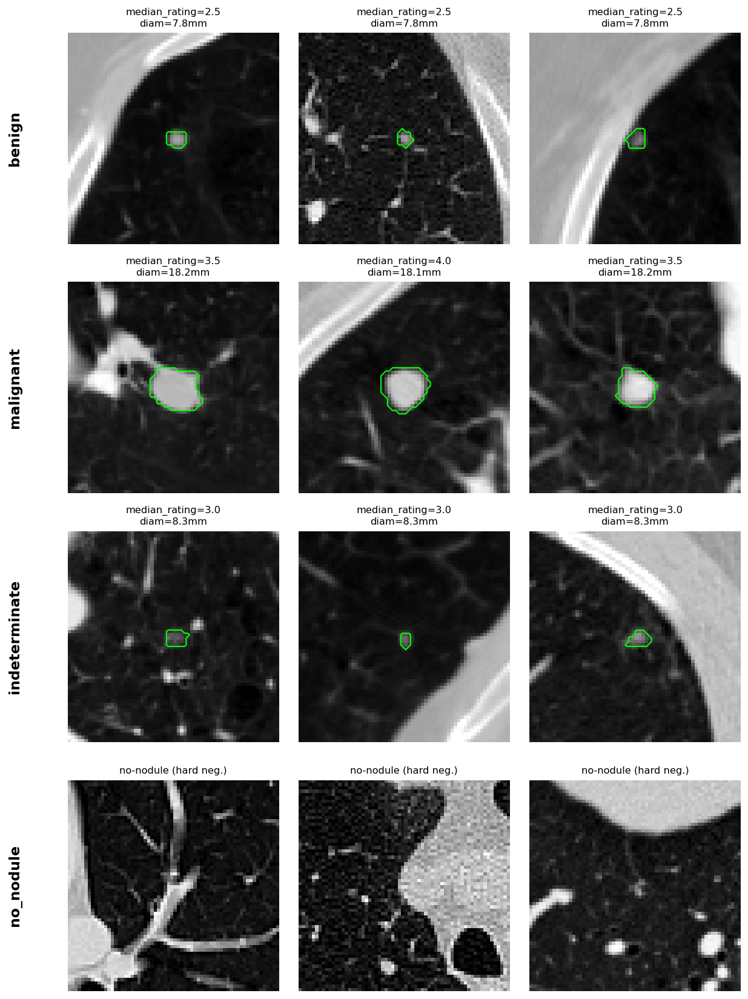

Kontur hijau pada figure di atas adalah mask segmentasi dari anotasi radiolog di dataset (bukan output model) -- dipakai sebagai referensi lokasi nodul saat membaca hasil Grad-CAM di Bab 6.2.

### 4.2 Preprocessing
- Patch 2.5D: 3 slice axial di sekitar centroid, ditumpuk sebagai channel (kompromi antara context 3D volumetric dan biaya komputasi 2D CNN standar)
- Ukuran: 64x64 pixel
- Window HU: -1000 s/d 400 (rentang lung window standar radiologi, mencakup jaringan paru s/d jaringan lunak/nodul solid)
- Resample: 1mm isotropic (menyamakan resolusi spasial antar scan, sebagian besar slice thickness asli berbeda-beda, lihat tabel karakteristik di bawah)

### 4.3 Split
- Patient-level stratified 5-fold (semua nodul 1 pasien di fold sama)
- Fixed: `artifacts/splits/folds.json` (seed=42)

**Tabel distribusi per class per fold:**

| fold | n_total | grade4_no_nodule | grade4_benign | grade4_indeterminate | grade4_malignant | binary_benign | binary_malignant |
|---|---|---|---|---|---|---|---|
| 0 | 952 | 449 | 203 | 204 | 96 | 203 | 96 |
| 1 | 831 | 445 | 173 | 132 | 81 | 173 | 81 |
| 2 | 821 | 418 | 175 | 135 | 93 | 175 | 93 |
| 3 | 839 | 401 | 215 | 131 | 92 | 215 | 92 |
| 4 | 833 | 425 | 171 | 145 | 92 | 171 | 92 |

**Karakteristik dataset:**

| metric | value |
|---|---|
| n_patients | 717 |
| n_scans | 725 |
| n_nodule_rows_total | 4276 |
| n_nodule_rows (class_kind=nodule) | 2138 |
| n_no_nodule_hard_negatives | 2138 |
| slice_thickness_mm_min | 0.45 |
| slice_thickness_mm_median | 1.25 |
| slice_thickness_mm_max | 5.0 |
| n_annotations_per_nodule_median | 0.5 |
| label_aggregation_rule | median of radiologist malignancy ratings (1-5) |
| arm_A_exclude_rule | median_rating == 3 (indeterminate) dropped |
| no_nodule_source | LUNA16 class-0 candidates (hard negatives) |
| nodule_diameter_mm_median (3D max, radiomics) | 11.0 |
| nodule_diameter_mm_range (3D max, radiomics) | 2.45-54.28 |

---

## 5. HYPERPARAMETER & SETUP (config kanonik)

> `configs/config.yaml` = KANONIK (6 backbone target). `configs/train.yaml` = versi lama, diarsipkan ke `docs/archive/train.yaml.deprecated`.

### 5.1 Training
| Parameter | Nilai |
|---|---|
| Epochs | 50 |
| Batch size | 16 |
| Learning rate | 1e-4 |
| Weight decay | 1e-4 |
| Early stopping patience | 10 |
| Checkpoint every | 5 epoch |
| Mixed precision | true |
| Seed | 42 |

### 5.2 Model (6 backbone)
| Backbone | Kategori | Params (M, nyata) |
|---|---|---|
| mobilenetv3_small | Lightweight | 0.928 |
| efficientnet_b0 | Lightweight | 4.01 |
| densenet121 | Lightweight | 6.956 |
| vgg16 | Heavyweight | 14.716 |
| resnet50 | Heavyweight | 23.512 |
| vit_base | Heavyweight | 85.8 |

### 5.3 Radiomics
- PyRadiomics, binWidth 25, resample [1,1,1]
- Feature classes: firstorder, shape, glcm, glrlm, glszm, gldm, ngtdm
- Selection per fold (train split only, anti-leakage): mRMR (fallback `mutual_info_classif`, `pymrmr` tidak terpasang) -> LASSO (`LassoCV`)

### 5.4 Fusion & statistik
- FusionNet: emb_dim=256, rad_dim=128, fusion_dim=128, dropout=0.3
- XGBoost (radiomics branch): default config, lihat `configs/config.yaml` key `xgboost`
- Evaluasi: bootstrap CI 95%, DeLong test alpha=0.05, decision rule pre-registered (fusion jadi headline HANYA jika DeLong p<0.05 DAN AUC fusion lebih tinggi)

---

## 6. HASIL

### 6.1 Track 2 — Model Comparison

**Tabel hasil utama, Arm A (binary), diurutkan AUC:**

| Backbone | Params (M) | GFLOPs | AUC (mean+-std) | AUC 95% CI | Sens | Spec | F1 | Infer (ms) | AUC/M params |
|---|---|---|---|---|---|---|---|---|---|
| vgg16 | 14.716 | 2.5142 | 0.9103 +- 0.0336 | [0.8809, 0.9398] | 0.7223 | 0.9273 | 0.7711 | 13.17 | 0.0619 |
| resnet50 | 23.512 | 0.6744 | 0.8945 +- 0.0303 | [0.8680, 0.9211] | 0.6988 | 0.9166 | 0.7465 | 21.45 | 0.038 |
| vit_base | 85.8 | 35.2108 | 0.8934 +- 0.0236 | [0.8727, 0.9141] | 0.6641 | 0.9240 | 0.7287 | 139.71 | 0.0104 |
| densenet121 | 6.956 | 0.4733 | 0.8825 +- 0.0218 | [0.8633, 0.9016] | 0.7243 | 0.8970 | 0.7472 | 30.79 | 0.1269 |
| efficientnet_b0 | 4.01 | 0.0679 | 0.8651 +- 0.0113 | [0.8552, 0.8750] | 0.6453 | 0.8889 | 0.6903 | 17.34 | 0.2157 |
| mobilenetv3_small | 0.928 | 0.0105 | 0.8302 +- 0.0198 | [0.8128, 0.8475] | 0.5818 | 0.8912 | 0.6448 | 6.8 | 0.8946 |

**Arm B (ordinal) — QWK per backbone:**

| model | params_M | gflops | latency_ms | qwk | qwk_ci_low | qwk_ci_high |
|---|---|---|---|---|---|---|
| vgg16 | 14.715 | 2.5142 | 7.158 | 0.6432 | 0.5921 | 0.6944 |
| densenet121 | 6.955 | 0.4733 | 15.1488 | 0.6129 | 0.568 | 0.6578 |
| resnet50 | 23.51 | 0.6744 | 9.3357 | 0.6122 | 0.5761 | 0.6483 |
| vit_base | 85.799 | 35.2108 | 61.8421 | 0.6083 | 0.5178 | 0.6988 |
| efficientnet_b0 | 4.009 | 0.0679 | 10.5767 | 0.4503 | 0.4214 | 0.4792 |
| mobilenetv3_small | 0.928 | 0.0105 | 5.1482 | 0.3438 | 0.2795 | 0.4081 |

**Arm D (grade4) — dua metrik terpisah:**

4-class macro-AUC (termasuk kelas no-nodule, mudah dipisahkan -> berpotensi inflasi):

| model | params_M | gflops | latency_ms | auc_macro | auc_macro_ci_low | auc_macro_ci_high |
|---|---|---|---|---|---|---|
| vgg16 | 14.717 | 2.5142 | 13.2023 | 0.9122 | 0.9015 | 0.9228 |
| vit_base | 85.802 | 35.2108 | 139.5416 | 0.8942 | 0.8828 | 0.9057 |
| resnet50 | 23.516 | 0.6744 | 25.5896 | 0.8843 | 0.8711 | 0.8975 |
| densenet121 | 6.958 | 0.4733 | 31.3192 | 0.88 | 0.8653 | 0.8946 |
| efficientnet_b0 | 4.013 | 0.0679 | 17.2916 | 0.8623 | 0.8482 | 0.8764 |
| mobilenetv3_small | 0.929 | 0.0105 | 9.1445 | 0.8369 | 0.824 | 0.8498 |

Benign-vs-malignant AUC pada subset nodul saja (headline, anti-inflasi):

| model | params_M | gflops | latency_ms | auc_nodule_only | auc_nodule_only_ci_low | auc_nodule_only_ci_high |
|---|---|---|---|---|---|---|
| vgg16 | 14.717 | 2.5142 | 13.2023 | 0.9225 | 0.8997 | 0.9452 |
| vit_base | 85.802 | 35.2108 | 139.5416 | 0.9121 | 0.8867 | 0.9376 |
| resnet50 | 23.516 | 0.6744 | 25.5896 | 0.9013 | 0.8809 | 0.9216 |
| densenet121 | 6.958 | 0.4733 | 31.3192 | 0.8957 | 0.8765 | 0.9148 |
| efficientnet_b0 | 4.013 | 0.0679 | 17.2916 | 0.8823 | 0.868 | 0.8965 |
| mobilenetv3_small | 0.929 | 0.0105 | 9.1445 | 0.8767 | 0.8485 | 0.9049 |

**DeLong test (arm A, pasangan signifikan p<0.05):**

- **mobilenetv3_small** vs **efficientnet_b0**: p=0.0008156 (significant)
- **mobilenetv3_small** vs **densenet121**: p=2.041e-07 (significant)
- **mobilenetv3_small** vs **resnet50**: p=2.359e-10 (significant)
- **mobilenetv3_small** vs **vgg16**: p=3.441e-11 (significant)
- **mobilenetv3_small** vs **vit_base**: p=7.322e-08 (significant)
- **efficientnet_b0** vs **resnet50**: p=0.009507 (significant)
- **efficientnet_b0** vs **vgg16**: p=0.001205 (significant)
- **efficientnet_b0** vs **vit_base**: p=0.04207 (significant)

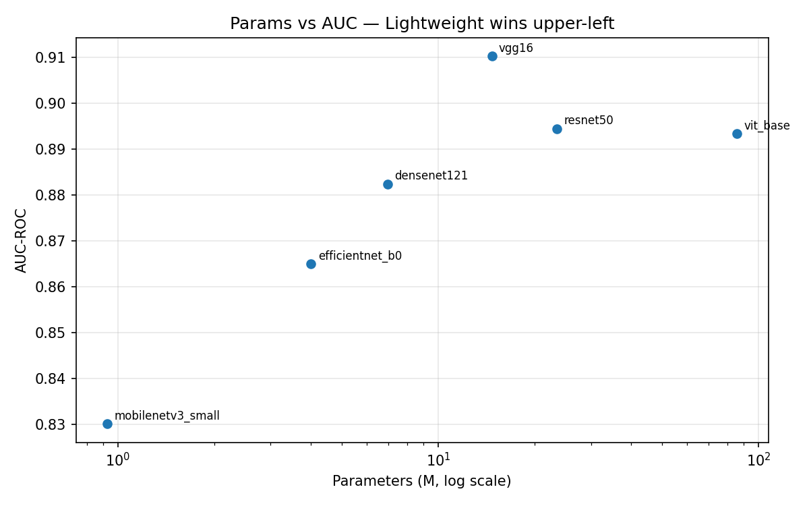

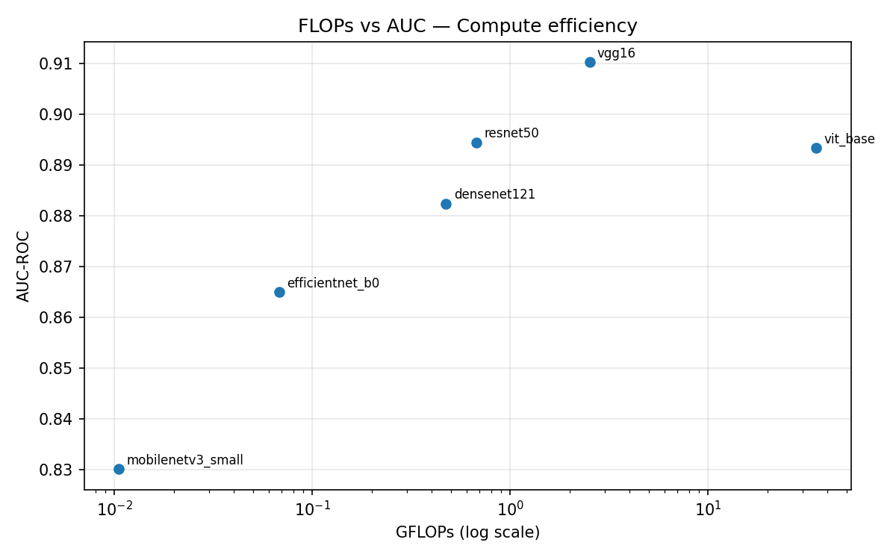

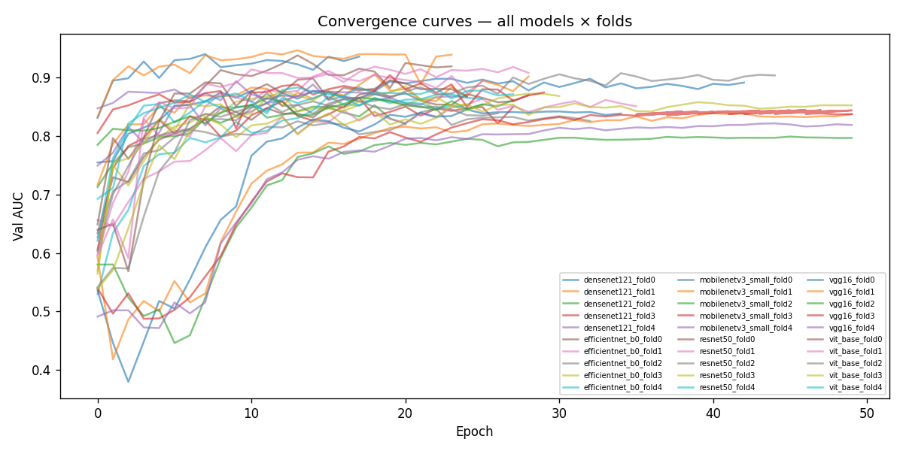

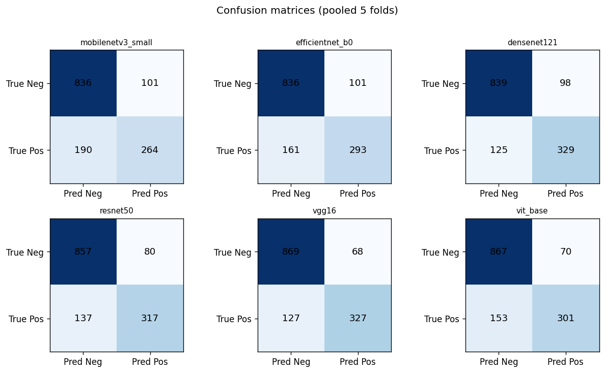

**Catatan framing penting**: AUC mentah tertinggi dipegang **vgg16** (heavyweight), BUKAN backbone lightweight -- judul figure "Lightweight wins upper-left" merujuk ke efisiensi (AUC per juta parameter), bukan akurasi absolut. mobilenetv3_small AUC terendah tapi AUC/M params tertinggi (paling efisien).

---

### 6.2 XAI (Track 2)

**Metrik XAI per arsitektur** (fold 0, n=60, threshold top-20%):

| Backbone | Dice | IoU | Dice (size-matched) | Pointing Acc | Energy |
|---|---|---|---|---|---|
| vgg16 | 0.0914 | 0.0597 | 0.1785 | 0.2 | 0.1027 |
| densenet121 | 0.0993 | 0.0599 | 0.1099 | 0.1333 | 0.045 |
| resnet50 | 0.1181 | 0.0703 | 0.1461 | 0.1167 | 0.0534 |
| efficientnet_b0 | 0.061 | 0.0353 | 0.0667 | 0.0833 | 0.0563 |
| mobilenetv3_small | 0.0379 | 0.0201 | 0.0176 | 0.0 | 0.0205 |
| vit_base | 0.0357 | 0.0198 | 0.015 | 0.0 | 0.0074 |

**Temuan kualitatif (fixed sample set S1-S6)**: densenet121, resnet50, dan vgg16 -- hot spot Grad-CAM konsisten jatuh di dalam mask nodul (S1-S4). mobilenetv3_small dan efficientnet_b0 sering meleset ke tepi nodul/struktur sekitar. vit_base nyaris flat (pointing_acc=0), konsisten dengan skor rendah di tabel metrik. **Interpretability tidak mengikuti kapasitas model** -- vit_base 86M params tapi lokalisasi terlemah.

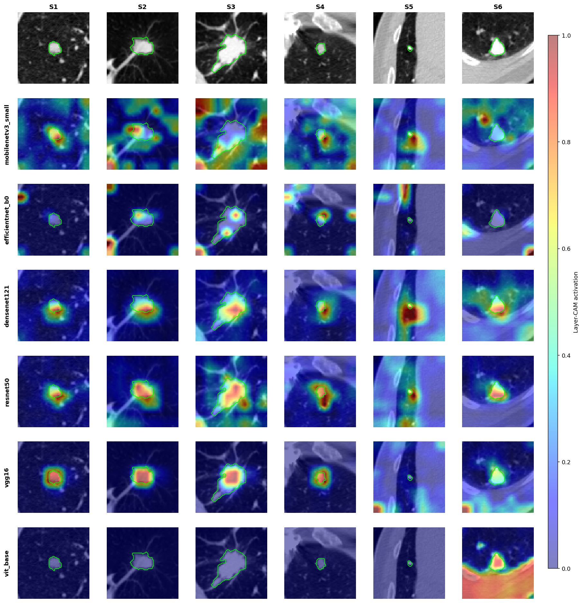

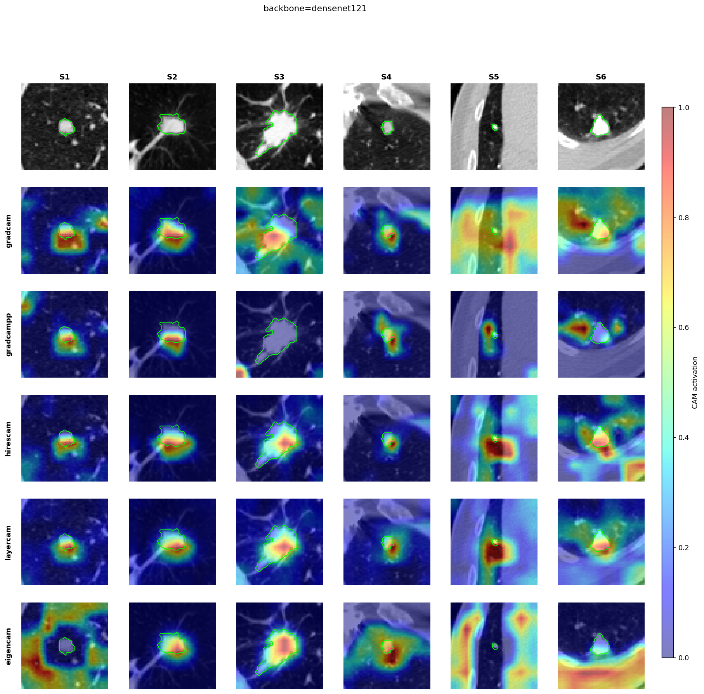

---

### 6.3 Track 1 — Fusion + XAI

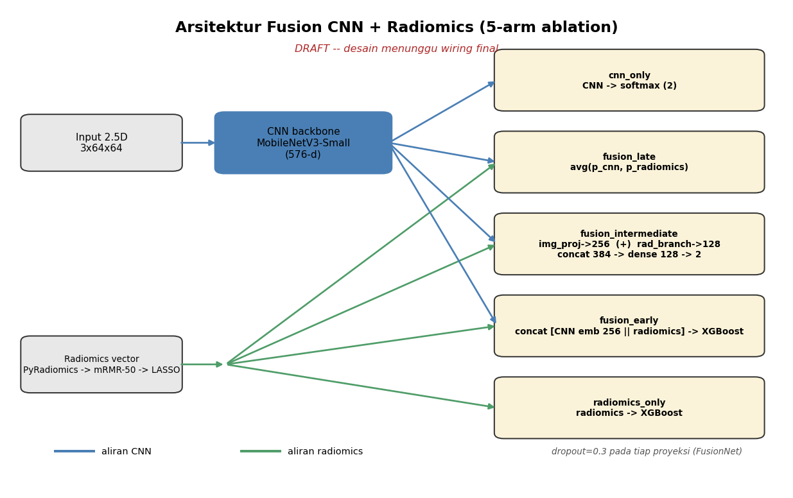

Diagram di atas skema 5 arm yang diablasi: dua modalitas tunggal (cnn_only, radiomics_only) plus tiga titik penggabungan (fusion_early feature-level, fusion_intermediate embedding 256+128=384 di FusionNet, fusion_late decision-level). Ini desain manual, arm sesuai ablation eksploratif; bisa berubah saat Track 1 di-wire final.

**Ablation 5-arm, pooled AUC (mean lintas 5 fold):**

| arm | pooled_auc | auc_std | n_folds |
|---|---|---|---|
| radiomics_only | 0.9342 | 0.0159 | 5 |
| fusion_intermediate | 0.9338 | 0.0106 | 5 |
| fusion_early | 0.922 | 0.0089 | 5 |
| fusion_late | 0.9196 | 0.0199 | 5 |
| cnn_only | 0.8362 | 0.0183 | 5 |

**DeLong test: tiap varian fusion vs radiomics-only (best single arm):**

| fusion_arm | fusion_auc | best_single_arm | best_single_auc | delong_p | fusion_significantly_better |
|---|---|---|---|---|---|
| fusion_intermediate | 0.9304 | radiomics | 0.9332 | 0.6008 | False |
| fusion_early | 0.9205 | radiomics | 0.9332 | 0.0186 | False |
| fusion_late | 0.9183 | radiomics | 0.9332 | 0.0015 | False |

**Kesimpulan (decision rule pre-registered, ditetapkan sebelum lihat hasil)**: fusion HANYA jadi headline kalau DeLong p<0.05 DAN AUC fusion lebih tinggi. Hasil nyata: fusion_intermediate tidak signifikan berbeda (p=0.60) dari radiomics-only; fusion_early dan fusion_late justru **signifikan lebih buruk** (p=0.019 dan p=0.0015). **Radiomics-only tetap headline Track 1** -- dilaporkan transparan sebagai temuan valid, bukan disembunyikan karena tidak sesuai ekspektasi.

**Top-10 fitur radiomics terpenting (mean |SHAP|):**

| feature | mean_abs_shap |
|---|---|
| original_shape_LeastAxisLength | 0.7827 |
| wavelet-LLL_glcm_Imc1 | 0.6882 |
| original_shape_Maximum2DDiameterSlice | 0.6284 |
| wavelet-HHH_glrlm_RunLengthNonUniformity | 0.6102 |
| wavelet-LHL_glszm_GrayLevelNonUniformity | 0.4646 |
| log-sigma-3-0-mm-3D_ngtdm_Coarseness | 0.365 |
| wavelet-HHH_gldm_DependenceNonUniformity | 0.3621 |
| wavelet-HHH_ngtdm_Coarseness | 0.3468 |
| wavelet-HLL_glszm_GrayLevelNonUniformity | 0.3234 |
| log-sigma-2-0-mm-3D_glszm_GrayLevelNonUniformity | 0.3213 |

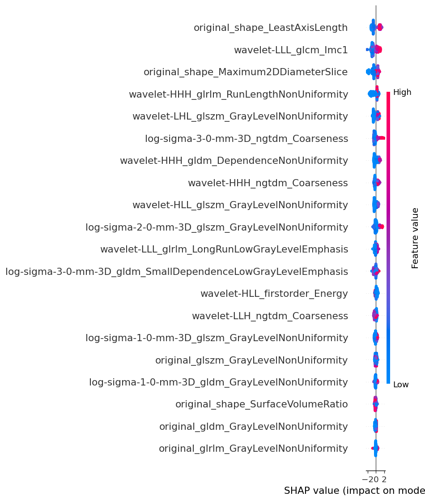

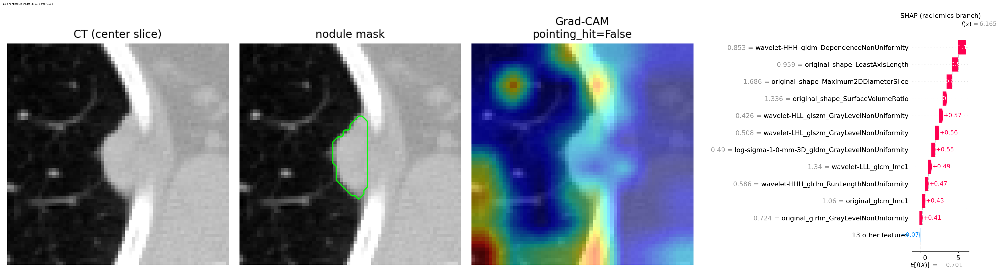

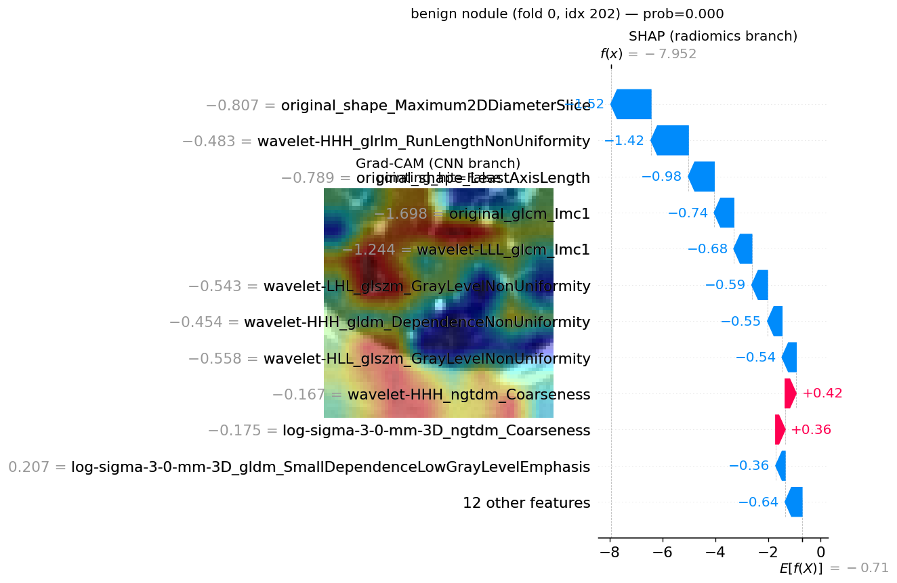

Kedua figure di atas membandingkan atensi spasial CNN (Grad-CAM) dengan kontribusi fitur radiomics (SHAP) pada sample sama -- level pertama dari cross-modality XAI. Cross-validation kuantitatif lintas lebih banyak sample (Level 2) menyusul di Fig 14, fase Track 1 lanjutan.

---

## 7. FIGURE YANG DITAMPILKAN KE DOSEN

**Sudah jadi (dipakai di laporan ini):**
- Fig A -- Dataset overview (severity-ordered): `figures/dataset_overview.png`
- Fig B -- Grid A backbone XAI: `figures_grid/grid_backbone.png`
- Fig C -- Grid B metode CAM: `figures_grid/grid_cam_method.png`
- Fig D -- Params vs AUC: `figures/params_vs_auc.png`
- Fig E -- FLOPs vs AUC: `figures/flops_vs_auc.png`
- Fig F -- Convergence curves: `figures/convergence.png`
- Fig G -- Confusion matrices: `figures/confusion_matrices.png`
- Fig H -- SHAP beeswarm: `xai_track1/shap_beeswarm.png`
- Fig I -- Grad-CAM + SHAP side-by-side: `xai_track1/sidebyside_malignant.png`, `sidebyside_benign.png`
- Fig J -- Diagram arsitektur fusion (DRAFT): `figures/fusion_architecture.png`
- Table 3.1-3.3 -- distribusi class per arm, per fold, karakteristik dataset

**Belum ada (menyusul fase Track 1 lanjutan):**
- Fig 14 -- Cross-validation SHAP<->Grad-CAM lintas >2 sample (Level 2 XAI)

> Rekomendasi presentasi: fokus Fig D (Params vs AUC) + Fig B (Grid backbone XAI) + Table hasil utama Bab 6.1 + Bab 6.3 (temuan negatif fusion, integritas riset).

---

## 8. TANTANGAN & PELAJARAN

- Bug XAI (3 iterasi, Fase 6) -- proses debugging terdokumentasi, bukan kegagalan
- Config dualism (`config.yaml` vs `train.yaml`) -- pentingnya satu sumber kebenaran, diselesaikan dengan arsip eksplisit
- Repo lokal sempat stale terhadap state remote (checkpoint 120 run sudah jalan tapi belum ter-sync) -- pentingnya audit state nyata sebelum planning
- Naming bug laten: checkpoint/log/pred arm A (binary) tidak pakai suffix task, sementara arm lain pakai -- ditemukan & diperbaiki sebelum sempat merusak hasil di rerun
- Temuan XAI: interpretability != kapasitas model (ViT besar tapi Grad-CAM nyaris flat)
- Temuan Track 1: fusion tidak otomatis menang atas modalitas tunggal -- radiomics-only mengalahkan 3 skema fusion, dilaporkan apa adanya sesuai decision rule pre-registered

---

## 9. RENCANA LANJUTAN

1. Fig 14 (cross-validation SHAP<->Grad-CAM lintas lebih banyak sample, Level 2 XAI) -- fase Track 1 lanjutan; Fig 11 sudah draft
2. Validasi eksternal (opsional): LUNGx/NLST/LNDb, cek kontaminasi data
3. Penulisan paper/skripsi
4. Target sidang: <<ISI: target sidang/deadline>>

---

## 10. INTEGRITAS RISET

- Semua arm dilaporkan transparan, termasuk yang hasilnya biasa/kalah (fusion vs radiomics-only)
- Decision rule fusion ditetapkan SEBELUM lihat hasil (anti post-hoc / anti-HARKing)
- Fold dibekukan lintas arm (`artifacts/splits/folds.json`, seed=42) -- fair comparison
- Fair-setup: split/augmentation/config identik semua backbone
- Metrik headline Track 2 arm D pakai subset nodul-saja (bukan campur no-nodule yang gampang dipisahkan)
- Radiomics feature selection dilakukan per-fold pada train split saja (anti-leakage)

---

## LAMPIRAN — FILE PENTING DI REPO

| File | Isi |
|---|---|
| `docs/implementation/PLAN_MALIGNANCY_GRADING.md` | Detail arm B/C/D + decision rule anti post-hoc |
| `docs/PROMPT_DATASET_RESEARCH.md` | Riset dataset + kontaminasi |
| `docs/training_guide.md` | Panduan setup + eksekusi |
| `docs/implementation/VISUALIZATION_FIGURES_PLAN.md` | Rencana figure paper, Bagian 1-4 |
| `configs/config.yaml` | Config kanonik (6 backbone) |
| `src/stage_00..07` | Pipeline lengkap (preprocessing s/d journey report) |
| `artifacts/splits/folds.json` | Split fixed |
| `artifacts/features/radiomics.parquet` | Fitur radiomics |
| `artifacts/results/summary*.csv` | Hasil agregat per arm |
| `artifacts/results/fusion/` | Hasil ablation Track 1 |
